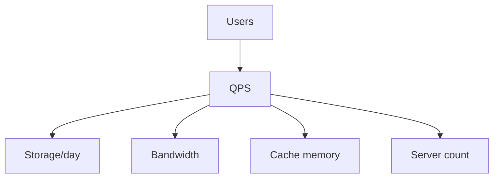

# Capacity Estimation

## Complete notes

Capacity estimation predicts traffic, storage, bandwidth, memory, and compute needs.

## Easy explanation

Capacity estimation predicts traffic, storage, bandwidth, memory, and compute needs.

In simple words: if you can explain `Capacity Estimation` with one real request, one failure case, and one metric, you understand the topic much better than just memorizing the definition.

## Simple example

Think of finding why a system is slow or expensive. This topic explains how to measure bottlenecks before optimizing.

For `Capacity Estimation`, ask yourself:

1. What is the normal happy path?
2. What can fail?
3. What is the tradeoff?
4. What would I monitor in production?

## Real-life examples

### Easy real-life example

A page loads slowly, so you check whether the API, database, cache, or external service is slow.

### Difficult production example

A high-QPS feed service hits p99 latency because of hot partitions, cache misses, DB query plans, thread pool exhaustion, queue lag, and backpressure failures.

### How to relate this topic

When reading `Capacity Estimation`, connect it to:

- one user action
- one backend component
- one failure case
- one tradeoff
- one metric

## Important points

- Core idea: `Capacity Estimation` must be understood through its production use case, not just its definition.
- When to use it: Focus on bottleneck identification, profiling, p95/p99 latency, DB plans, cache hit rate, queue lag, backpressure, and capacity estimation.
- At scale: explain the bottleneck, failure path, operational owner, and rollback/fallback.
- What to monitor: p50/p95/p99 latency, throughput, CPU, memory, GC, DB time, cache hit rate, queue lag, and external dependency latency.
- Interview rule: always give one concrete example, one tradeoff, one failure mode, and one metric.

## Diagram



## SDE-3 interview angle

At SDE-3 level, do not only define this topic. Explain tradeoffs, failure modes, production debugging signals, and what you would choose under different requirements.

## Common mistakes

- Optimizing before measuring.
- Looking only at average latency and ignoring p95/p99.
- Adding cache before fixing bad queries or dependency bottlenecks.
- Ignoring backpressure and overload behavior.
- Scaling app servers while the database or external dependency is the real bottleneck.

## Quick revision

Capacity estimation predicts traffic, storage, bandwidth, memory, and compute needs.

## Examples and deeper diagrams

### Example estimate

Assume:

- 1 million daily active users.
- Each user makes 20 requests/day.
- Peak traffic is 10x average.

```text
daily requests = 1,000,000 * 20 = 20,000,000
average RPS = 20,000,000 / 86,400 ≈ 231 RPS
peak RPS ≈ 2,310 RPS
```


### What to estimate

- RPS/QPS
- storage/day
- cache memory
- bandwidth
- number of workers
- DB read/write split


## Deep understanding checklist

To fully understand `Capacity Estimation`, be able to answer:

1. Where does it sit in the architecture?
2. What production problem does it solve?
3. What is the simplest implementation?
4. What breaks when traffic or data grows?
5. What is the main failure mode?
6. What tradeoff does it introduce?
7. Which metric proves it is healthy?

Strong answer focus: Focus on bottleneck identification, profiling, p95/p99 latency, DB plans, cache hit rate, queue lag, backpressure, and capacity estimation.

## Senior interview bank

These are topic-specific questions and strong answers for `Capacity Estimation`.

### 1. Where is the bottleneck likely to be?

Check traces and metrics before guessing. Bottlenecks commonly appear in database queries, connection pools, external APIs, locks, GC, hot partitions, cache misses, CPU, memory, or network.

### 2. What does p99 tell you that average does not?

p99 shows tail pain affecting a small but important user group. If p99 rises and p50 does not, suspect one bad node, slow dependency, pool exhaustion, GC pauses, hot keys, or specific request shapes.

### 3. How would you capacity plan this?

Estimate users, QPS, read/write ratio, payload size, storage, bandwidth, peak factor, and dependency limits. Then compare demand with service capacity and add headroom.

### 4. What optimization would you avoid first?

Avoid adding cache or sharding before proving the bottleneck. The simplest fix may be an index, query rewrite, pool tuning, batching, or timeout.

### 5. How do you protect the system under overload?

Use rate limits, queues, backpressure, load shedding, circuit breakers, autoscaling, and graceful degradation. Protect critical paths before optional work.

## Topic-specific drill

### How would I answer `Capacity Estimation` if the interviewer asks directly?

For `Capacity Estimation`, I would explain how to measure before optimizing, what bottleneck is likely, what p95/p99 show, and which change reduces load without breaking correctness.

### What is the trap question for `Capacity Estimation`?

The trap is giving only a definition. A senior answer must include a concrete production example, a failure mode, a tradeoff, and a metric.

### What should I draw?

Draw the smallest flow that shows where `Capacity Estimation` sits, then add the failure path next to the happy path.

## Reviewer checklist

- Can I explain this without reading the note?
- Can I draw the happy path and failure path?
- Can I name one concrete metric?
- Can I explain the tradeoff against a simpler option?
- Can I give a production example in under two minutes?
