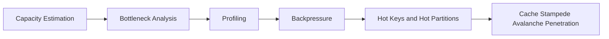

# Performance Engineering Content Table

- [[Capacity Estimation]]
- [[Bottleneck Analysis]]
- [[Profiling]]
- [[Backpressure]]
- [[Hot Keys and Hot Partitions]]
- [[Cache Stampede Avalanche Penetration]]

## Revision dashboard

Performance engineering is measuring and improving latency, throughput, cost, and resource usage.

## Visual topic map

Use this map like the Excalidraw roadmap: follow the arrows first, then open the linked notes.

## Color legend

- Blue = core concept
- Green = recommended pattern
- Red = risk or failure mode
- Purple = tradeoff
- Orange = current 2026 update

## Linked notes in this map

- [[Capacity Estimation]]
- [[Bottleneck Analysis]]
- [[Profiling]]
- [[Backpressure]]
- [[Hot Keys and Hot Partitions]]
- [[Cache Stampede Avalanche Penetration]]

## Grill audit additions

- [[Thread Pools and Blocking IO]]
