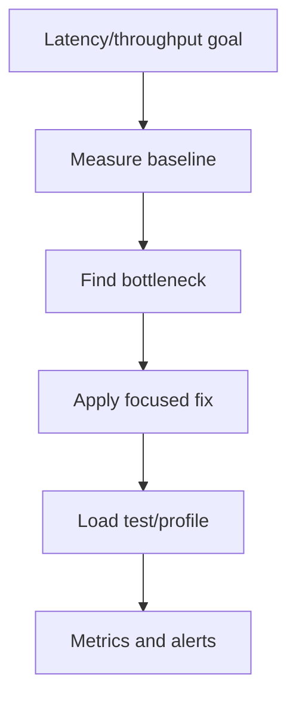

# Performance Engineering Content Table

Performance engineering is finding and removing bottlenecks so the system meets latency, throughput, and cost goals.

## Study order

1. [[Capacity Estimation]]
2. [[Bottleneck Analysis]]
3. [[Profiling]]
4. [[Backpressure]]
5. [[Hot Keys and Hot Partitions]]
6. [[Cache Stampede Avalanche Penetration]]
7. [[Thread Pools and Blocking IO]]

## Complete notes

Performance is not guessing. It is measurement plus tradeoffs.

A senior backend engineer asks:

- what is the latency target?
- what is p50/p95/p99?
- what is throughput?
- what is the bottleneck: CPU, memory, DB, network, lock, queue, downstream dependency?
- what happens under overload?
- what gets cached and invalidated?
- what is the cost of the optimization?

## Performance flow

## How this applies to InvoiceOps

Performance appears in:

- dashboard summary queries
- invoice list pagination
- client search
- webhook processing latency
- reminder worker throughput
- database connection pool sizing
- Redis cache for expensive dashboard data

## Easy example

If dashboard refresh is slow, cache `dashboard:{workspace_id}:summary` for 30 seconds and invalidate after invoice/payment changes.

## Difficult production example

If one workspace has millions of invoices, `GET /invoices` can become slow even with pagination unless indexes match filters like `workspace_id`, `status`, and `due_date`.

## Common mistakes

- optimizing without measuring
- looking only at average latency, not p95/p99
- adding cache without invalidation plan
- unlimited concurrency with no backpressure
- no database indexes for filters
- ignoring hot keys/partitions
- benchmarking locally and assuming production behavior

## Senior interview bank

### 1. How do you debug slow API latency?

Break down time by handler, service, database, cache, external API, and serialization. Use logs/traces/metrics, then optimize the largest contributor.

### 2. When do you add cache?

Add cache when reads are repeated, data can tolerate staleness, and invalidation/TTL rules are clear.

### 3. What is backpressure?

Backpressure is slowing or rejecting incoming work when the system cannot safely process more, preventing collapse.

## Reviewer checklist

- Is there a measurable SLO?
- Are p95/p99 tracked?
- Is the bottleneck proven?
- Is pagination/indexing correct?
- Is cache invalidation defined?
- Is overload behavior explicit?
