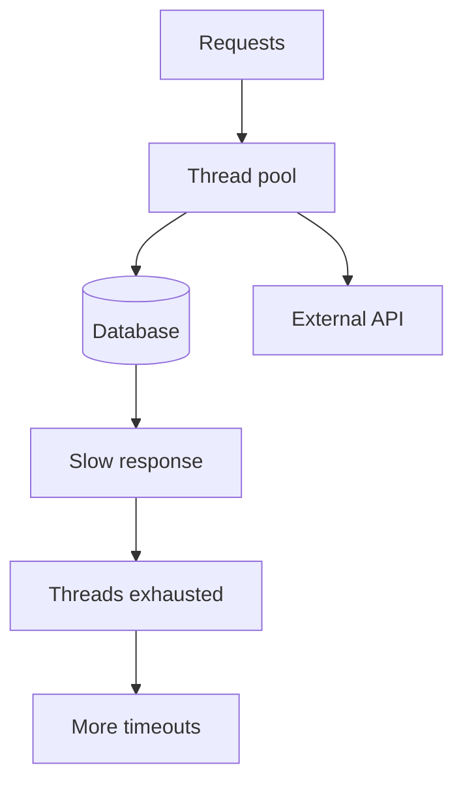

# Thread Pools and Blocking IO

## Complete notes

Thread pools control how much concurrent work a backend can do. Blocking IO ties up threads while waiting for network, disk, or database responses.

## Easy explanation

Thread pools control how much concurrent work a backend can do.

In simple words: if you can explain `Thread Pools and Blocking IO` with one real request, one failure case, and one metric, you understand the topic much better than just memorizing the definition.

## Simple example

Think of finding why a system is slow or expensive. This topic explains how to measure bottlenecks before optimizing.

For `Thread Pools and Blocking IO`, ask yourself:

1. What is the normal happy path?
2. What can fail?
3. What is the tradeoff?
4. What would I monitor in production?

## Why it matters

Many production latency incidents happen because a dependency slows down and threads/connections get exhausted.

## Diagram

## Interview explanation

If a service has 100 worker threads and an external API starts taking 10 seconds instead of 100ms, threads pile up. New requests wait, p99 latency rises, and health checks may fail.

## Fixes

- Timeouts on every dependency call.
- Separate pools for risky dependencies.
- Async/non-blocking IO where appropriate.
- Bulkheads.
- Circuit breakers.
- Queue and backpressure.
- Connection pool limits.

## Real-life examples

### Easy real-life example

A page loads slowly, so you check whether the API, database, cache, or external service is slow.

### Difficult production example

A high-QPS feed service hits p99 latency because of hot partitions, cache misses, DB query plans, thread pool exhaustion, queue lag, and backpressure failures.

### How to relate this topic

When reading `Thread Pools and Blocking IO`, connect it to:

- one user action
- one backend component
- one failure case
- one tradeoff
- one metric

## Important points

- Core idea: `Thread Pools and Blocking IO` must be understood through its production use case, not just its definition.
- When to use it: Focus on bottleneck identification, profiling, p95/p99 latency, DB plans, cache hit rate, queue lag, backpressure, and capacity estimation.
- At scale: explain the bottleneck, failure path, operational owner, and rollback/fallback.
- What to monitor: p50/p95/p99 latency, throughput, CPU, memory, GC, DB time, cache hit rate, queue lag, and external dependency latency.
- Interview rule: always give one concrete example, one tradeoff, one failure mode, and one metric.

## Common mistakes

- Optimizing before measuring.
- Looking only at average latency and ignoring p95/p99.
- Adding cache before fixing bad queries or dependency bottlenecks.
- Ignoring backpressure and overload behavior.
- Scaling app servers while the database or external dependency is the real bottleneck.

## Quick revision

- One-line meaning: Thread Pools and Blocking IO is a performance topic. It should be understood as part of a real production backend, not only as a definition.
- Use it when: Use it when latency, throughput, resource usage, or cost becomes important.
- Failure to mention: partial failure, overload, bad config, stale data, or unsafe retries.
- Tradeoff to mention: simplicity vs production safety.
- Metric to mention: Watch p50/p95/p99 latency, CPU, memory, DB time, cache hit rate, queue lag, and dependency latency.

## Deep understanding checklist

To fully understand `Thread Pools and Blocking IO`, be able to answer:

1. Where does it sit in the architecture?
2. What production problem does it solve?
3. What is the simplest implementation?
4. What breaks when traffic or data grows?
5. What is the main failure mode?
6. What tradeoff does it introduce?
7. Which metric proves it is healthy?

Strong answer focus: Focus on bottleneck identification, profiling, p95/p99 latency, DB plans, cache hit rate, queue lag, backpressure, and capacity estimation.

## Senior interview bank

These are topic-specific questions and strong answers for `Thread Pools and Blocking IO`.

### 1. Where is the bottleneck likely to be?

Check traces and metrics before guessing. Bottlenecks commonly appear in database queries, connection pools, external APIs, locks, GC, hot partitions, cache misses, CPU, memory, or network.

### 2. What does p99 tell you that average does not?

p99 shows tail pain affecting a small but important user group. If p99 rises and p50 does not, suspect one bad node, slow dependency, pool exhaustion, GC pauses, hot keys, or specific request shapes.

### 3. How would you capacity plan this?

Estimate users, QPS, read/write ratio, payload size, storage, bandwidth, peak factor, and dependency limits. Then compare demand with service capacity and add headroom.

### 4. What optimization would you avoid first?

Avoid adding cache or sharding before proving the bottleneck. The simplest fix may be an index, query rewrite, pool tuning, batching, or timeout.

### 5. How do you protect the system under overload?

Use rate limits, queues, backpressure, load shedding, circuit breakers, autoscaling, and graceful degradation. Protect critical paths before optional work.

## Topic-specific drill

### How would I answer `Thread Pools and Blocking IO` if the interviewer asks directly?

For `Thread Pools and Blocking IO`, I would explain how to measure before optimizing, what bottleneck is likely, what p95/p99 show, and which change reduces load without breaking correctness.

### What is the trap question for `Thread Pools and Blocking IO`?

The trap is giving only a definition. A senior answer must include a concrete production example, a failure mode, a tradeoff, and a metric.

### What should I draw?

Draw the smallest flow that shows where `Thread Pools and Blocking IO` sits, then add the failure path next to the happy path.

## Reviewer checklist

- Can I explain this without reading the note?
- Can I draw the happy path and failure path?
- Can I name one concrete metric?
- Can I explain the tradeoff against a simpler option?
- Can I give a production example in under two minutes?
