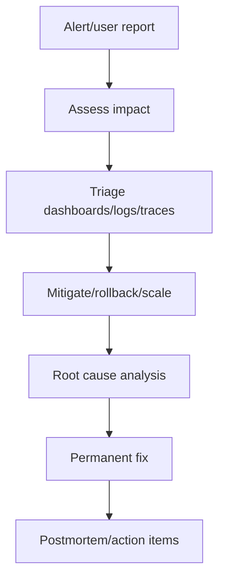

# Production Debugging Content Table

Production debugging is the skill of finding the real cause of user-impacting issues using evidence, not guesses.

## Study order

1. [[SLO SLA SLI]]
2. [[Incident Response]]
3. [[Latency Debugging]]
4. [[Database Performance Debugging]]
5. [[Memory Leak Debugging]]
6. [[Root Cause Analysis]]
7. [[Postmortems]]

## Complete notes

A production incident is not solved by randomly changing code. Use a structured process:

1. detect the symptom
2. define user impact
3. check recent changes
4. inspect dashboards/logs/traces
5. isolate failing dependency or component
6. mitigate first
7. fix root cause after stability
8. write postmortem

## Incident flow

## How this applies to InvoiceOps

Example incidents:

- login failures spike
- payment webhook duplicate count increases
- dashboard latency rises
- reminder worker backlog grows
- database connection pool is exhausted
- invoices are not marked overdue
- one workspace reports missing invoices

## Easy example

If `/dashboard/summary` becomes slow, check request latency, DB query latency, cache hit rate, and recent deploys.

## Difficult production example

Payment webhook endpoint returns 500 after successfully committing the database transaction. Provider retries, duplicate webhook count spikes. If idempotency works, no double payment occurs; if not, invoices can be corrupted.

## Common mistakes

- debugging without request id
- reading logs manually with no structure
- ignoring recent deploys/config changes
- fixing root cause before mitigating impact
- no rollback plan
- no postmortem action items
- alerting on noise instead of user impact

## Senior interview bank

### 1. What do you do first during an incident?

Assess user impact and stabilize the system. Mitigation comes before perfect root cause analysis.

### 2. What signals do you check?

Check logs, metrics, traces, recent deploys, dependency health, saturation, error rate, and latency percentiles.

### 3. What makes a good postmortem?

It is blameless, factual, timeline-based, identifies contributing factors, and creates concrete action items.

## Reviewer checklist

- Is every request traceable by request id?
- Are important jobs observable?
- Are SLOs defined?
- Is rollback possible?
- Are incidents documented?
- Are action items tracked?
