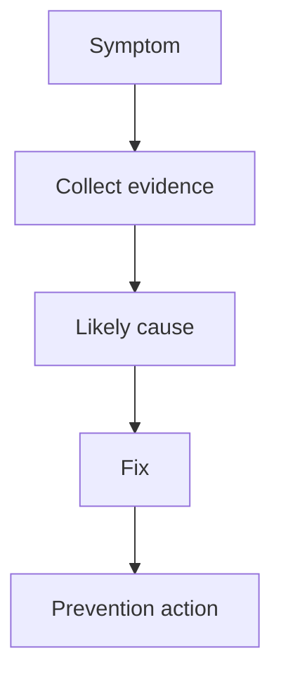

# Root Cause Analysis

## Complete notes

RCA finds why an incident happened and how to prevent repeat.

## Easy explanation

RCA finds why an incident happened and how to prevent repeat.

In simple words: if you can explain `Root Cause Analysis` with one real request, one failure case, and one metric, you understand the topic much better than just memorizing the definition.

## Simple example

Think of a real incident. This topic explains how to reduce user impact, find root cause, and prevent the same failure again.

For `Root Cause Analysis`, ask yourself:

1. What is the normal happy path?
2. What can fail?
3. What is the tradeoff?
4. What would I monitor in production?

## Real-life examples

### Easy real-life example

An alert says error rate increased, so you check what changed and which users are affected.

### Difficult production example

An incident has high p99 latency, queue backlog, partial regional impact, recent deploys, and unclear root cause. You mitigate first, then run RCA and postmortem.

### How to relate this topic

When reading `Root Cause Analysis`, connect it to:

- one user action
- one backend component
- one failure case
- one tradeoff
- one metric

## Important points

- Core idea: `Root Cause Analysis` must be understood through its production use case, not just its definition.
- When to use it: Focus on impact, scope, recent changes, metrics, traces, logs, mitigation, root cause, postmortem, and prevention.
- At scale: explain the bottleneck, failure path, operational owner, and rollback/fallback.
- What to monitor: MTTD, MTTR, error rate, p95/p99 latency, affected users, queue lag, dependency latency, and incident recurrence.
- Interview rule: always give one concrete example, one tradeoff, one failure mode, and one metric.

## Diagram

## SDE-3 interview angle

At SDE-3 level, do not only define this topic. Explain tradeoffs, failure modes, production debugging signals, and what you would choose under different requirements.

## Common mistakes

- Guessing before scoping impact.
- Not checking recent changes.
- No request id/trace id correlation.
- Root causing before mitigation during user impact.
- No postmortem action item.

## Quick revision

RCA finds why an incident happened and how to prevent repeat.

## Deep understanding checklist

To fully understand `Root Cause Analysis`, be able to answer:

1. Where does it sit in the architecture?
2. What production problem does it solve?
3. What is the simplest implementation?
4. What breaks when traffic or data grows?
5. What is the main failure mode?
6. What tradeoff does it introduce?
7. Which metric proves it is healthy?

Strong answer focus: Focus on impact, scope, recent changes, metrics, traces, logs, mitigation, root cause, postmortem, and prevention.

## Production example and edge cases

Example: if p99 latency suddenly jumps, first check recent deploy/config/data changes, scope by endpoint/region/tenant, then use metrics to find the symptom, traces to find the slow span, and logs to confirm the exact error.

For `Root Cause Analysis`, the edge cases to always think about are:

- duplicate request or duplicate event
- dependency timeout or partial failure
- stale data or inconsistent state
- bad input or abusive client
- high traffic causing bottleneck
- rollback or replay after a bad deploy

Interview answer rule: after explaining the concept, immediately give one production example, one failure mode, one tradeoff, and one metric.

## Senior interview bank

These are topic-specific questions and strong answers for `Root Cause Analysis`.

### 1. What is the first thing you ask?

Clarify requirements: users, core features, read/write ratio, scale, latency, availability, consistency, geography, security, and what is explicitly out of scope.

### 2. What design path should you follow?

Requirements -> scale estimate -> APIs -> data model -> high-level design -> deep dive -> failure modes -> observability -> tradeoffs.

### 3. What separates senior from mid-level?

Senior answers discuss tradeoffs, failure modes, ownership, rollout, metrics, and recovery. Mid-level answers often stop at listing components.

### 4. How do you choose the deep dive?

Pick the hardest product risk: feed fanout, payment idempotency, chat ordering, file upload consistency, search latency, or notification delivery.

### 5. How do you close the interview?

Summarize the design, name key tradeoffs, say what you would monitor, and mention the first bottleneck or future improvement.

## Topic-specific drill

### How would I answer `Root Cause Analysis` if the interviewer asks directly?

For `Root Cause Analysis`, I would explain the incident symptom, blast radius, recent changes, the metrics/traces/logs I would inspect, the first mitigation, and the prevention after root cause.

### What is the trap question for `Root Cause Analysis`?

The trap is giving only a definition. A senior answer must include a concrete production example, a failure mode, a tradeoff, and a metric.

### What should I draw?

Draw the smallest flow that shows where `Root Cause Analysis` sits, then add the failure path next to the happy path.

## Reviewer checklist

- Can I explain this without reading the note?
- Can I draw the happy path and failure path?
- Can I name one concrete metric?
- Can I explain the tradeoff against a simpler option?
- Can I give a production example in under two minutes?
