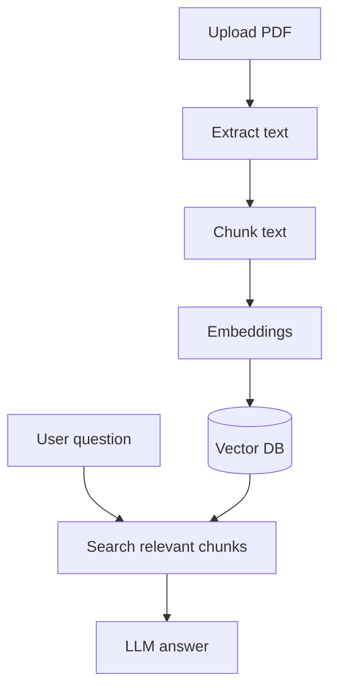
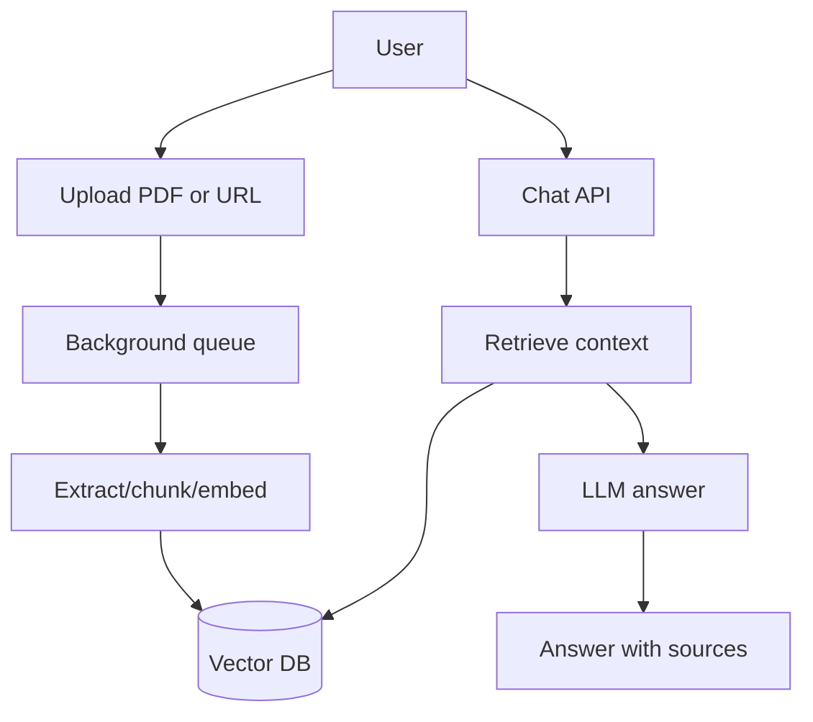

# AI Chat with PDFs and Websites

## Complete notes

AI chat with PDFs/websites is a RAG app where source documents are PDFs or web pages.

## PDF chat flow



## Website chat flow

1. Crawl or load web page.
2. Extract main text.
3. Remove nav/footer/noise.
4. Chunk and embed.
5. Store in vector DB.
6. Retrieve context for questions.

## Backend routes example

- `POST /upload` upload PDF.
- `POST /ingest-url` ingest website URL.
- `POST /chat` ask question.
- `GET /sources` list source files.

## Important production points

- Validate file type and size.
- Store source metadata.
- Use background job for large documents.
- Show citations/page numbers when possible.
- Handle empty or poor extraction.
- Secure user documents.

## Quick revision

PDF/website chat = document processing + embeddings + vector DB + RAG answer.

## Deep revision

### Full backend design



### Why background queue is useful

Large PDFs/websites take time.

Do not block request while processing.

Use Redis/BullMQ queue:

- upload returns job id
- worker processes document
- frontend polls status
- chat enabled after indexing

### API design

```text

POST /documents/upload
POST /documents/url
GET /documents/:id/status
POST /chat
DELETE /documents/:id
```

### Security

- Check file size.
- Check file type.
- Scan/validate URL.
- Store user id with chunks.
- Filter retrieval by user id.
- Do not expose other user's sources.

### Answer format

Good answer should include:

- answer
- sources
- page/section
- "not found" when context is missing
