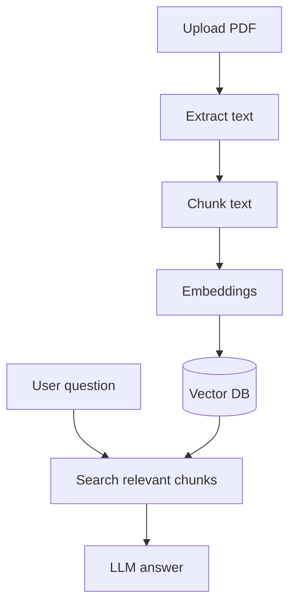
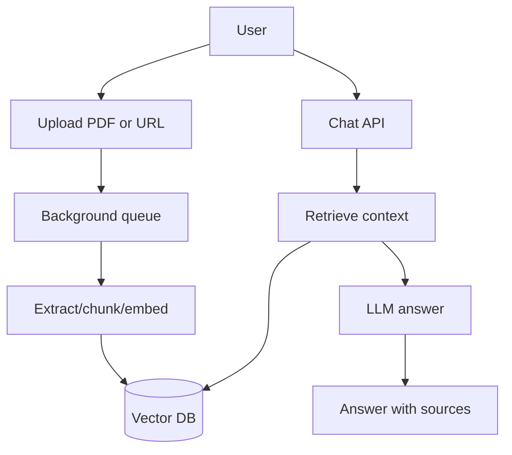

# AI Chat with PDFs and Websites

## Complete notes

AI chat with PDFs/websites is a [[RAG]] app where source documents are PDFs or web pages.

## Easy explanation

AI chat with PDFs/websites is a RAG app where source documents are PDFs or web pages.

In simple words: if you can explain `AI Chat with PDFs and Websites` with one real request, one failure case, and one metric, you understand the topic much better than just memorizing the definition.

## Simple example

Think of an LLM answering using your own documents. This topic explains how documents are chunked, embedded, retrieved, reranked, and grounded.

For `AI Chat with PDFs and Websites`, ask yourself:

1. What is the normal happy path?
2. What can fail?
3. What is the tradeoff?
4. What would I monitor in production?

## PDF chat flow



## Website chat flow

1. Crawl or load web page.
2. Extract main text.
3. Remove nav/footer/noise.
4. Chunk and embed.
5. Store in [[Vector Databases|vector DB]].
6. Retrieve context for questions.

## Backend routes example

- `POST /upload` upload PDF.
- `POST /ingest-url` ingest website URL.
- `POST /chat` ask question.
- `GET /sources` list source files.

## Important production points

- Validate file type and size.
- Store source metadata.
- Use background job for large documents.
- Show citations/page numbers when possible.
- Handle empty or poor extraction.
- Secure user documents.

## Real-life examples

### Easy real-life example

A chatbot answers questions from your PDF notes by searching relevant chunks first.

### Difficult production example

A company knowledge assistant enforces document permissions, chunking, embeddings, metadata filters, reranking, citations, stale index handling, and retrieval evaluation.

### How to relate this topic

When reading `AI Chat with PDFs and Websites`, connect it to:

- one user action
- one backend component
- one failure case
- one tradeoff
- one metric

## Important points

- Core idea: `AI Chat with PDFs and Websites` must be understood through its production use case, not just its definition.
- When to use it: Focus on chunking, embeddings, metadata, vector DB, hybrid search, reranking, permissions, citations, evals, and hallucination control.
- At scale: explain the bottleneck, failure path, operational owner, and rollback/fallback.
- What to monitor: recall@k, precision, groundedness, citation accuracy, retrieval latency, stale document rate, and user feedback.
- Interview rule: always give one concrete example, one tradeoff, one failure mode, and one metric.

## Common mistakes

- Blaming the LLM before checking retrieval quality.
- No metadata/permission filters.
- Bad chunk size or stale index.
- No citation/grounding check.
- No eval dataset.

## Quick revision

PDF/website chat = [[Document Processing|document processing]] + embeddings + vector DB + RAG answer.

## Deep revision

### Full backend design



### Why background queue is useful

Large PDFs/websites take time.

Do not block request while processing.

Use Redis/[[Message Queue with Redis|BullMQ]] queue:

- upload returns job id
- worker processes document
- frontend polls status
- chat enabled after indexing

### API design

```text

POST /documents/upload
POST /documents/url
GET /documents/:id/status
POST /chat
DELETE /documents/:id
```

### Security

- Check file size.
- Check file type.
- Scan/validate URL.
- Store user id with chunks.
- Filter retrieval by user id.
- Do not expose other user's sources.

### Answer format

Good answer should include:

- answer
- sources
- page/section
- "not found" when context is missing


## Deep understanding checklist

To fully understand `AI Chat with PDFs and Websites`, be able to answer:

1. Where does it sit in the architecture?
2. What production problem does it solve?
3. What is the simplest implementation?
4. What breaks when traffic or data grows?
5. What is the main failure mode?
6. What tradeoff does it introduce?
7. Which metric proves it is healthy?

Strong answer focus: Focus on chunking, embeddings, metadata, vector DB, hybrid search, reranking, permissions, citations, evals, and hallucination control.

## Senior interview bank

These are topic-specific questions and strong answers for `AI Chat with PDFs and Websites`.

### 1. What usually causes bad RAG answers?

Bad retrieval, not bad generation: poor chunking, missing metadata, stale index, wrong permissions, weak embeddings, no reranking, or missing source docs.

### 2. How do you improve retrieval?

Tune chunk size/overlap, add metadata filters, use hybrid search, rerank top results, improve embeddings, and evaluate recall@k with known questions.

### 3. How do you enforce permissions?

Filter by permission at retrieval time, not after generation. Every chunk should carry tenant/user/doc access metadata.

### 4. How do you reduce hallucination?

Require citations, answer only from retrieved context, detect low-confidence retrieval, and return 'not enough information' when sources are weak.

### 5. What should be monitored?

Recall@k, groundedness, citation accuracy, retrieval latency, empty-result rate, stale document rate, and user feedback.

## Topic-specific drill

### How would I answer `AI Chat with PDFs and Websites` if the interviewer asks directly?

For `AI Chat with PDFs and Websites`, I would explain retrieval quality, chunking/metadata, permissions, grounding, evaluation, and what failure looks like.

### What is the trap question for `AI Chat with PDFs and Websites`?

The trap is giving only a definition. A senior answer must include a concrete production example, a failure mode, a tradeoff, and a metric.

### What should I draw?

Draw the smallest flow that shows where `AI Chat with PDFs and Websites` sits, then add the failure path next to the happy path.

## Reviewer checklist

- Can I explain this without reading the note?
- Can I draw the happy path and failure path?
- Can I name one concrete metric?
- Can I explain the tradeoff against a simpler option?
- Can I give a production example in under two minutes?
