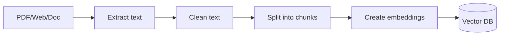
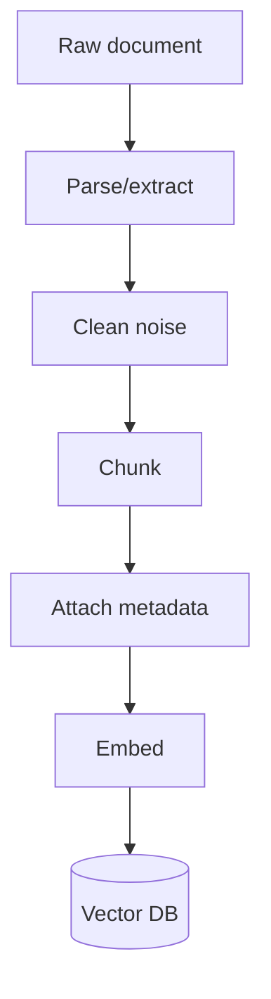

# Document Processing

## Complete notes

Document processing prepares files so they can be used in RAG.

Raw PDFs/web pages are usually too big and messy for direct LLM context.

## Steps

1. Load document.
2. Extract text.
3. Clean text.
4. Split into chunks.
5. Create embeddings.
6. Store chunks and metadata in vector DB.

## Diagram

## Chunking

Chunking means splitting document text into smaller parts.

Good chunk should:

- keep related information together
- fit model/retriever limits
- include metadata
- avoid cutting important context badly

## Common mistakes

- Very large chunks.
- Very tiny chunks with no meaning.
- No metadata.
- Bad PDF extraction.
- Not removing duplicate/noisy text.

## Quick revision

Document processing = load, clean, chunk, embed, store.

## Deep revision

### Document loaders

Different sources need different loaders:

- PDF loader.
- Website/web crawler.
- Markdown loader.
- CSV loader.
- Notion/Google Drive loader.
- Database loader.

### Cleaning steps

- Remove headers/footers.
- Remove page numbers when noisy.
- Remove duplicate text.
- Keep headings with content.
- Keep tables in readable format.

### Chunking strategies

| Strategy | Meaning | Use case |
|---|---|---|
| Fixed size | split by token/char count | simple docs |
| Recursive | split by paragraphs/headings | general RAG |
| Semantic | split by meaning | higher quality |
| Parent-child | retrieve small chunk, return larger context | better answers |

### Diagram

### What to store

- chunk id
- chunk text
- source name
- page/section
- document id
- permissions

### Common mistake

If chunks have no metadata, the answer cannot show source and deleting/updating documents becomes hard.
