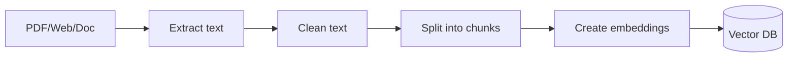
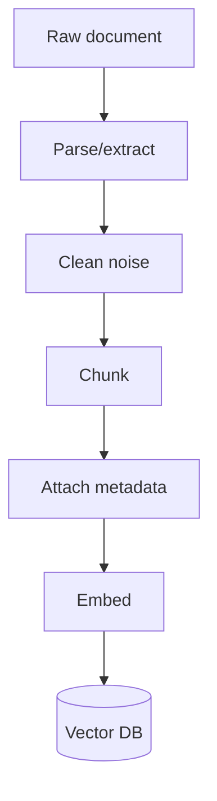

# Document Processing

## Complete notes

Document processing prepares files so they can be used in [[RAG]].

Raw PDFs/web pages are usually too big and messy for direct [[LLM Fundamentals|LLM]] context.

## Easy explanation

Document processing prepares files so they can be used in RAG.

In simple words: if you can explain `Document Processing` with one real request, one failure case, and one metric, you understand the topic much better than just memorizing the definition.

## Simple example

Think of an LLM answering using your own documents. This topic explains how documents are chunked, embedded, retrieved, reranked, and grounded.

For `Document Processing`, ask yourself:

1. What is the normal happy path?
2. What can fail?
3. What is the tradeoff?
4. What would I monitor in production?

## Steps

1. Load document.
2. Extract text.
3. Clean text.
4. Split into chunks.
5. Create [[Embedding Models|embeddings]].
6. Store chunks and metadata in [[Vector Databases|vector DB]].

## Diagram

## Chunking

Chunking means splitting document text into smaller parts.

Good chunk should:

- keep related information together
- fit model/retriever limits
- include metadata
- avoid cutting important context badly

## Real-life examples

### Easy real-life example

A chatbot answers questions from your PDF notes by searching relevant chunks first.

### Difficult production example

A company knowledge assistant enforces document permissions, chunking, embeddings, metadata filters, reranking, citations, stale index handling, and retrieval evaluation.

### How to relate this topic

When reading `Document Processing`, connect it to:

- one user action
- one backend component
- one failure case
- one tradeoff
- one metric

## Important points

- Core idea: `Document Processing` must be understood through its production use case, not just its definition.
- When to use it: Focus on chunking, embeddings, metadata, vector DB, hybrid search, reranking, permissions, citations, evals, and hallucination control.
- At scale: explain the bottleneck, failure path, operational owner, and rollback/fallback.
- What to monitor: recall@k, precision, groundedness, citation accuracy, retrieval latency, stale document rate, and user feedback.
- Interview rule: always give one concrete example, one tradeoff, one failure mode, and one metric.

## Common mistakes

- Blaming the LLM before checking retrieval quality.
- No metadata/permission filters.
- Bad chunk size or stale index.
- No citation/grounding check.
- No eval dataset.

## Quick revision

Document processing = load, clean, chunk, embed, store.

## Deep revision

### Document loaders

Different sources need different loaders:

- PDF loader.
- Website/web crawler.
- Markdown loader.
- CSV loader.
- Notion/Google Drive loader.
- Database loader.

### Cleaning steps

- Remove headers/footers.
- Remove page numbers when noisy.
- Remove duplicate text.
- Keep headings with content.
- Keep tables in readable format.

### Chunking strategies

| Strategy | Meaning | Use case |
|---|---|---|
| Fixed size | split by token/char count | simple docs |
| Recursive | split by paragraphs/headings | general RAG |
| Semantic | split by meaning | higher quality |
| Parent-child | retrieve small chunk, return larger context | better answers |

### Diagram

### What to store

- chunk id
- chunk text
- source name
- page/section
- document id
- permissions

### Common mistake

If chunks have no metadata, the answer cannot show source and deleting/updating documents becomes hard.

## Deep understanding checklist

To fully understand `Document Processing`, be able to answer:

1. Where does it sit in the architecture?
2. What production problem does it solve?
3. What is the simplest implementation?
4. What breaks when traffic or data grows?
5. What is the main failure mode?
6. What tradeoff does it introduce?
7. Which metric proves it is healthy?

Strong answer focus: Focus on chunking, embeddings, metadata, vector DB, hybrid search, reranking, permissions, citations, evals, and hallucination control.

## Senior interview bank

These are topic-specific questions and strong answers for `Document Processing`.

### 1. What usually causes bad RAG answers?

Bad retrieval, not bad generation: poor chunking, missing metadata, stale index, wrong permissions, weak embeddings, no reranking, or missing source docs.

### 2. How do you improve retrieval?

Tune chunk size/overlap, add metadata filters, use hybrid search, rerank top results, improve embeddings, and evaluate recall@k with known questions.

### 3. How do you enforce permissions?

Filter by permission at retrieval time, not after generation. Every chunk should carry tenant/user/doc access metadata.

### 4. How do you reduce hallucination?

Require citations, answer only from retrieved context, detect low-confidence retrieval, and return 'not enough information' when sources are weak.

### 5. What should be monitored?

Recall@k, groundedness, citation accuracy, retrieval latency, empty-result rate, stale document rate, and user feedback.

## Topic-specific drill

### How would I answer `Document Processing` if the interviewer asks directly?

For `Document Processing`, I would explain retrieval quality, chunking/metadata, permissions, grounding, evaluation, and what failure looks like.

### What is the trap question for `Document Processing`?

The trap is giving only a definition. A senior answer must include a concrete production example, a failure mode, a tradeoff, and a metric.

### What should I draw?

Draw the smallest flow that shows where `Document Processing` sits, then add the failure path next to the happy path.

## Reviewer checklist

- Can I explain this without reading the note?
- Can I draw the happy path and failure path?
- Can I name one concrete metric?
- Can I explain the tradeoff against a simpler option?
- Can I give a production example in under two minutes?
