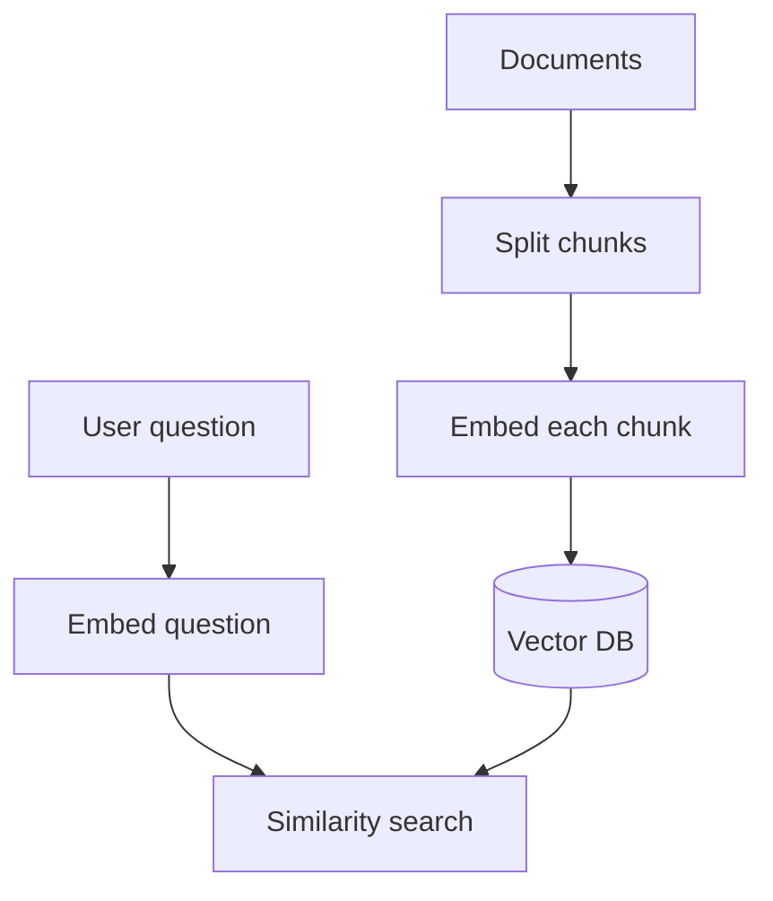

# Embedding Models

## Complete notes

Embedding model converts text into a vector of numbers.

Similar meaning gets similar vectors.

## Easy explanation

Embedding model converts text into a vector of numbers.

In simple words: if you can explain `Embedding Models` with one real request, one failure case, and one metric, you understand the topic much better than just memorizing the definition.

## Simple example

Think of an LLM answering using your own documents. This topic explains how documents are chunked, embedded, retrieved, reranked, and grounded.

For `Embedding Models`, ask yourself:

1. What is the normal happy path?
2. What can fail?
3. What is the tradeoff?
4. What would I monitor in production?

## Why embeddings are used

- Semantic search.
- RAG.
- Clustering.
- Recommendation.
- Duplicate detection.
- Classification.

## Diagram

## Example idea

The words `car` and `vehicle` should have closer embeddings than `car` and `banana`.

## Real-life examples

### Easy real-life example

A chatbot answers questions from your PDF notes by searching relevant chunks first.

### Difficult production example

A company knowledge assistant enforces document permissions, chunking, embeddings, metadata filters, reranking, citations, stale index handling, and retrieval evaluation.

### How to relate this topic

When reading `Embedding Models`, connect it to:

- one user action
- one backend component
- one failure case
- one tradeoff
- one metric

## Important points

- Core idea: `Embedding Models` must be understood through its production use case, not just its definition.
- When to use it: Focus on chunking, embeddings, metadata, vector DB, hybrid search, reranking, permissions, citations, evals, and hallucination control.
- At scale: explain the bottleneck, failure path, operational owner, and rollback/fallback.
- What to monitor: recall@k, precision, groundedness, citation accuracy, retrieval latency, stale document rate, and user feedback.
- Interview rule: always give one concrete example, one tradeoff, one failure mode, and one metric.

## Common mistakes

- Blaming the LLM before checking retrieval quality.
- No metadata/permission filters.
- Bad chunk size or stale index.
- No citation/grounding check.
- No eval dataset.

## Quick revision

Embedding = meaning converted into numbers.

## Deep revision

### Why embeddings matter in RAG

Embeddings let computer compare meaning mathematically.

When user asks a question, we embed the question and search for document chunks with nearby vectors.

### Indexing and query flow

### Chunk metadata

Every embedded chunk should store:

- source file/url
- page number or heading
- chunk text
- user/team id
- created time

### Important decisions

- Which embedding model?
- What chunk size?
- How much overlap?
- Which similarity metric?
- How many results to retrieve?

### Common mistake

Using one embedding model to store documents and a different model to search can reduce quality.

## Deep understanding checklist

To fully understand `Embedding Models`, be able to answer:

1. Where does it sit in the architecture?
2. What production problem does it solve?
3. What is the simplest implementation?
4. What breaks when traffic or data grows?
5. What is the main failure mode?
6. What tradeoff does it introduce?
7. Which metric proves it is healthy?

Strong answer focus: Focus on chunking, embeddings, metadata, vector DB, hybrid search, reranking, permissions, citations, evals, and hallucination control.

## Production example and edge cases

Example: if designing this system in an interview, start with the user flow, estimate QPS/storage, define APIs, choose data model, draw services/cache/queue/database, then deep dive the hardest path. Always mention how the system fails and how you observe it.

For `Embedding Models`, the edge cases to always think about are:

- duplicate request or duplicate event
- dependency timeout or partial failure
- stale data or inconsistent state
- bad input or abusive client
- high traffic causing bottleneck
- rollback or replay after a bad deploy

Interview answer rule: after explaining the concept, immediately give one production example, one failure mode, one tradeoff, and one metric.

## Senior interview bank

These are topic-specific questions and strong answers for `Embedding Models`.

### 1. What usually causes bad RAG answers?

Bad retrieval, not bad generation: poor chunking, missing metadata, stale index, wrong permissions, weak embeddings, no reranking, or missing source docs.

### 2. How do you improve retrieval?

Tune chunk size/overlap, add metadata filters, use hybrid search, rerank top results, improve embeddings, and evaluate recall@k with known questions.

### 3. How do you enforce permissions?

Filter by permission at retrieval time, not after generation. Every chunk should carry tenant/user/doc access metadata.

### 4. How do you reduce hallucination?

Require citations, answer only from retrieved context, detect low-confidence retrieval, and return 'not enough information' when sources are weak.

### 5. What should be monitored?

Recall@k, groundedness, citation accuracy, retrieval latency, empty-result rate, stale document rate, and user feedback.

## Topic-specific drill

### How would I answer `Embedding Models` if the interviewer asks directly?

For `Embedding Models`, I would explain retrieval quality, chunking/metadata, permissions, grounding, evaluation, and what failure looks like.

### What is the trap question for `Embedding Models`?

The trap is giving only a definition. A senior answer must include a concrete production example, a failure mode, a tradeoff, and a metric.

### What should I draw?

Draw the smallest flow that shows where `Embedding Models` sits, then add the failure path next to the happy path.

## Reviewer checklist

- Can I explain this without reading the note?
- Can I draw the happy path and failure path?
- Can I name one concrete metric?
- Can I explain the tradeoff against a simpler option?
- Can I give a production example in under two minutes?
