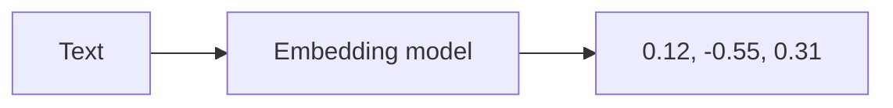
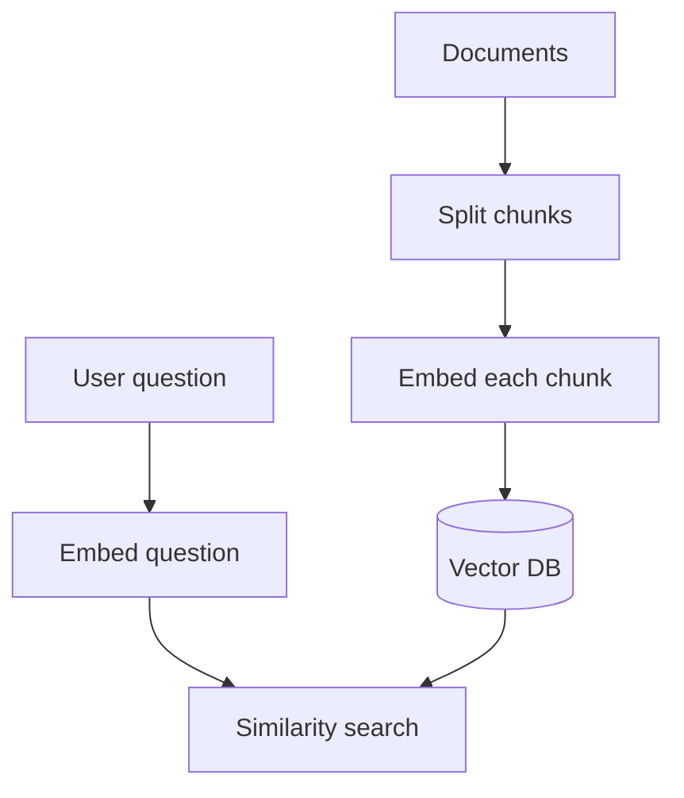

# Embedding Models

## Complete notes

Embedding model converts text into a vector of numbers.

Similar meaning gets similar vectors.

## Why embeddings are used

- Semantic search.
- RAG.
- Clustering.
- Recommendation.
- Duplicate detection.
- Classification.

## Diagram

## Example idea

The words `car` and `vehicle` should have closer embeddings than `car` and `banana`.

## Important points

- Embeddings are not readable by humans.
- Use same embedding model for indexing and searching.
- Chunk size affects retrieval quality.
- Store vector with metadata like source file/page.

## Quick revision

Embedding = meaning converted into numbers.

## Deep revision

### Why embeddings matter in RAG

Embeddings let computer compare meaning mathematically.

When user asks a question, we embed the question and search for document chunks with nearby vectors.

### Indexing and query flow

### Chunk metadata

Every embedded chunk should store:

- source file/url
- page number or heading
- chunk text
- user/team id
- created time

### Important decisions

- Which embedding model?
- What chunk size?
- How much overlap?
- Which similarity metric?
- How many results to retrieve?

### Common mistake

Using one embedding model to store documents and a different model to search can reduce quality.
