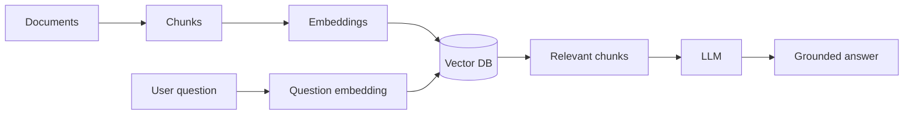
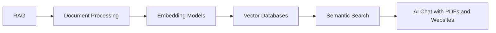

# RAG Content Table

## Course topics from Part 2

- [[RAG]]
- [[Embedding Models]]
- [[Vector Databases]]
- [[Semantic Search]]
- [[Document Processing]]
- [[AI Chat with PDFs and Websites]]

## Revision dashboard

RAG means Retrieval-Augmented Generation. It lets an AI answer using your documents/data instead of only model memory.

## Study order

1. [[Embedding Models]]
2. [[Vector Databases]]
3. [[Document Processing]]
4. [[Semantic Search]]
5. [[RAG]]
6. [[AI Chat with PDFs and Websites]]

## Big picture diagram

## Quick revision

- Embeddings convert text to vectors.
- Vector DB stores/searches vectors.
- Retriever finds relevant chunks.
- LLM answers using retrieved context.

## Visual topic map

Use this map like the Excalidraw roadmap: follow the arrows first, then open the linked notes.

## Color legend

- Blue = core concept
- Green = recommended pattern
- Red = risk or failure mode
- Purple = tradeoff
- Orange = current 2026 update

## Linked notes in this map

- [[RAG]]
- [[Document Processing]]
- [[Embedding Models]]
- [[Vector Databases]]
- [[Semantic Search]]
- [[AI Chat with PDFs and Websites]]
