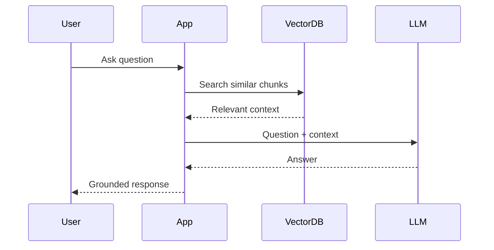
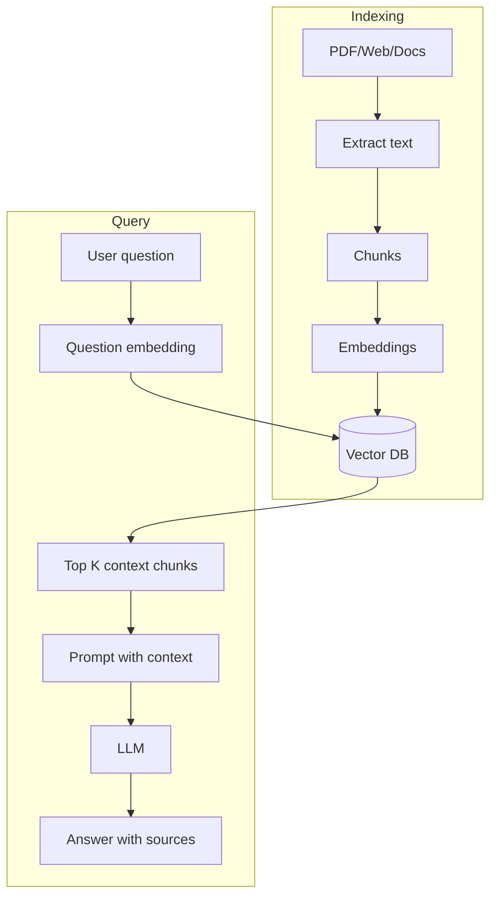
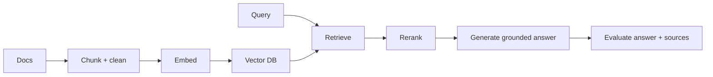

# RAG

## Complete notes

RAG means Retrieval-Augmented Generation.

It connects [[LLM Fundamentals|LLM]] with external/private knowledge.

## Easy explanation

RAG retrieves relevant documents before asking the LLM to answer, so the answer is grounded in real source material.

In simple words: if you can explain `RAG` with one real request, one failure case, and one metric, you understand the topic much better than just memorizing the definition.

## Simple example

Think of an LLM answering using your own documents. This topic explains how documents are chunked, embedded, retrieved, reranked, and grounded.

For `RAG`, ask yourself:

1. What is the normal happy path?
2. What can fail?
3. What is the tradeoff?
4. What would I monitor in production?

## Why RAG is used

- LLM does not know private company documents.
- Model knowledge can be outdated.
- We need answers based on source documents.
- We want citations/context.

## RAG flow

## Two pipelines

### Indexing pipeline

Documents -> chunks -> embeddings -> [[Vector Databases|vector database]].

### Query pipeline

Question -> [[Embedding Models|embedding]] -> retrieve chunks -> prompt LLM -> answer.

## RAG components

- Loader.
- Splitter/chunker.
- Embedding model.
- Vector database.
- Retriever.
- Prompt template.
- LLM.
- Answer/citation layer.

## Real-life examples

### Easy real-life example

A chatbot searches your notes before answering your question.

### Difficult production example

A company assistant uses chunking, embeddings, vector DB, metadata permissions, reranking, citations, stale-document handling, and retrieval evals.

### How to relate this topic

When reading `RAG`, connect it to:

- one user action
- one backend component
- one failure case
- one tradeoff
- one metric

## Important points

- Core idea: `RAG` must be understood through its production use case, not just its definition.
- When to use it: Focus on chunking, embeddings, metadata, vector DB, hybrid search, reranking, permissions, citations, evals, and hallucination control.
- At scale: explain the bottleneck, failure path, operational owner, and rollback/fallback.
- What to monitor: recall@k, precision, groundedness, citation accuracy, retrieval latency, stale document rate, and user feedback.
- Interview rule: always give one concrete example, one tradeoff, one failure mode, and one metric.

## Common mistakes

- Blaming the LLM before checking retrieval quality.
- No metadata/permission filters.
- Bad chunk size or stale index.
- No citation/grounding check.
- No eval dataset.

## Quick revision

RAG = retrieve relevant document chunks, then generate answer using that context.

## Deep revision

### RAG architecture

### Retrieval quality controls

- Chunk size.
- Chunk overlap.
- Top K count.
- Metadata filters.
- Reranking.
- Hybrid search.
- Prompt rule to answer only from context.

### RAG answer should include

- direct answer
- source file/page/url
- uncertainty if context is not enough
- no unsupported claim

### Advanced RAG patterns

- Query rewriting.
- Multi-query retrieval.
- Reranking.
- Parent-child chunks.
- Hybrid keyword + vector search.
- Conversational memory with retrieval.

### Common production problem

Bad retrieval gives bad answers even if the LLM is good.

So debug retrieval first before blaming the model.

## 2026 update: RAG quality loop

> [!tip] Most RAG bugs are retrieval bugs
> Before changing the model, check chunking, metadata filters, embeddings, reranking, stale documents, citation grounding, and evaluation sets.

## Deep understanding checklist

To fully understand `RAG`, be able to answer:

1. Where does it sit in the architecture?
2. What production problem does it solve?
3. What is the simplest implementation?
4. What breaks when traffic or data grows?
5. What is the main failure mode?
6. What tradeoff does it introduce?
7. Which metric proves it is healthy?

Strong answer focus: Focus on chunking, embeddings, metadata, vector DB, hybrid search, reranking, permissions, citations, evals, and hallucination control.

## Senior interview bank

These are topic-specific questions and strong answers for `RAG`.

### 1. What usually causes bad RAG answers?

Bad retrieval, not bad generation: poor chunking, missing metadata, stale index, wrong permissions, weak embeddings, no reranking, or missing source docs.

### 2. How do you improve retrieval?

Tune chunk size/overlap, add metadata filters, use hybrid search, rerank top results, improve embeddings, and evaluate recall@k with known questions.

### 3. How do you enforce permissions?

Filter by permission at retrieval time, not after generation. Every chunk should carry tenant/user/doc access metadata.

### 4. How do you reduce hallucination?

Require citations, answer only from retrieved context, detect low-confidence retrieval, and return 'not enough information' when sources are weak.

### 5. What should be monitored?

Recall@k, groundedness, citation accuracy, retrieval latency, empty-result rate, stale document rate, and user feedback.

## Topic-specific drill

### How would I answer `RAG` if the interviewer asks directly?

For `RAG`, I would explain retrieval quality, chunking/metadata, permissions, grounding, evaluation, and what failure looks like.

### What is the trap question for `RAG`?

The trap is giving only a definition. A senior answer must include a concrete production example, a failure mode, a tradeoff, and a metric.

### What should I draw?

Draw the smallest flow that shows where `RAG` sits, then add the failure path next to the happy path.

## Reviewer checklist

- Can I explain this without reading the note?
- Can I draw the happy path and failure path?
- Can I name one concrete metric?
- Can I explain the tradeoff against a simpler option?
- Can I give a production example in under two minutes?
