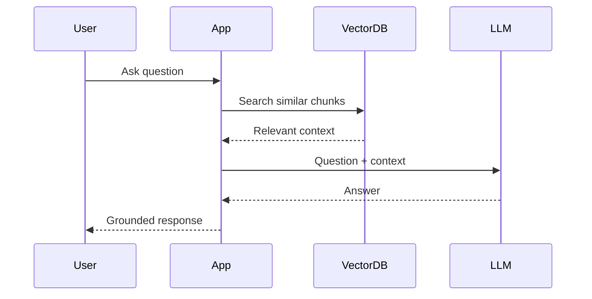
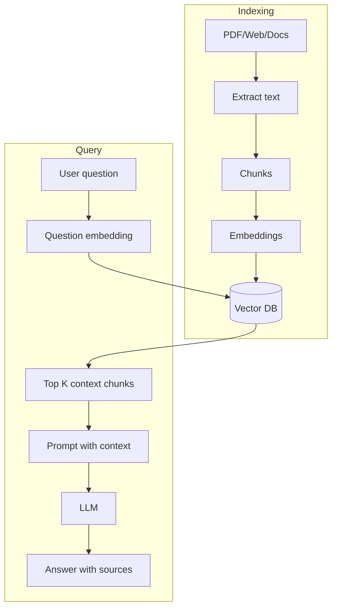

# RAG

## Complete notes

RAG means Retrieval-Augmented Generation.

It connects LLM with external/private knowledge.

## Why RAG is used

- LLM does not know private company documents.
- Model knowledge can be outdated.
- We need answers based on source documents.
- We want citations/context.

## RAG flow

## Two pipelines

### Indexing pipeline

Documents -> chunks -> embeddings -> vector database.

### Query pipeline

Question -> embedding -> retrieve chunks -> prompt LLM -> answer.

## RAG components

- Loader.
- Splitter/chunker.
- Embedding model.
- Vector database.
- Retriever.
- Prompt template.
- LLM.
- Answer/citation layer.

## Common mistakes

- Bad chunks.
- Too few or too many retrieved chunks.
- No metadata/citations.
- Not handling irrelevant questions.
- Trusting retrieved context without checking quality.

## Quick revision

RAG = retrieve relevant document chunks, then generate answer using that context.

## Deep revision

### RAG architecture

### Retrieval quality controls

- Chunk size.
- Chunk overlap.
- Top K count.
- Metadata filters.
- Reranking.
- Hybrid search.
- Prompt rule to answer only from context.

### RAG answer should include

- direct answer
- source file/page/url
- uncertainty if context is not enough
- no unsupported claim

### Advanced RAG patterns

- Query rewriting.
- Multi-query retrieval.
- Reranking.
- Parent-child chunks.
- Hybrid keyword + vector search.
- Conversational memory with retrieval.

### Common production problem

Bad retrieval gives bad answers even if the LLM is good.

So debug retrieval first before blaming the model.
