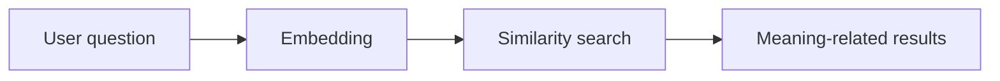
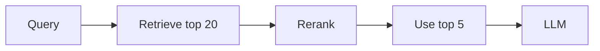

# Semantic Search

## Complete notes

Semantic search finds results by meaning, not only exact words.

## Keyword search

Looks for exact words.

Example:

`car insurance` matches pages containing those exact words.

## Semantic search

Understands meaning.

Example:

`vehicle protection plan` can match `car insurance`.

## Diagram

## Hybrid search

Hybrid search combines:

- keyword search
- semantic/vector search

This often gives better results.

## Quick revision

Semantic search = search by meaning using embeddings.

## Important additions

### Semantic vs keyword search

| Search type | How it works | Weakness |
|---|---|---|
| Keyword | exact words | misses same meaning |
| Semantic | embedding meaning | may miss exact required term |
| Hybrid | both keyword + semantic | more setup |

### Reranking

Reranker takes retrieved results and reorders them for better relevance.

Pipeline:

### When semantic search is useful

- user asks in different words
- documents use different terms
- support/help-center search
- RAG retrieval
