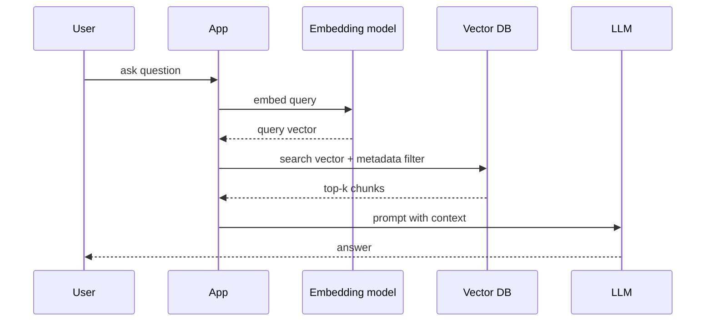
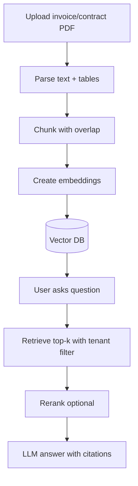

# Vector Database Architecture

## Complete notes

A vector database stores embeddings and searches by similarity. It is used for semantic search, RAG, recommendations, image/audio similarity, and anomaly matching.

## Core concepts

- embedding: numeric vector representation of text/image/audio
- vector index: structure for nearest-neighbor search
- metadata: filters like tenant, source, date, document type
- top-k: number of nearest results returned
- similarity metric: cosine, dot product, Euclidean
- ANN: approximate nearest neighbor search

## Flow



## Vector DB record

```json
{
  "id": "chunk_123",
  "values": [0.12, -0.44, 0.88],
  "metadata": {
    "workspace_id": "w1",
    "document_id": "doc7",
    "source": "invoice_pdf",
    "created_at": "2026-10-06"
  }
}
```

## Metadata filtering

Filtering restricts search to allowed or relevant records.

Examples:

- only current workspace
- only one document
- only recent data
- only support tickets

For multi-tenant apps, metadata filtering is also an authorization safety layer, but do not rely on it alone. Enforce authorization in application logic too.

## RAG chunking

Good RAG needs:

- document parsing
- chunk size strategy
- chunk overlap
- embedding model choice
- metadata design
- reranking optional
- citations/source links
- stale vector cleanup

## Index algorithms you should recognize

| Algorithm | Meaning | Common use |
|---|---|---|
| HNSW | graph-based approximate nearest neighbor | low-latency semantic search |
| IVF | partitions vector space into clusters | large datasets with tuned recall/speed |
| Flat/exact | compares against all vectors | small datasets or highest recall |

You do not need to implement these from scratch for interviews, but you should know the tradeoff: approximate indexes are faster but can miss the true nearest result.

## Vector DB vs full-text search

| Need | Better fit |
|---|---|
| exact keyword | full-text search |
| semantic meaning | vector search |
| filters + keywords + semantic | hybrid search |
| relational reporting | SQL |

## InvoiceOps future use

Vector DB is not needed for MVP. Later add:

- ask questions over invoices/contracts
- semantic search across client notes
- AI assistant for overdue payment history
- RAG over uploaded documents

## RAG production pipeline



## Chunking example

Bad chunk:

```text
One huge 40-page contract as one vector.
```

Problem: retrieval gets vague and the LLM receives too much irrelevant text.

Better chunk:

```text
contract_123#section_4_payment_terms#chunk_02
text: "Payment is due within 30 days..."
metadata: workspace_id, document_id, page, section, created_at
```

## Evaluation

Vector search quality must be tested. Track:

- retrieval precision: did top-k include the right chunk?
- answer faithfulness: did the answer stay inside retrieved context?
- citation correctness
- latency
- cost per query
- unauthorized retrieval attempts

## Deletion and updates

When a document changes:

1. mark old chunks inactive or delete by `document_id`
2. parse and chunk new version
3. embed new chunks
4. upsert with version metadata
5. verify old version does not appear in retrieval

For privacy and compliance, deletion must remove both raw text and vectors.

## Real-life example

In Notion or Google Drive search, exact keyword search finds a word you typed. Semantic search finds a document that means the same thing even if it uses different words. RAG uses that semantic retrieval and then asks an LLM to answer using the retrieved content.

## Common mistakes

- storing private data without tenant metadata
- no source/citation tracking
- bad chunking
- assuming vector search replaces SQL
- no deletion/update strategy
- no evaluation of answer quality
- metadata filters too broad

## Interview bank

### 1. What is a vector database?

A database optimized for storing embeddings and retrieving nearest vectors by similarity.

### 2. Why is metadata important?

Metadata filters restrict search by tenant, document, source, date, or permission and make retrieval safer and more relevant.

### 3. What is hybrid search?

Combining keyword/full-text search with vector similarity search to improve precision and recall.

### 4. Why can RAG give wrong answers?

The retriever may fetch irrelevant chunks, chunks may be stale, metadata filters may be wrong, or the LLM may infer beyond context. I would fix this with better chunking, reranking, citations, evaluation datasets, and strict prompting to answer only from provided context.

### 5. How do you handle multi-tenant vector search?

Every vector record has tenant/workspace metadata, the application enforces authorization before search, the vector query includes a tenant filter, and tests verify cross-tenant records never appear.

## Sources

- Pinecone vector upsert/query docs: https://sdk.pinecone.io/python/how-to/vectors/upsert-and-query.html
- Pinecone metadata filtering: https://sdk.pinecone.io/typescript/documents/data-operations_metadata-filtering.html
