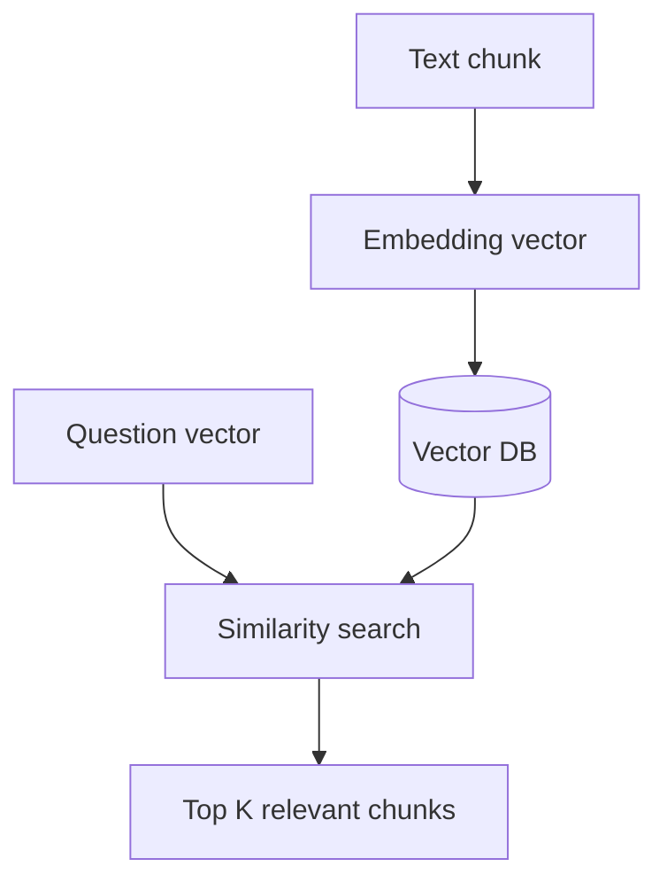
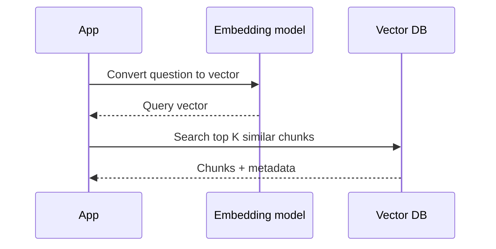

# Vector Databases

## Complete notes

Vector database stores [[Embedding Models|embeddings]] and searches for similar vectors.

It is important for [[RAG]] because we need to find documents similar to the user question.

## Easy explanation

Vector database stores embeddings and searches for similar vectors.

In simple words: if you can explain `Vector Databases` with one real request, one failure case, and one metric, you understand the topic much better than just memorizing the definition.

## Simple example

Think of an LLM answering using your own documents. This topic explains how documents are chunked, embedded, retrieved, reranked, and grounded.

For `Vector Databases`, ask yourself:

1. What is the normal happy path?
2. What can fail?
3. What is the tradeoff?
4. What would I monitor in production?

## Common vector DBs

- Pinecone
- Weaviate
- Chroma
- Qdrant
- Milvus
- FAISS
- pgvector

## Diagram



## Similarity search

Vector DB compares query vector with stored vectors.

Common similarity methods:

- Cosine similarity.
- Dot product.
- Euclidean distance.

## Metadata

Store metadata with vectors:

- file name
- page number
- URL
- user ID
- created date

## Real-life examples

### Easy real-life example

A chatbot answers questions from your PDF notes by searching relevant chunks first.

### Difficult production example

A company knowledge assistant enforces document permissions, chunking, embeddings, metadata filters, reranking, citations, stale index handling, and retrieval evaluation.

### How to relate this topic

When reading `Vector Databases`, connect it to:

- one user action
- one backend component
- one failure case
- one tradeoff
- one metric

## Important points

- Core idea: `Vector Databases` must be understood through its production use case, not just its definition.
- When to use it: Focus on chunking, embeddings, metadata, vector DB, hybrid search, reranking, permissions, citations, evals, and hallucination control.
- At scale: explain the bottleneck, failure path, operational owner, and rollback/fallback.
- What to monitor: recall@k, precision, groundedness, citation accuracy, retrieval latency, stale document rate, and user feedback.
- Interview rule: always give one concrete example, one tradeoff, one failure mode, and one metric.

## Common mistakes

- Blaming the LLM before checking retrieval quality.
- No metadata/permission filters.
- Bad chunk size or stale index.
- No citation/grounding check.
- No eval dataset.

## Quick revision

Vector DB = database for embedding vectors and similarity search.

## Deep revision

### What vector DB stores

Vector DB usually stores:

- vector embedding
- original text chunk
- metadata
- document id

### Retrieval flow



### Important vector DB features

- similarity search
- metadata filtering
- namespaces/collections
- upsert vectors
- delete by document id
- hybrid search support

### Metadata filtering example

Only search documents for current user:

```text

filter: userId = "123"
```

### Choosing vector DB

- Local learning: Chroma, FAISS.
- Postgres app: pgvector.
- Production managed: Pinecone, Weaviate, Qdrant Cloud.

### Common mistake

Not filtering by user/team can leak another user's documents.


## Deep understanding checklist

To fully understand `Vector Databases`, be able to answer:

1. Where does it sit in the architecture?
2. What production problem does it solve?
3. What is the simplest implementation?
4. What breaks when traffic or data grows?
5. What is the main failure mode?
6. What tradeoff does it introduce?
7. Which metric proves it is healthy?

Strong answer focus: Focus on chunking, embeddings, metadata, vector DB, hybrid search, reranking, permissions, citations, evals, and hallucination control.

## Senior interview bank

These are topic-specific questions and strong answers for `Vector Databases`.

### 1. What usually causes bad RAG answers?

Bad retrieval, not bad generation: poor chunking, missing metadata, stale index, wrong permissions, weak embeddings, no reranking, or missing source docs.

### 2. How do you improve retrieval?

Tune chunk size/overlap, add metadata filters, use hybrid search, rerank top results, improve embeddings, and evaluate recall@k with known questions.

### 3. How do you enforce permissions?

Filter by permission at retrieval time, not after generation. Every chunk should carry tenant/user/doc access metadata.

### 4. How do you reduce hallucination?

Require citations, answer only from retrieved context, detect low-confidence retrieval, and return 'not enough information' when sources are weak.

### 5. What should be monitored?

Recall@k, groundedness, citation accuracy, retrieval latency, empty-result rate, stale document rate, and user feedback.

## Topic-specific drill

### How would I answer `Vector Databases` if the interviewer asks directly?

For `Vector Databases`, I would explain retrieval quality, chunking/metadata, permissions, grounding, evaluation, and what failure looks like.

### What is the trap question for `Vector Databases`?

The trap is giving only a definition. A senior answer must include a concrete production example, a failure mode, a tradeoff, and a metric.

### What should I draw?

Draw the smallest flow that shows where `Vector Databases` sits, then add the failure path next to the happy path.

## Reviewer checklist

- Can I explain this without reading the note?
- Can I draw the happy path and failure path?
- Can I name one concrete metric?
- Can I explain the tradeoff against a simpler option?
- Can I give a production example in under two minutes?
