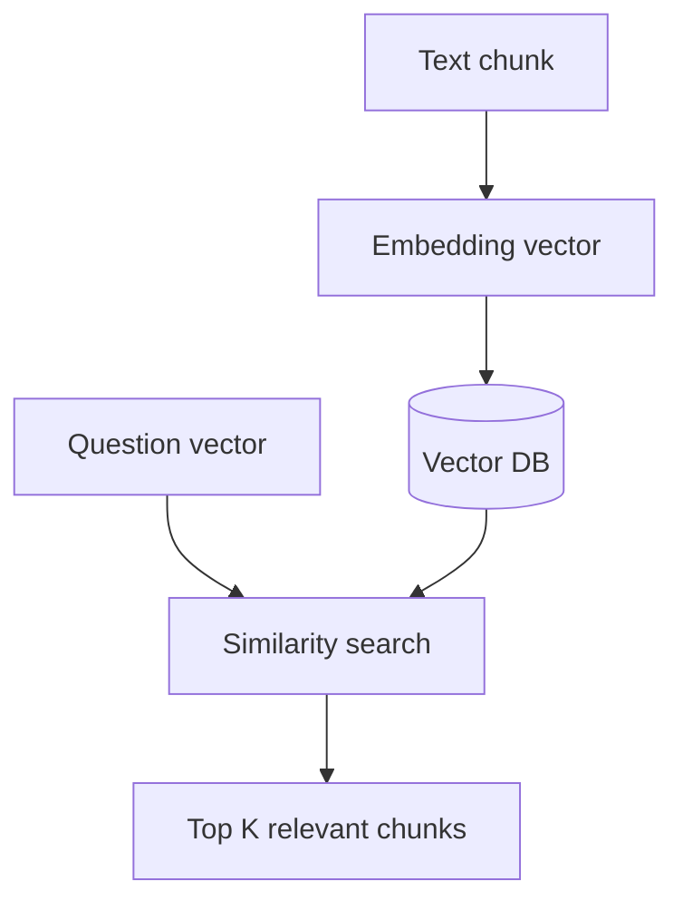
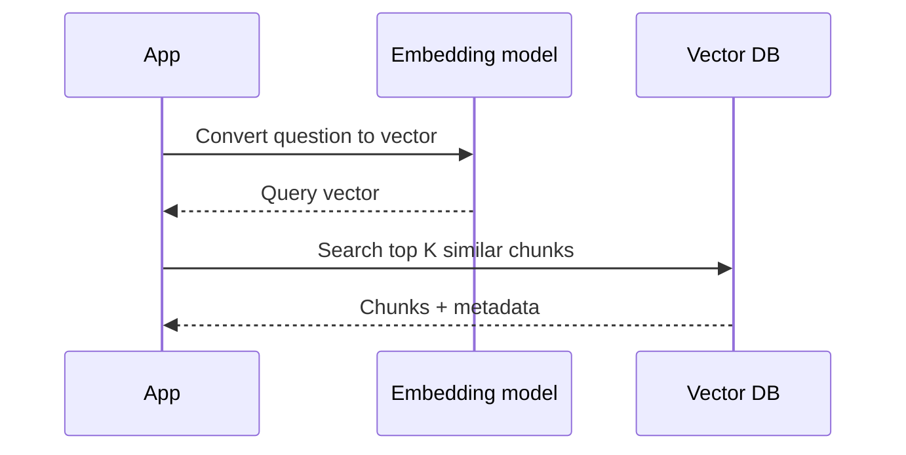

# Vector Databases

## Complete notes

Vector database stores embeddings and searches for similar vectors.

It is important for RAG because we need to find documents similar to the user question.

## Common vector DBs

- Pinecone
- Weaviate
- Chroma
- Qdrant
- Milvus
- FAISS
- pgvector

## Diagram



## Similarity search

Vector DB compares query vector with stored vectors.

Common similarity methods:

- Cosine similarity.
- Dot product.
- Euclidean distance.

## Metadata

Store metadata with vectors:

- file name
- page number
- URL
- user ID
- created date

## Quick revision

Vector DB = database for embedding vectors and similarity search.

## Deep revision

### What vector DB stores

Vector DB usually stores:

- vector embedding
- original text chunk
- metadata
- document id

### Retrieval flow



### Important vector DB features

- similarity search
- metadata filtering
- namespaces/collections
- upsert vectors
- delete by document id
- hybrid search support

### Metadata filtering example

Only search documents for current user:

```text

filter: userId = "123"
```

### Choosing vector DB

- Local learning: Chroma, FAISS.
- Postgres app: pgvector.
- Production managed: Pinecone, Weaviate, Qdrant Cloud.

### Common mistake

Not filtering by user/team can leak another user's documents.
