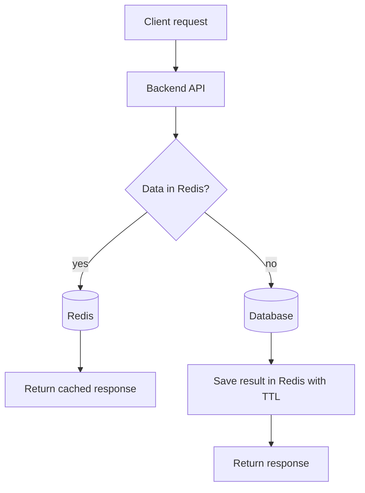

# API Caching with Redis

## Complete notes

API caching means storing API response data in Redis so repeated requests can be served faster.

Instead of hitting the database every time, backend first checks Redis.

## Why API caching is used

- Reduce database load.
- Improve response speed.
- Reduce repeated expensive calculations.
- Handle more traffic.
- Improve user experience.

## Basic cache flow



## Example

Product details do not change every second.

So backend can cache:

```text

product:123 -> product details JSON
TTL -> 5 minutes
```

## Cache-aside pattern

This is the most common backend caching pattern.

1. App checks cache.
2. If cache hit, return cached data.
3. If cache miss, query database.
4. Store result in cache.
5. Return result.

## Redis commands

```bash

GET product:123
SET product:123 "{...json...}" EX 300
DEL product:123
TTL product:123
```

## Node.js example

```js

async function getProduct(req, res) {
  const id = req.params.id;
  const cacheKey = `product:${id}`;

  const cached = await redis.get(cacheKey);
  if (cached) {
    return res.json(JSON.parse(cached));
  }

  const product = await Product.findById(id);
  await redis.set(cacheKey, JSON.stringify(product), { EX: 300 });

  res.json(product);
}
```

## Cache invalidation

When product updates, old cache must be removed.

```js

await Product.findByIdAndUpdate(id, data);
await redis.del(`product:${id}`);
```

## Common cache strategies

| Strategy | Meaning | Use case |
|---|---|---|
| Cache aside | App manually reads/writes cache | Most APIs |
| Write through | Write cache and DB together | Strong consistency |
| Write behind | Write cache first, DB later | High write speed |
| Read through | Cache layer loads data | Managed cache layer |

## Common mistakes

- No TTL, cache grows forever.
- Cache old data after update.
- Caching user-private data with a public key.
- Caching errors for too long.
- Using same TTL for every type of data.

## Quick revision

API caching = check Redis first, database second, then store response in Redis with TTL.
