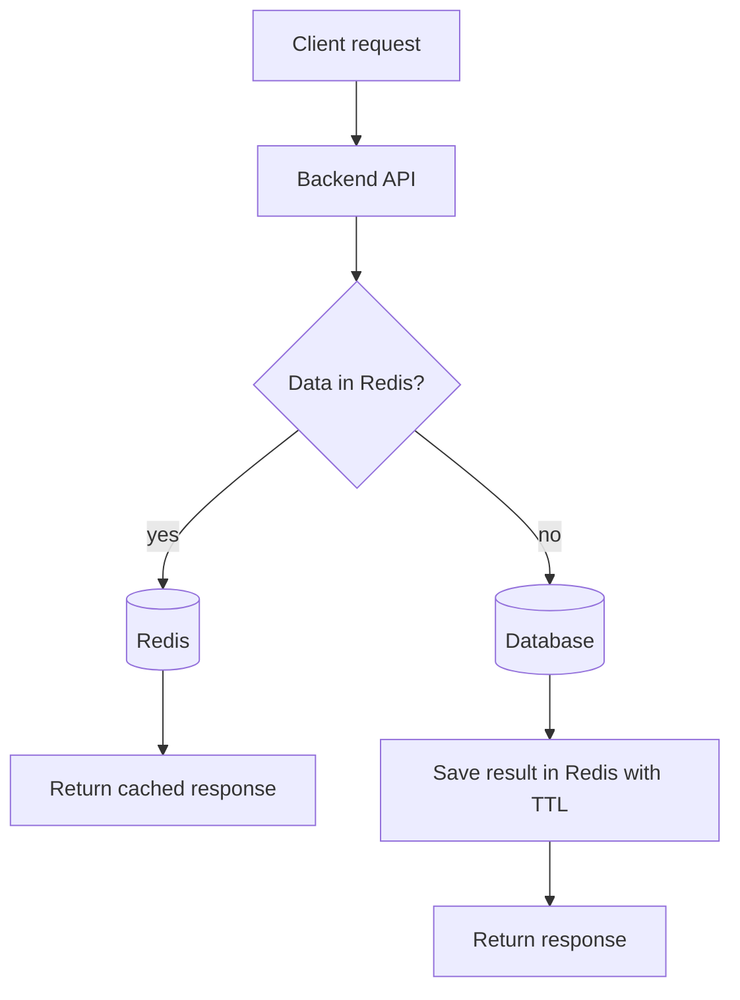

# API Caching with Redis

## Complete notes

API caching means storing API response data in [[what is redis|Redis]] so repeated requests can be served faster.

Instead of hitting the database every time, backend first checks Redis.

## Easy explanation

API caching means storing API response data in Redis so repeated requests can be served faster.

In simple words: if you can explain `API Caching with Redis` with one real request, one failure case, and one metric, you understand the topic much better than just memorizing the definition.

## Simple example

Think of many backend servers needing one fast shared place for cache, counters, sessions, queues, or rate limits. This topic explains how Redis helps and what can break if Redis is misused.

For `API Caching with Redis`, ask yourself:

1. What is the normal happy path?
2. What can fail?
3. What is the tradeoff?
4. What would I monitor in production?

## Why API caching is used

- Reduce database load.
- Improve response speed.
- Reduce repeated expensive calculations.
- Handle more traffic.
- Improve user experience.

## Basic cache flow



## Example

Product details do not change every second.

So backend can [[cache]]:

```text

product:123 -> product details JSON
TTL -> 5 minutes
```

## Cache-aside pattern

This is the most common backend caching pattern.

1. App checks cache.
2. If cache hit, return cached data.
3. If cache miss, query database.
4. Store result in cache.
5. Return result.

## Redis commands

```bash

GET product:123
SET product:123 "{...json.}" EX 300
DEL product:123
TTL product:123
```

## Node.js example

```js

async function getProduct(req, res) {
  const id = req.params.id;
  const cacheKey = `product:${id}`;

  const cached = await redis.get(cacheKey);
  if (cached) {
    return res.json(JSON.parse(cached));
  }

  const product = await Product.findById(id);
  await redis.set(cacheKey, JSON.stringify(product), { EX: 300 });

  res.json(product);
}
```

## Cache invalidation

When product updates, old cache must be removed.

```js

await Product.findByIdAndUpdate(id, data);
await redis.del(`product:${id}`);
```

## Common cache strategies

| Strategy | Meaning | Use case |
|---|---|---|
| Cache aside | App manually reads/writes cache | Most APIs |
| Write through | Write cache and DB together | Strong consistency |
| Write behind | Write cache first, DB later | High write speed |
| Read through | Cache layer loads data | Managed cache layer |

## Real-life examples

### Easy real-life example

A product page is opened many times, so the backend stores the product details in Redis for a short time instead of hitting the database every request.

### Difficult production example

During a sale, Redis handles cache, rate limits, idempotency keys, sessions, hot keys, TTL jitter, and queue-like workflows while avoiding cache stampede and Redis outage blast radius.

### How to relate this topic

When reading `API Caching with Redis`, connect it to:

- one user action
- one backend component
- one failure case
- one tradeoff
- one metric

## Important points

- Core idea: `API Caching with Redis` must be understood through its production use case, not just its definition.
- When to use it: Focus on data structure choice, key design, TTL, atomicity, cache invalidation, hot keys, memory policy, cluster/replication, and Redis-down behavior.
- At scale: explain the bottleneck, failure path, operational owner, and rollback/fallback.
- What to monitor: Redis latency, memory usage, evictions, hit rate, command rate, connection count, hot keys, and error rate.
- Interview rule: always give one concrete example, one tradeoff, one failure mode, and one metric.

## Common mistakes

- Using Redis without a TTL or cleanup strategy.
- Creating hot keys that overload one shard/node.
- Assuming Redis is always available and not defining fail-open/fail-closed behavior.
- Doing non-atomic check-then-write logic without Lua/transactions where needed.
- Caching data without an invalidation or freshness strategy.

## Quick revision

API caching = check Redis first, database second, then store response in Redis with TTL.


## Deep understanding checklist

To fully understand `API Caching with Redis`, be able to answer:

1. Where does it sit in the architecture?
2. What production problem does it solve?
3. What is the simplest implementation?
4. What breaks when traffic or data grows?
5. What is the main failure mode?
6. What tradeoff does it introduce?
7. Which metric proves it is healthy?

Strong answer focus: Focus on data structure choice, key design, TTL, atomicity, cache invalidation, hot keys, memory policy, cluster/replication, and Redis-down behavior.

## Senior interview bank

These are topic-specific questions and strong answers for `API Caching with Redis`.

### 1. Which Redis structure would you choose for this topic?

Choose by access pattern: string for counters/cache, hash for grouped small fields, sorted set for ranking or sliding windows, stream for durable event processing, set for uniqueness, and Lua when multiple commands must be atomic.

### 2. What is the key and TTL design?

Keys should include scope and identity, for example `rate:tenant:123:user:456`. TTL should match freshness or quota window. Add jitter to cache TTLs to reduce stampedes.

### 3. What if Redis goes down?

Decide fail-open or fail-closed based on risk. For login abuse or payments, fail closed or degrade carefully. For optional recommendations, bypass Redis and serve a simpler response. Alert on latency, errors, evictions, and connection count.

### 4. How do you prevent stampede/hot keys?

Use TTL jitter, request coalescing, single-flight locks, early refresh, local cache for ultra-hot keys, and sharding/replication for load distribution.

### 5. What is the senior-level tradeoff?

Redis improves latency and shared coordination, but it can become load-bearing. If the database cannot survive a cache miss storm, the cache is not just an optimization; it is a reliability dependency that needs capacity planning and fallback.

## Topic-specific drill

### How would I answer `API Caching with Redis` if the interviewer asks directly?

For `API Caching with Redis`, I would explain the Redis data structure, key pattern, TTL, atomicity, failure mode if Redis is down, and the metric I would watch.

### What is the trap question for `API Caching with Redis`?

The trap is giving only a definition. A senior answer must include a concrete production example, a failure mode, a tradeoff, and a metric.

### What should I draw?

Draw the smallest flow that shows where `API Caching with Redis` sits, then add the failure path next to the happy path.

## Reviewer checklist

- Can I explain this without reading the note?
- Can I draw the happy path and failure path?
- Can I name one concrete metric?
- Can I explain the tradeoff against a simpler option?
- Can I give a production example in under two minutes?
