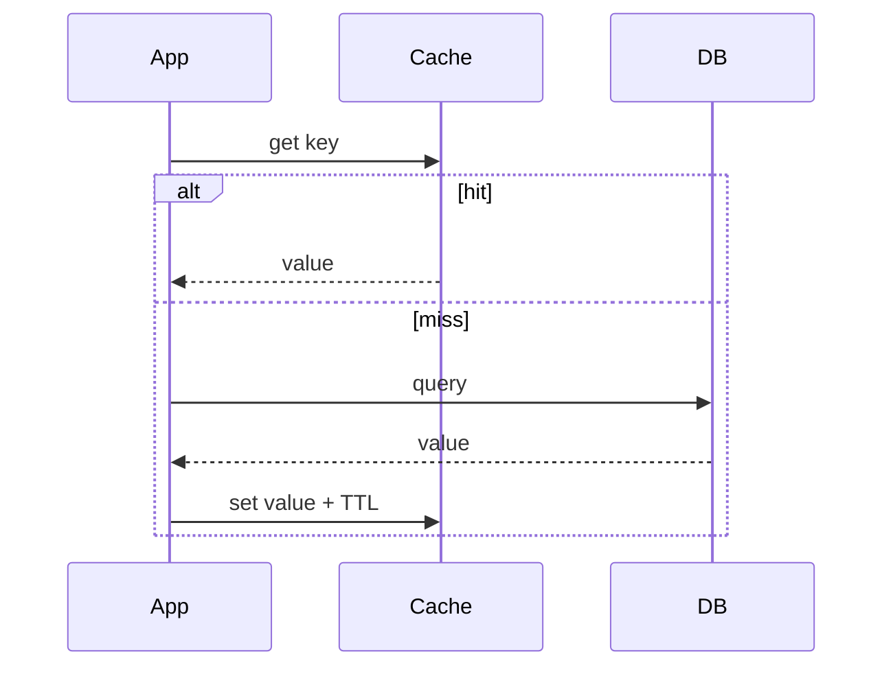
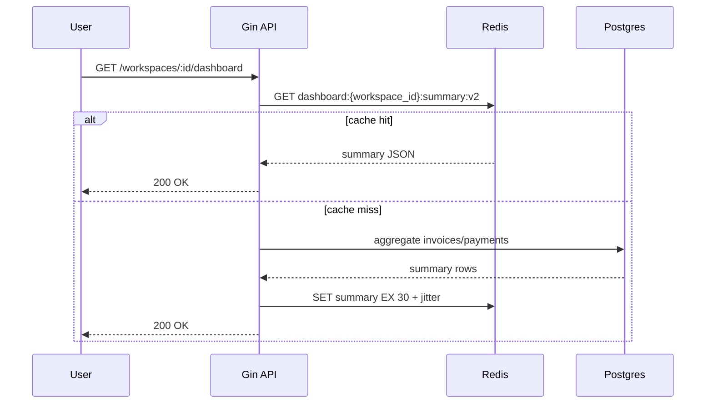

# Caching Patterns and Types

## Complete notes

Caching stores frequently used data closer to the application so reads are faster and the database or downstream service receives less load.

A complete caching answer must explain:

- what is cached
- where it is cached
- cache key design
- TTL
- invalidation
- consistency risk
- failure behavior
- stampede protection
- metrics

## Types of cache by location

| Cache type | Where it lives | Example |
|---|---|---|
| Browser cache | user browser | static JS/CSS/images |
| CDN cache | edge locations | product images, static files |
| Reverse proxy cache | Nginx/API gateway | public GET responses |
| Application memory cache | inside service process | small config/lookup data |
| Distributed cache | Redis/Memcached | sessions, dashboard summary |
| Database buffer/cache | inside DB engine | hot pages/indexes |

## Caching patterns

### Cache-aside / lazy loading

Application checks cache first. On miss, app reads DB and populates cache.



Use for dashboard summaries, product details, profile data, and expensive reads.

### Read-through

Application asks cache; cache itself loads from database on miss. This hides loading behavior behind cache API.

### Write-through

Application writes to cache and backing store synchronously. Reads are usually warm, but writes are slower.

### Write-behind / write-back

Application writes to cache first; cache flushes to database later. Faster writes, but higher data-loss/consistency risk.

### Refresh-ahead

Cache refreshes hot keys before they expire so users do not see misses.

## Eviction policies

- LRU: least recently used
- LFU: least frequently used
- TTL-based expiration
- size-based eviction

Redis policies you should know:

| Policy | Meaning | When to use |
|---|---|---|
| `noeviction` | reject writes when memory is full | when losing cached writes is worse than failing fast |
| `allkeys-lru` | evict least recently used key from all keys | general purpose cache |
| `allkeys-lfu` | evict least frequently used key from all keys | stable hot-key workloads |
| `volatile-lru` | evict LRU only among keys with TTL | mixed cache + persistent Redis usage |
| `volatile-lfu` | evict LFU only among keys with TTL | TTL based cache with stable hot keys |
| `volatile-ttl` | evict key with shortest remaining TTL | when near-expiring keys should go first |

Interview point: eviction is not invalidation. Eviction happens because memory is full. Invalidation happens because the source data changed.

## Cache invalidation

Common strategies:

- TTL only
- delete cache on write
- update cache on write
- versioned keys
- event-driven invalidation

Example key:

```text
dashboard:{workspace_id}:summary:v1
```

## Cache stampede protection

A stampede happens when many requests miss the same key and all hit the DB.

Fixes:

- request coalescing/singleflight
- lock per cache key
- stale-while-revalidate
- jittered TTL
- refresh-ahead
- rate limiting expensive recomputation

## InvoiceOps example

Cache dashboard summary:

```text
key: dashboard:{workspace_id}:summary
TTL: 30 seconds
invalidate when invoice/payment changes
```

### InvoiceOps detailed flow



When a payment is created:

1. Save payment in Postgres transaction.
2. Update invoice status/balance.
3. Publish `invoice.updated` event or delete `dashboard:{workspace_id}:summary:v2`.
4. Next dashboard request rebuilds cache.

If exact freshness is required, do not serve the cached dashboard after writes. If eventual freshness is okay, keep a short TTL and show `last_updated_at`.

## Key design

Good cache keys are explicit and stable:

```text
{domain}:{tenant_id}:{entity_or_query}:{version}:{filters_hash}
```

Examples:

```text
invoice:workspace_123:invoice_999:v1
dashboard:workspace_123:summary:v2
clients:workspace_123:list:v1:status_active_page_1
```

Rules:

- include tenant/workspace/user when the data is private
- include API version or schema version when response shape can change
- include filters, sort, and pagination for list caches
- avoid extremely long raw query strings; hash them if needed

## Cache consistency models

| Model | Meaning | Example |
|---|---|---|
| Strong freshness | read must reflect latest write | payment confirmation page |
| Bounded staleness | stale for N seconds is acceptable | dashboard count with 30s TTL |
| Eventual freshness | background invalidation will catch up | analytics rollup |

For interviews, say which model the feature needs before choosing cache strategy.

## When not to cache

- data changes on almost every request
- data is cheap to compute and cache adds complexity
- permissions are complicated and key design is risky
- correctness is more important than latency
- cache hit rate is low

## Operational checklist

- Hit rate: is the cache actually helping?
- Miss latency: what happens when Redis is cold?
- DB load on mass expiry: can DB survive?
- Evictions: is max memory too low?
- Hot keys: is one key overloaded?
- Error behavior: do we fail open, fail closed, or bypass cache?
- Warmup: do critical keys need preloading after deploy?

## Common mistakes

- caching without invalidation plan
- using same TTL for every key
- caching user-specific data without tenant/user in key
- no metric for hit rate
- cache stampede during expiry
- treating cache as source of truth when it is not

## Interview bank

### 1. Which caching pattern would you use for dashboard summary?

Cache-aside with TTL and invalidation on invoice/payment writes. Dashboard data can tolerate short staleness, and the database remains source of truth.

### 2. What is the hardest part of caching?

Invalidation and consistency. Caches improve speed but can return stale or incorrect data if keys and write behavior are not designed carefully.

### 3. How do you detect cache problems?

Track hit rate, miss rate, latency, evictions, memory usage, hot keys, and database load during misses.

### 4. How do you prevent cache stampede?

Use singleflight/request coalescing so only one request rebuilds a missing key, add TTL jitter so keys do not expire together, serve stale data while one request refreshes, and rate limit expensive recomputation. For very hot keys, refresh ahead in the background.

### 5. What is the difference between cache-aside and write-through?

In cache-aside, the application reads from cache, loads from DB on miss, and writes cache itself. In write-through, writes go through the cache layer and are written to the backing store synchronously. Cache-aside is simpler and common for read-heavy data; write-through keeps cache warm but increases write path latency.

### 6. How would you cache user-specific data safely?

Put tenant/user identity in the key, never share private data under a public key, keep TTL short for sensitive data, and invalidate on permission changes. I would also avoid caching authorization decisions unless the invalidation path is very clear.

## Sources

- AWS Caching Best Practices: https://aws.amazon.com/caching/best-practices/
- AWS Redis caching patterns: https://docs.aws.amazon.com/whitepapers/latest/database-caching-strategies-using-redis/caching-patterns.html
- Redis eviction policies: https://redis.io/docs/latest/reference/eviction/
