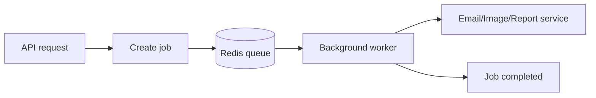

# Message Queue with Redis

## Complete notes

Message queue stores backend tasks so they can be processed later in background.

This helps the API respond fast instead of making user wait.

## Easy explanation

Message queue stores backend tasks so they can be processed later in background.

In simple words: if you can explain `Message Queue with Redis` with one real request, one failure case, and one metric, you understand the topic much better than just memorizing the definition.

## Simple example

Think of many backend servers needing one fast shared place for cache, counters, sessions, queues, or rate limits. This topic explains how Redis helps and what can break if Redis is misused.

For `Message Queue with Redis`, ask yourself:

1. What is the normal happy path?
2. What can fail?
3. What is the tradeoff?
4. What would I monitor in production?

## Why queue is used

- Send email after signup.
- Process uploaded image/video.
- Generate PDF/report.
- Handle payment webhooks.
- Retry failed jobs.
- Run scheduled background tasks.

## Queue flow



## Producer and worker

- Producer adds job to queue.
- Worker takes job from queue and processes it.

Example:

```text

API server -> add sendEmail job
Worker -> read job -> send email
```

## Redis ways to build queue

### List based queue

Use [[what is redis|Redis]] list commands.

```bash

LPUSH emailQueue job
BRPOP emailQueue 0
```

Good for simple queues.

### Stream based queue

Redis Streams store events in append-only style.

Useful for consumer groups and more reliable processing.

Commands:

```bash

XADD jobs * type email userId 123
XREADGROUP GROUP workers worker1 STREAMS jobs >
XACK jobs workers messageId
```

### BullMQ

BullMQ is a Node.js queue library built on Redis.

It supports:

- Delayed jobs.
- Retries.
- Job priority.
- Repeatable jobs.
- Worker concurrency.
- Failed job tracking.

## BullMQ example

```js

import { Queue, Worker } from "bullmq";

const emailQueue = new Queue("email", {
  connection: { host: "localhost", port: 6379 }
});

await emailQueue.add("send-welcome", {
  userId: "123",
  email: "test@example.com"
});

new Worker("email", async (job) => {
  console.log("send email", job.data.email);
}, {
  connection: { host: "localhost", port: 6379 }
});
```

## Queue vs Pub/Sub

| Concept | Queue | Pub/Sub |
|---|---|---|
| Job stored? | Yes | Usually no |
| Worker can process later? | Yes | No, subscriber must be online |
| Best for | Background jobs | Real-time broadcast |

## Real-life examples

### Easy real-life example

A product page is opened many times, so the backend stores the product details in Redis for a short time instead of hitting the database every request.

### Difficult production example

During a sale, Redis handles cache, rate limits, idempotency keys, sessions, hot keys, TTL jitter, and queue-like workflows while avoiding cache stampede and Redis outage blast radius.

### How to relate this topic

When reading `Message Queue with Redis`, connect it to:

- one user action
- one backend component
- one failure case
- one tradeoff
- one metric

## Important points

- Core idea: `Message Queue with Redis` must be understood through its production use case, not just its definition.
- When to use it: Focus on data structure choice, key design, TTL, atomicity, cache invalidation, hot keys, memory policy, cluster/replication, and Redis-down behavior.
- At scale: explain the bottleneck, failure path, operational owner, and rollback/fallback.
- What to monitor: Redis latency, memory usage, evictions, hit rate, command rate, connection count, hot keys, and error rate.
- Interview rule: always give one concrete example, one tradeoff, one failure mode, and one metric.

## Common mistakes

- Using Redis without a TTL or cleanup strategy.
- Creating hot keys that overload one shard/node.
- Assuming Redis is always available and not defining fail-open/fail-closed behavior.
- Doing non-atomic check-then-write logic without Lua/transactions where needed.
- Caching data without an invalidation or freshness strategy.

## Quick revision

Queue = waiting line for backend jobs.
Redis stores jobs, [[Worker Architecture|workers]] process them in background.


## Deep understanding checklist

To fully understand `Message Queue with Redis`, be able to answer:

1. Where does it sit in the architecture?
2. What production problem does it solve?
3. What is the simplest implementation?
4. What breaks when traffic or data grows?
5. What is the main failure mode?
6. What tradeoff does it introduce?
7. Which metric proves it is healthy?

Strong answer focus: Focus on data structure choice, key design, TTL, atomicity, cache invalidation, hot keys, memory policy, cluster/replication, and Redis-down behavior.

## Senior interview bank

These are topic-specific questions and strong answers for `Message Queue with Redis`.

### 1. Which Redis structure would you choose for this topic?

Choose by access pattern: string for counters/cache, hash for grouped small fields, sorted set for ranking or sliding windows, stream for durable event processing, set for uniqueness, and Lua when multiple commands must be atomic.

### 2. What is the key and TTL design?

Keys should include scope and identity, for example `rate:tenant:123:user:456`. TTL should match freshness or quota window. Add jitter to cache TTLs to reduce stampedes.

### 3. What if Redis goes down?

Decide fail-open or fail-closed based on risk. For login abuse or payments, fail closed or degrade carefully. For optional recommendations, bypass Redis and serve a simpler response. Alert on latency, errors, evictions, and connection count.

### 4. How do you prevent stampede/hot keys?

Use TTL jitter, request coalescing, single-flight locks, early refresh, local cache for ultra-hot keys, and sharding/replication for load distribution.

### 5. What is the senior-level tradeoff?

Redis improves latency and shared coordination, but it can become load-bearing. If the database cannot survive a cache miss storm, the cache is not just an optimization; it is a reliability dependency that needs capacity planning and fallback.

## Topic-specific drill

### How would I answer `Message Queue with Redis` if the interviewer asks directly?

For `Message Queue with Redis`, I would explain the Redis data structure, key pattern, TTL, atomicity, failure mode if Redis is down, and the metric I would watch.

### What is the trap question for `Message Queue with Redis`?

The trap is giving only a definition. A senior answer must include a concrete production example, a failure mode, a tradeoff, and a metric.

### What should I draw?

Draw the smallest flow that shows where `Message Queue with Redis` sits, then add the failure path next to the happy path.

## Reviewer checklist

- Can I explain this without reading the note?
- Can I draw the happy path and failure path?
- Can I name one concrete metric?
- Can I explain the tradeoff against a simpler option?
- Can I give a production example in under two minutes?
