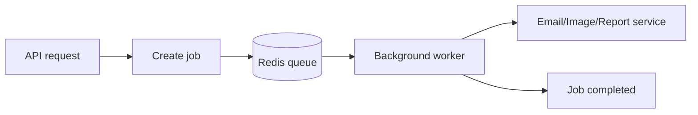

# Message Queue with Redis

## Complete notes

Message queue stores backend tasks so they can be processed later in background.

This helps the API respond fast instead of making user wait.

## Why queue is used

- Send email after signup.
- Process uploaded image/video.
- Generate PDF/report.
- Handle payment webhooks.
- Retry failed jobs.
- Run scheduled background tasks.

## Queue flow



## Producer and worker

- Producer adds job to queue.
- Worker takes job from queue and processes it.

Example:

```text

API server -> add sendEmail job
Worker -> read job -> send email
```

## Redis ways to build queue

### List based queue

Use Redis list commands.

```bash

LPUSH emailQueue job
BRPOP emailQueue 0
```

Good for simple queues.

### Stream based queue

Redis Streams store events in append-only style.

Useful for consumer groups and more reliable processing.

Commands:

```bash

XADD jobs * type email userId 123
XREADGROUP GROUP workers worker1 STREAMS jobs >
XACK jobs workers messageId
```

### BullMQ

BullMQ is a Node.js queue library built on Redis.

It supports:

- Delayed jobs.
- Retries.
- Job priority.
- Repeatable jobs.
- Worker concurrency.
- Failed job tracking.

## BullMQ example

```js

import { Queue, Worker } from "bullmq";

const emailQueue = new Queue("email", {
  connection: { host: "localhost", port: 6379 }
});

await emailQueue.add("send-welcome", {
  userId: "123",
  email: "test@example.com"
});

new Worker("email", async (job) => {
  console.log("send email", job.data.email);
}, {
  connection: { host: "localhost", port: 6379 }
});
```

## Queue vs Pub/Sub

| Concept | Queue | Pub/Sub |
|---|---|---|
| Job stored? | Yes | Usually no |
| Worker can process later? | Yes | No, subscriber must be online |
| Best for | Background jobs | Real-time broadcast |

## Common mistakes

- Doing slow work inside API request.
- No retry logic.
- No dead-letter/failed job handling.
- No idempotency, so retry creates duplicate email/payment.
- Not monitoring workers.

## Quick revision

Queue = waiting line for backend jobs.
Redis stores jobs, workers process them in background.
