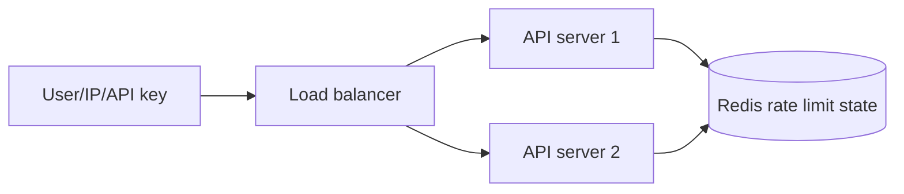
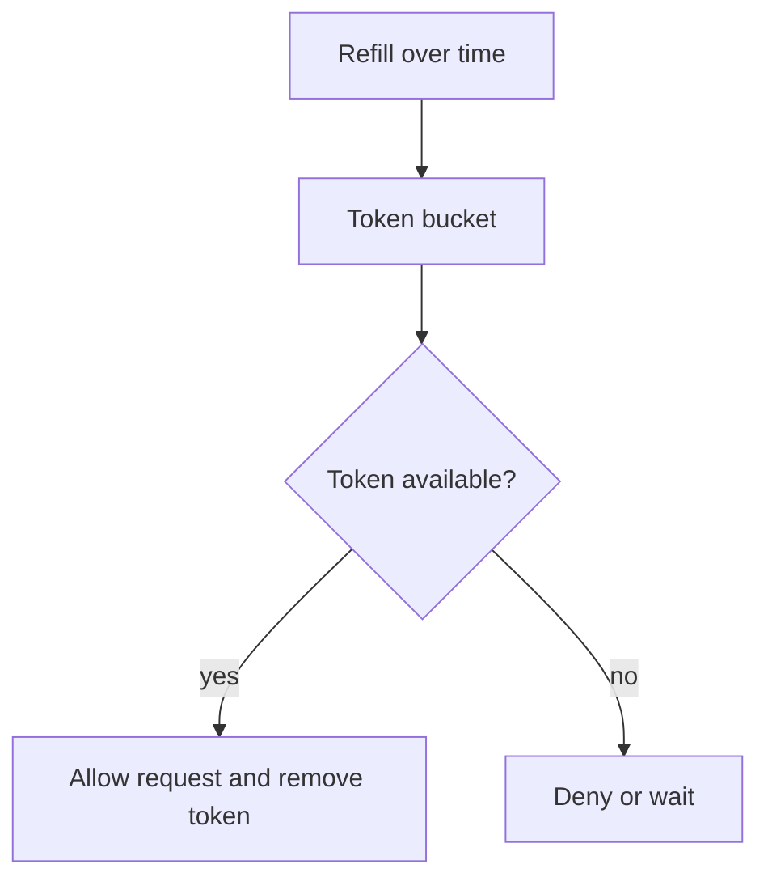
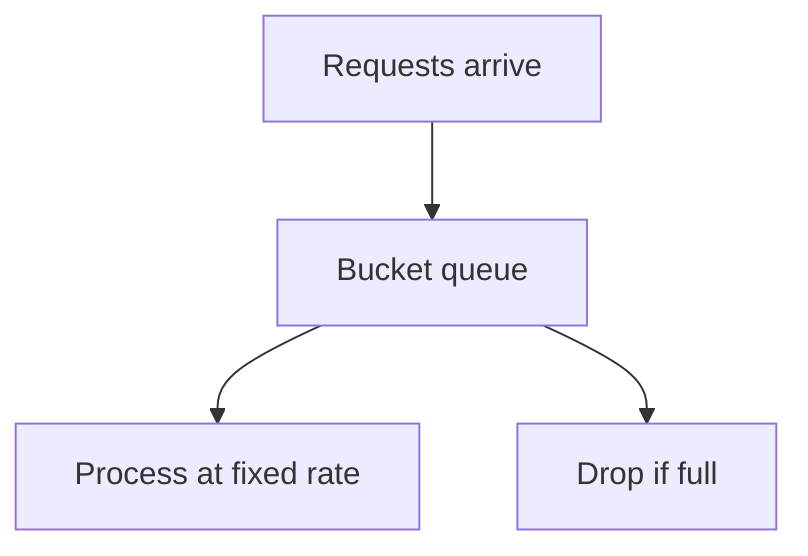

# Rate limiting with Redis

## Complete notes

Rate limiting controls how many requests a user, IP, API key, or tenant can make in a time period.

It protects backend APIs from abuse, traffic spikes, brute-force login attempts, high cost, and overload.

## Why Redis is used

If one backend server keeps the counter in local memory, another server will not know about it.

Redis is shared by all backend servers, so every server checks the same limit.



## What can be limited

- IP address.
- User ID.
- API key.
- Tenant/company.
- Endpoint path.
- Login attempts.
- Expensive LLM/payment/search requests.

## Fixed window counter

Counts requests inside one fixed time window.

Example: 100 requests per minute.

```text

key = rate:user:42:minute:2026-09-09-10-30
INCR key
EXPIRE key 60
```

### Good

- Very simple.
- Low memory.
- Good for basic APIs.

### Problem

A user can send many requests at the end of one window and again at the start of next window.
This is called boundary burst.

## Sliding window log

Stores exact request timestamps in a sorted set.

```text

ZADD rate:user:42 timestamp requestId
ZREMRANGEBYSCORE rate:user:42 -inf oldTimestamp
ZCARD rate:user:42
```

### Good

- Very accurate.
- No boundary burst.

### Problem

- Uses more memory because every request timestamp is stored.

## Sliding window counter

Keeps counters for current and previous window, then calculates weighted count.

### Good

- More accurate than fixed window.
- Less memory than sliding log.
- Good general-purpose API limiter.

## Token bucket

Bucket contains tokens.
Each request spends one token.
Tokens refill over time.



### Good

- Allows controlled bursts.
- Good for APIs where short bursts are okay.

### Example

Limit is 10 tokens.
Refill is 1 token per second.
User can burst up to 10 requests, then must wait for refill.

## Leaky bucket

Requests enter a bucket and leave at a fixed rate.



### Good

- Smooth traffic.
- Prevents bursts.

### Problem

- Can delay requests or reject when queue is full.

## Algorithm comparison

| Algorithm | Redis data type | Accuracy | Burst behavior | Best for |
|---|---|---|---|---|
| Fixed window | String counter | Medium | Boundary burst possible | Simple APIs |
| Sliding window log | Sorted set | High | No boundary burst | Sensitive APIs |
| Sliding window counter | String counters | Good | Smooth boundary | General APIs |
| Token bucket | Hash/string | High | Controlled burst | Public APIs |
| Leaky bucket | Hash/list | High | Strict smooth flow | Strict traffic shaping |

## Important Redis commands

- `INCR` increments counters.
- `EXPIRE` sets TTL.
- `TTL` checks remaining time.
- `ZADD` stores timestamp in sorted set.
- `ZREMRANGEBYSCORE` removes old timestamps.
- `ZCARD` counts current requests.
- `EVAL` runs Lua script atomically.

## Why Lua script is used

Rate limiting needs read, check, update, and expire to happen together.

Lua makes this atomic, so two requests at the same time do not both bypass the limit.

## Common response headers

```text

X-RateLimit-Limit: 100
X-RateLimit-Remaining: 24
X-RateLimit-Reset: 60
Retry-After: 12
```

## Express middleware idea

```js

async function rateLimit(req, res, next) {
  const key = `rate:${req.ip}`;
  const count = await redis.incr(key);

  if (count === 1) {
    await redis.expire(key, 60);
  }

  if (count > 100) {
    return res.status(429).json({ message: "Too many requests" });
  }

  next();
}
```

## Common mistakes

- Rate limiting only in local memory when multiple servers exist.
- Not setting TTL, so keys never expire.
- Same limit for cheap and expensive endpoints.
- Not returning `429 Too Many Requests`.
- Not using atomic operations for complex algorithms.

## Quick revision

- Fixed window: easiest but boundary burst.
- Sliding log: accurate but memory heavy.
- Sliding counter: balanced.
- Token bucket: allows controlled bursts.
- Leaky bucket: smooths traffic and rejects overflow.
