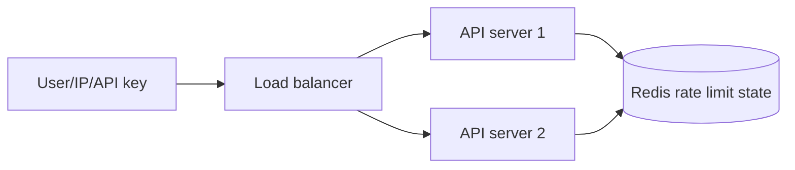
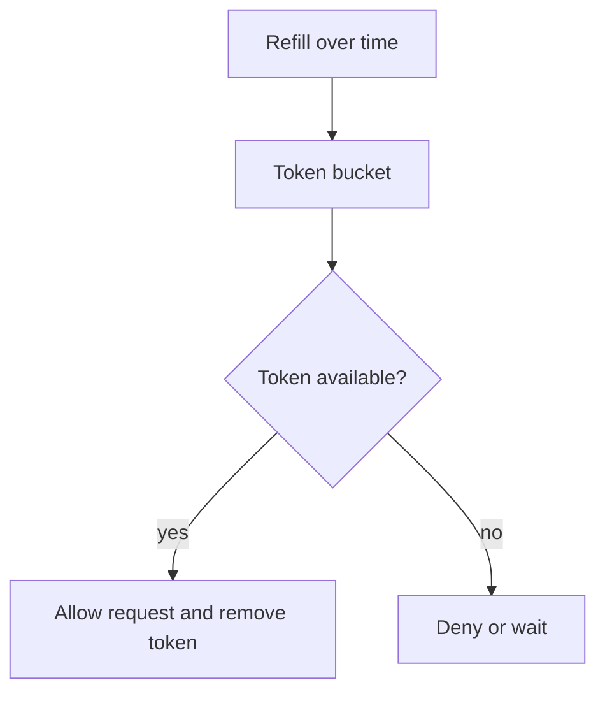
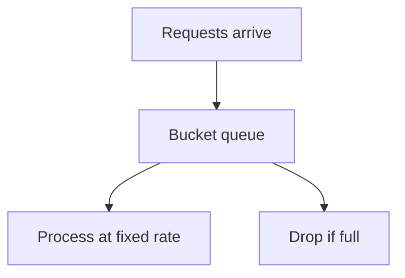
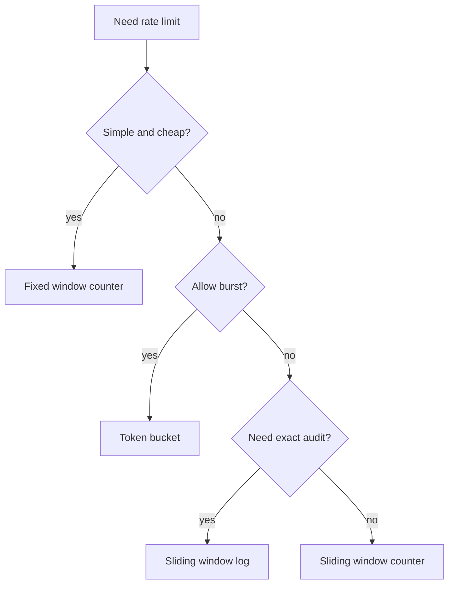

# Rate limiting with Redis

## Complete notes

Rate limiting controls how many requests a user, IP, API key, or tenant can make in a time period.

It protects backend APIs from abuse, traffic spikes, brute-force login attempts, high cost, and overload.

## Easy explanation

Rate limiting with Redis uses shared counters or buckets so all backend servers enforce the same request limit.

In simple words: if you can explain `Rate limiting with Redis` with one real request, one failure case, and one metric, you understand the topic much better than just memorizing the definition.

## Simple example

Think of many backend servers needing one fast shared place for cache, counters, sessions, queues, or rate limits. This topic explains how Redis helps and what can break if Redis is misused.

For `Rate limiting with Redis`, ask yourself:

1. What is the normal happy path?
2. What can fail?
3. What is the tradeoff?
4. What would I monitor in production?

## Why Redis is used

If one backend server keeps the counter in local memory, another server will not know about it.

[[what is redis|Redis]] is shared by all backend servers, so every server checks the same limit.



## What can be limited

- IP address.
- User ID.
- API key.
- Tenant/company.
- Endpoint path.
- Login attempts.
- Expensive LLM/payment/search requests.

## Fixed window counter

Counts requests inside one fixed time window.

Example: 100 requests per minute.

```text

key = rate:user:42:minute:2026-09-09-10-30
INCR key
EXPIRE key 60
```

### Good

- Very simple.
- Low memory.
- Good for basic APIs.

### Problem

A user can send many requests at the end of one window and again at the start of next window.
This is called boundary burst.

## Sliding window log

Stores exact request timestamps in a sorted set.

```text

ZADD rate:user:42 timestamp requestId
ZREMRANGEBYSCORE rate:user:42 -inf oldTimestamp
ZCARD rate:user:42
```

### Good

- Very accurate.
- No boundary burst.

### Problem

- Uses more memory because every request timestamp is stored.

## Sliding window counter

Keeps counters for current and previous window, then calculates weighted count.

### Good

- More accurate than fixed window.
- Less memory than sliding log.
- Good general-purpose API limiter.

## Token bucket

Bucket contains tokens.
Each request spends one token.
Tokens refill over time.



### Good

- Allows controlled bursts.
- Good for APIs where short bursts are okay.

### Example

Limit is 10 tokens.
Refill is 1 token per second.
User can burst up to 10 requests, then must wait for refill.

## Leaky bucket

Requests enter a bucket and leave at a fixed rate.



### Good

- Smooth traffic.
- Prevents bursts.

### Problem

- Can delay requests or reject when queue is full.

## Algorithm comparison

| Algorithm | Redis data type | Accuracy | Burst behavior | Best for |
|---|---|---|---|---|
| Fixed window | String counter | Medium | Boundary burst possible | Simple APIs |
| Sliding window log | Sorted set | High | No boundary burst | Sensitive APIs |
| Sliding window counter | String counters | Good | Smooth boundary | General APIs |
| Token bucket | Hash/string | High | Controlled burst | Public APIs |
| Leaky bucket | Hash/list | High | Strict smooth flow | Strict traffic shaping |

## Important Redis commands

- `INCR` increments counters.
- `EXPIRE` sets TTL.
- `TTL` checks remaining time.
- `ZADD` stores timestamp in sorted set.
- `ZREMRANGEBYSCORE` removes old timestamps.
- `ZCARD` counts current requests.
- `EVAL` runs Lua script atomically.

## Why Lua script is used

Rate limiting needs read, check, update, and expire to happen together.

Lua makes this atomic, so two requests at the same time do not both bypass the limit.

## Common response headers

```text

X-RateLimit-Limit: 100
X-RateLimit-Remaining: 24
X-RateLimit-Reset: 60
Retry-After: 12
```

## Express middleware idea

```js

async function rateLimit(req, res, next) {
  const key = `rate:${req.ip}`;
  const count = await redis.incr(key);

  if (count === 1) {
    await redis.expire(key, 60);
  }

  if (count > 100) {
    return res.status(429).json({ message: "Too many requests" });
  }

  next();
}
```

## Real-life examples

### Easy real-life example

A product page is opened many times, so the backend stores the product details in Redis for a short time instead of hitting the database every request.

### Difficult production example

During a sale, Redis handles cache, rate limits, idempotency keys, sessions, hot keys, TTL jitter, and queue-like workflows while avoiding cache stampede and Redis outage blast radius.

### How to relate this topic

When reading `Rate limiting with Redis`, connect it to:

- one user action
- one backend component
- one failure case
- one tradeoff
- one metric

## Important points

- Core idea: `Rate limiting with Redis` must be understood through its production use case, not just its definition.
- When to use it: Focus on data structure choice, key design, TTL, atomicity, cache invalidation, hot keys, memory policy, cluster/replication, and Redis-down behavior.
- At scale: explain the bottleneck, failure path, operational owner, and rollback/fallback.
- What to monitor: Redis latency, memory usage, evictions, hit rate, command rate, connection count, hot keys, and error rate.
- Interview rule: always give one concrete example, one tradeoff, one failure mode, and one metric.

## Common mistakes

- Using Redis without a TTL or cleanup strategy.
- Creating hot keys that overload one shard/node.
- Assuming Redis is always available and not defining fail-open/fail-closed behavior.
- Doing non-atomic check-then-write logic without Lua/transactions where needed.
- Caching data without an invalidation or freshness strategy.

## Quick revision

- Fixed window: easiest but boundary burst.
- Sliding log: accurate but memory heavy.
- Sliding counter: balanced.
- Token bucket: allows controlled bursts.
- Leaky bucket: smooths traffic and rejects overflow.

## 2026 update: Redis rate limiting choices

> [!tip] 2026 practical choice
> <span class="sd-good">Sliding window counter</span> is usually the best default for normal APIs because it is accurate enough, memory efficient, and avoids the worst fixed-window boundary burst. Use <span class="sd-key">token bucket</span> when you want controlled bursts. Use <span class="sd-risk">leaky bucket</span> when bursts must be smoothed or rejected.



### Algorithms to remember

- <span class="sd-key">Fixed window</span>: simple counter with TTL; risk is double burst at window boundary.
- <span class="sd-key">Sliding window log</span>: exact but stores every request timestamp.
- <span class="sd-good">Sliding window counter</span>: practical default for most APIs.
- <span class="sd-good">Token bucket</span>: average rate plus controlled burst.
- <span class="sd-tradeoff">Leaky bucket</span>: steady output; can delay or drop excess requests.

## Senior interview bank

These are topic-specific questions and strong answers for `Rate limiting with Redis`.

### 1. Which Redis structure would you choose for this topic?

Choose by access pattern: string for counters/cache, hash for grouped small fields, sorted set for ranking or sliding windows, stream for durable event processing, set for uniqueness, and Lua when multiple commands must be atomic.

### 2. What is the key and TTL design?

Keys should include scope and identity, for example `rate:tenant:123:user:456`. TTL should match freshness or quota window. Add jitter to cache TTLs to reduce stampedes.

### 3. What if Redis goes down?

Decide fail-open or fail-closed based on risk. For login abuse or payments, fail closed or degrade carefully. For optional recommendations, bypass Redis and serve a simpler response. Alert on latency, errors, evictions, and connection count.

### 4. How do you prevent stampede/hot keys?

Use TTL jitter, request coalescing, single-flight locks, early refresh, local cache for ultra-hot keys, and sharding/replication for load distribution.

### 5. What is the senior-level tradeoff?

Redis improves latency and shared coordination, but it can become load-bearing. If the database cannot survive a cache miss storm, the cache is not just an optimization; it is a reliability dependency that needs capacity planning and fallback.

## Topic-specific drill

### How would I answer `Rate limiting with Redis` if the interviewer asks directly?

For `Rate limiting with Redis`, I would explain the Redis data structure, key pattern, TTL, atomicity, failure mode if Redis is down, and the metric I would watch.

### What is the trap question for `Rate limiting with Redis`?

The trap is giving only a definition. A senior answer must include a concrete production example, a failure mode, a tradeoff, and a metric.

### What should I draw?

Draw the smallest flow that shows where `Rate limiting with Redis` sits, then add the failure path next to the happy path.

## Reviewer checklist

- Can I explain this without reading the note?
- Can I draw the happy path and failure path?
- Can I name one concrete metric?
- Can I explain the tradeoff against a simpler option?
- Can I give a production example in under two minutes?
