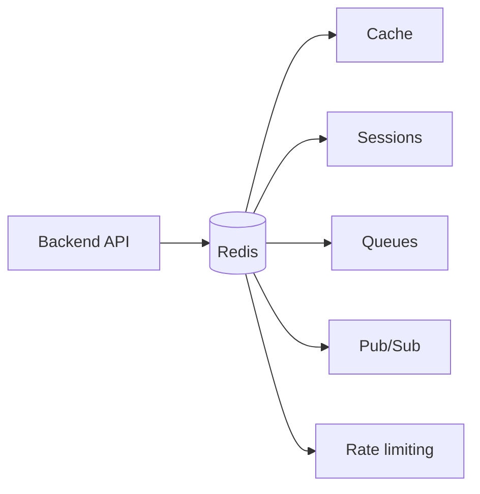
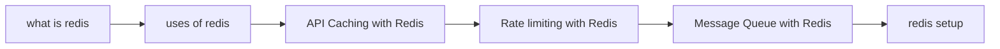

what is redis [[what is redis]]
redis setup [[redis setup]]
uses of Redis [[uses of redis]]

# redis Content table

- [[what is redis]]
- [[uses of redis]]
- [[redis setup]]
- [[Rate limiting with Redis]]
- [[Message Queue with Redis]]
- [[API Caching with Redis]]

## Revision dashboard

Redis is an in-memory data store used for cache, [[Sessions and Cookies|sessions]], queues, pub/sub, rate limiting, counters, and real-time backend features.

### Study order

1. [[what is redis]]
2. [[redis setup]]
3. [[uses of redis]]
4. [[API Caching with Redis]]
5. [[Rate limiting with Redis]]
6. [[Message Queue with Redis]]

### Diagram

### Quick revision

- Redis stores data in memory, so it is very fast.
- Redis supports many data types, not only key-value strings.
- Redis is often used between backend and database.
- Redis is good for rate limiting because all backend servers can share one counter/token state.

## Important additions

### Redis course checklist

- I know what Redis is.
- I can connect Redis locally/Docker.
- I can explain cache hit and miss.
- I can implement API caching.
- I can explain rate limiting algorithms.
- I know queues and BullMQ.
- I know sessions and OTP storage.

### Redis data choice

| Use case | Redis type |
|---|---|
| cache value | String |
| user session object | Hash/String JSON |
| simple queue | List |
| reliable event stream | Stream |
| leaderboard | Sorted set |
| unique online users | Set |
| sliding rate limit | Sorted set |

## Related backend notes

- [[cache]] and [[type of cache]] explain general caching concepts.
- [[API Caching with Redis]] explains Redis as API cache.
- [[Rate limiting with Redis]] explains Redis counters/token buckets/sliding windows.
- [[Message Queue with Redis]], [[Background Jobs]], and [[Worker Architecture]] explain async work.
- [[Sessions and Cookies]] explains Redis session-store use cases.

## Visual topic map

Use this map like the Excalidraw roadmap: follow the arrows first, then open the linked notes.

## Color legend

- Blue = core concept
- Green = recommended pattern
- Red = risk or failure mode
- Purple = tradeoff
- Orange = current 2026 update

## Linked notes in this map

- [[what is redis]]
- [[uses of redis]]
- [[API Caching with Redis]]
- [[Rate limiting with Redis]]
- [[Message Queue with Redis]]
- [[redis setup]]

## Missing advanced caching topics

- [[Caching Patterns and Types]]
