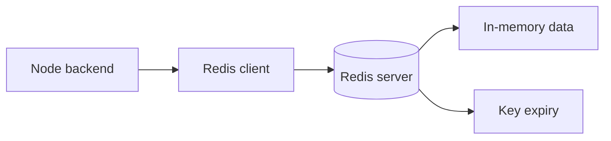

![[Pasted image 20260908160048.png]]

![[Pasted image 20260908160105.png]]

![[Pasted image 20260908160606.png]]

## send otp

![[Pasted image 20260909152730.png]]

![[Pasted image 20260909152630.png]]

## JWT auth

![[Pasted image 20260909152938.png|318]]

## Rate Limit

![[Pasted image 20260909153519.png|535]]

added a middleware so we can control it

## Queues

![[Pasted image 20260909154614.png]]

## Types of Queue

- BULL MQ
- ![[Pasted image 20260909160103.png]]

# redis setup

## Complete notes

Redis can run locally, in Docker, or as a managed cloud service.

## Local install idea

```bash

redis-server
redis-cli ping
```

Expected response:

```text

PONG
```

## Docker setup

```bash

docker run --name redis-dev -p 6379:6379 -d redis
```

Connect:

```bash

docker exec -it redis-dev redis-cli
```

## Node.js connection example

```js

import { createClient } from "redis";

const redis = createClient({
  url: "redis://localhost:6379"
});

await redis.connect();
await redis.set("name", "test");
const value = await redis.get("name");
```

## Environment variable

```text

REDIS_URL=redis://localhost:6379
```

## Important production points

- Use password/TLS if Redis is exposed outside local network.
- Never expose Redis publicly without security.
- Set memory limit and eviction policy.
- Monitor memory, latency, and connected clients.
- Use managed Redis when production reliability matters.

## Diagram


