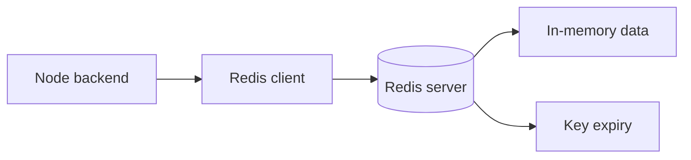

![[Pasted image 20260908160048.png]]

![[Pasted image 20260908160105.png]]

![[Pasted image 20260908160606.png]]

## send otp

![[Pasted image 20260909152730.png]]

![[Pasted image 20260909152630.png]]

## JWT auth

![[Pasted image 20260909152938.png|318]]

## Rate Limit

![[Pasted image 20260909153519.png|535]]

added a middleware so we can control it

## Queues

![[Pasted image 20260909154614.png]]

## Types of Queue

- BULL MQ
- ![[Pasted image 20260909160103.png]]

# redis setup

## Complete notes

Redis can run locally, in [[Docker Content Table|Docker]], or as a managed cloud service.

## Easy explanation

Redis can run locally, in Docker, or as a managed cloud service.

In simple words: if you can explain `redis setup` with one real request, one failure case, and one metric, you understand the topic much better than just memorizing the definition.

## Simple example

Think of many backend servers needing one fast shared place for cache, counters, sessions, queues, or rate limits. This topic explains how Redis helps and what can break if Redis is misused.

For `redis setup`, ask yourself:

1. What is the normal happy path?
2. What can fail?
3. What is the tradeoff?
4. What would I monitor in production?

## Local install idea

```bash

redis-server
redis-cli ping
```

Expected response:

```text

PONG
```

## Docker setup

```bash

docker run --name redis-dev -p 6379:6379 -d redis
```

Connect:

```bash

docker exec -it redis-dev redis-cli
```

## Node.js connection example

```js

import { createClient } from "redis";

const redis = createClient({
  url: "redis://localhost:6379"
});

await redis.connect();
await redis.set("name", "test");
const value = await redis.get("name");
```

## Environment variable

```text

REDIS_URL=redis://localhost:6379
```

## Important production points

- Use password/TLS if Redis is exposed outside local network.
- Never expose Redis publicly without security.
- Set memory limit and eviction policy.
- Monitor memory, latency, and connected clients.
- Use managed Redis when production reliability matters.

## Diagram



## Real-life examples

### Easy real-life example

A product page is opened many times, so the backend stores the product details in Redis for a short time instead of hitting the database every request.

### Difficult production example

During a sale, Redis handles cache, rate limits, idempotency keys, sessions, hot keys, TTL jitter, and queue-like workflows while avoiding cache stampede and Redis outage blast radius.

### How to relate this topic

When reading `redis setup`, connect it to:

- one user action
- one backend component
- one failure case
- one tradeoff
- one metric

## Important points

- Core idea: `redis setup` must be understood through its production use case, not just its definition.
- When to use it: Focus on data structure choice, key design, TTL, atomicity, cache invalidation, hot keys, memory policy, cluster/replication, and Redis-down behavior.
- At scale: explain the bottleneck, failure path, operational owner, and rollback/fallback.
- What to monitor: Redis latency, memory usage, evictions, hit rate, command rate, connection count, hot keys, and error rate.
- Interview rule: always give one concrete example, one tradeoff, one failure mode, and one metric.

## Common mistakes

- Using Redis without a TTL or cleanup strategy.
- Creating hot keys that overload one shard/node.
- Assuming Redis is always available and not defining fail-open/fail-closed behavior.
- Doing non-atomic check-then-write logic without Lua/transactions where needed.
- Caching data without an invalidation or freshness strategy.

## Quick revision

- One-line meaning: redis setup is a Redis/shared-state topic. It should be understood as part of a real production backend, not only as a definition.
- Use it when: Use it when low-latency shared state is needed across multiple servers.
- Failure to mention: partial failure, overload, bad config, stale data, or unsafe retries.
- Tradeoff to mention: simplicity vs production safety.
- Metric to mention: Watch Redis latency, hit rate, memory, evictions, command rate, and connection count.


## Deep understanding checklist

To fully understand `redis setup`, be able to answer:

1. Where does it sit in the architecture?
2. What production problem does it solve?
3. What is the simplest implementation?
4. What breaks when traffic or data grows?
5. What is the main failure mode?
6. What tradeoff does it introduce?
7. Which metric proves it is healthy?

Strong answer focus: Focus on data structure choice, key design, TTL, atomicity, cache invalidation, hot keys, memory policy, cluster/replication, and Redis-down behavior.

## Senior interview bank

These are topic-specific questions and strong answers for `redis setup`.

### 1. Which Redis structure would you choose for this topic?

Choose by access pattern: string for counters/cache, hash for grouped small fields, sorted set for ranking or sliding windows, stream for durable event processing, set for uniqueness, and Lua when multiple commands must be atomic.

### 2. What is the key and TTL design?

Keys should include scope and identity, for example `rate:tenant:123:user:456`. TTL should match freshness or quota window. Add jitter to cache TTLs to reduce stampedes.

### 3. What if Redis goes down?

Decide fail-open or fail-closed based on risk. For login abuse or payments, fail closed or degrade carefully. For optional recommendations, bypass Redis and serve a simpler response. Alert on latency, errors, evictions, and connection count.

### 4. How do you prevent stampede/hot keys?

Use TTL jitter, request coalescing, single-flight locks, early refresh, local cache for ultra-hot keys, and sharding/replication for load distribution.

### 5. What is the senior-level tradeoff?

Redis improves latency and shared coordination, but it can become load-bearing. If the database cannot survive a cache miss storm, the cache is not just an optimization; it is a reliability dependency that needs capacity planning and fallback.

## Topic-specific drill

### How would I answer `redis setup` if the interviewer asks directly?

For `redis setup`, I would explain the Redis data structure, key pattern, TTL, atomicity, failure mode if Redis is down, and the metric I would watch.

### What is the trap question for `redis setup`?

The trap is giving only a definition. A senior answer must include a concrete production example, a failure mode, a tradeoff, and a metric.

### What should I draw?

Draw the smallest flow that shows where `redis setup` sits, then add the failure path next to the happy path.

## Reviewer checklist

- Can I explain this without reading the note?
- Can I draw the happy path and failure path?
- Can I name one concrete metric?
- Can I explain the tradeoff against a simpler option?
- Can I give a production example in under two minutes?
