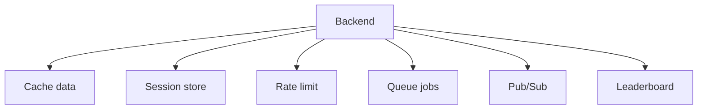

![[Pasted image 20260908160837.png]]

# uses of redis

## Complete notes

Redis is useful when the backend needs very fast shared state.

## Main uses

### 1. Cache

Store repeated API/database results.

```text

GET product:123
if found in Redis -> return fast
else read DB -> store in Redis -> return
```

### 2. Session store

Store login/session data.

- Key: `session:userId`
- Value: token/session data
- TTL: expires automatically

### 3. Rate limiting

Count requests per user/IP/API key.

Example:

- `rate:user:42`
- Limit: 100 requests per minute
- Redis increments count and expires the key

### 4. Queue

Use Redis lists or streams for background work.

Examples:

- Send email later.
- Process uploaded image.
- Generate report.

### 5. Pub/Sub

Publish message from one service and receive it in another.

Good for real-time notifications and live updates.

### 6. Leaderboard

Sorted set stores users with score.

Example:

```text

ZADD leaderboard 500 priya
ZADD leaderboard 900 amit
```

### 7. Distributed lock

Use Redis to allow only one worker to do a job at a time.

## Diagram



## Quick revision

Redis is best when data must be fast, shared across servers, and sometimes temporary.
