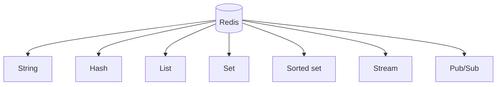

it is a in memory storage

![[Pasted image 20260908154907.png]]

## cache hit

![[Pasted image 20260908154748.png]]

cache miss

![[Pasted image 20260908154819.png]]

# what is redis

Redis is an in-memory data store.

It can be used like a fast database, cache, message broker, queue, session store, and rate limiter.

## Why Redis is fast

- It mainly keeps data in RAM.
- It has simple data structures.
- Many commands are very fast.
- It can expire keys automatically using TTL.

## Redis data types

- String: simple value, counter, token count.
- Hash: object with fields like user profile or bucket state.
- List: queue-like ordered values.
- Set: unique values.
- Sorted set: values ordered by score, useful for leaderboards and sliding-window logs.
- Stream: append-only event log.
- Pub/Sub: publish messages to subscribers.
- JSON: nested object data when RedisJSON is available.

## Diagram

## Redis vs normal database

- Redis is faster for temporary/frequently used data.
- SQL/NoSQL database is better as main permanent source of truth.
- Redis can persist data, but many apps still use it as cache or helper store.

## Common mistakes

- Using Redis as the only database without planning persistence.
- Forgetting TTL on cache keys.
- Caching data but not invalidating it.
- Storing very large objects without memory planning.

## Quick revision

Redis = fast in-memory data structure server used for cache, session, queue, pub/sub, counters, and rate limits.
