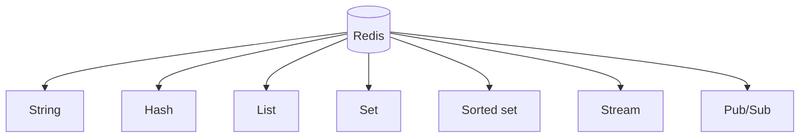

## Complete notes

what is redis is a Redis/shared-state topic. It should be understood as part of a real production backend, not only as a definition. The goal is to know where it fits, when to use it, what can fail, and how to explain it in an interview.

it is a in memory storage

![[Pasted image 20260908154907.png]]

## Easy explanation

what is redis is a Redis/shared-state topic.

In simple words: if you can explain `what is redis` with one real request, one failure case, and one metric, you understand the topic much better than just memorizing the definition.

## Simple example

Think of many backend servers needing one fast shared place for cache, counters, sessions, queues, or rate limits. This topic explains how Redis helps and what can break if Redis is misused.

For `what is redis`, ask yourself:

1. What is the normal happy path?
2. What can fail?
3. What is the tradeoff?
4. What would I monitor in production?

## cache hit

![[Pasted image 20260908154748.png]]

[[cache]] miss

![[Pasted image 20260908154819.png]]

# what is redis

Redis is an in-memory data store.

It can be used like a fast database, cache, message broker, queue, [[Sessions and Cookies|session]] store, and rate limiter.

## Why Redis is fast

- It mainly keeps data in RAM.
- It has simple data structures.
- Many commands are very fast.
- It can expire keys automatically using TTL.

## Redis data types

- String: simple value, counter, token count.
- Hash: object with fields like user profile or bucket state.
- List: queue-like ordered values.
- Set: unique values.
- Sorted set: values ordered by score, useful for leaderboards and sliding-window logs.
- Stream: append-only event log.
- Pub/Sub: publish messages to subscribers.
- JSON: nested object data when RedisJSON is available.

## Diagram

## Redis vs normal database

- Redis is faster for temporary/frequently used data.
- SQL/NoSQL database is better as main permanent source of truth.
- Redis can persist data, but many apps still use it as cache or helper store.

## Real-life examples

### Easy real-life example

A product page is opened many times, so the backend stores the product details in Redis for a short time instead of hitting the database every request.

### Difficult production example

During a sale, Redis handles cache, rate limits, idempotency keys, sessions, hot keys, TTL jitter, and queue-like workflows while avoiding cache stampede and Redis outage blast radius.

### How to relate this topic

When reading `what is redis`, connect it to:

- one user action
- one backend component
- one failure case
- one tradeoff
- one metric

## Important points

- Core idea: `what is redis` must be understood through its production use case, not just its definition.
- When to use it: Focus on data structure choice, key design, TTL, atomicity, cache invalidation, hot keys, memory policy, cluster/replication, and Redis-down behavior.
- At scale: explain the bottleneck, failure path, operational owner, and rollback/fallback.
- What to monitor: Redis latency, memory usage, evictions, hit rate, command rate, connection count, hot keys, and error rate.
- Interview rule: always give one concrete example, one tradeoff, one failure mode, and one metric.

## Common mistakes

- Using Redis without a TTL or cleanup strategy.
- Creating hot keys that overload one shard/node.
- Assuming Redis is always available and not defining fail-open/fail-closed behavior.
- Doing non-atomic check-then-write logic without Lua/transactions where needed.
- Caching data without an invalidation or freshness strategy.

## Quick revision

Redis = fast in-memory data structure server used for cache, session, [[Message Queue with Redis|queue]], pub/sub, counters, and rate limits.

## Deep understanding checklist

To fully understand `what is redis`, be able to answer:

1. Where does it sit in the architecture?
2. What production problem does it solve?
3. What is the simplest implementation?
4. What breaks when traffic or data grows?
5. What is the main failure mode?
6. What tradeoff does it introduce?
7. Which metric proves it is healthy?

Strong answer focus: Focus on data structure choice, key design, TTL, atomicity, cache invalidation, hot keys, memory policy, cluster/replication, and Redis-down behavior.

## Senior interview bank

These are topic-specific questions and strong answers for `what is redis`.

### 1. Which Redis structure would you choose for this topic?

Choose by access pattern: string for counters/cache, hash for grouped small fields, sorted set for ranking or sliding windows, stream for durable event processing, set for uniqueness, and Lua when multiple commands must be atomic.

### 2. What is the key and TTL design?

Keys should include scope and identity, for example `rate:tenant:123:user:456`. TTL should match freshness or quota window. Add jitter to cache TTLs to reduce stampedes.

### 3. What if Redis goes down?

Decide fail-open or fail-closed based on risk. For login abuse or payments, fail closed or degrade carefully. For optional recommendations, bypass Redis and serve a simpler response. Alert on latency, errors, evictions, and connection count.

### 4. How do you prevent stampede/hot keys?

Use TTL jitter, request coalescing, single-flight locks, early refresh, local cache for ultra-hot keys, and sharding/replication for load distribution.

### 5. What is the senior-level tradeoff?

Redis improves latency and shared coordination, but it can become load-bearing. If the database cannot survive a cache miss storm, the cache is not just an optimization; it is a reliability dependency that needs capacity planning and fallback.

## Topic-specific drill

### How would I answer `what is redis` if the interviewer asks directly?

For `what is redis`, I would explain the Redis data structure, key pattern, TTL, atomicity, failure mode if Redis is down, and the metric I would watch.

### What is the trap question for `what is redis`?

The trap is giving only a definition. A senior answer must include a concrete production example, a failure mode, a tradeoff, and a metric.

### What should I draw?

Draw the smallest flow that shows where `what is redis` sits, then add the failure path next to the happy path.

## Reviewer checklist

- Can I explain this without reading the note?
- Can I draw the happy path and failure path?
- Can I name one concrete metric?
- Can I explain the tradeoff against a simpler option?
- Can I give a production example in under two minutes?
