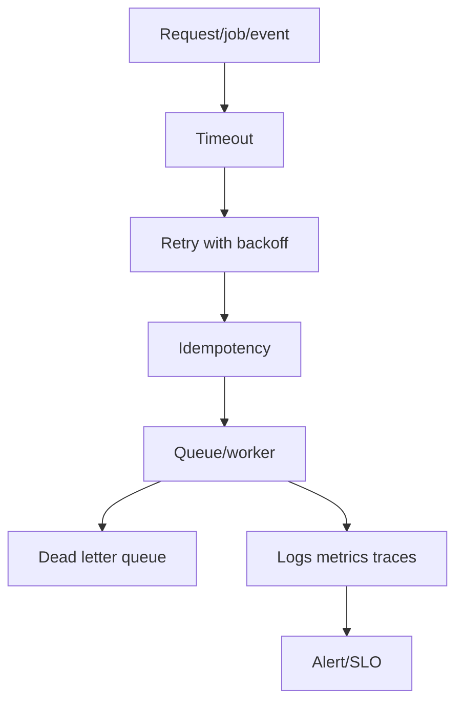

# Reliability Content Table

Reliability means the backend performs correctly despite retries, failures, overload, duplicate events, worker crashes, and dependency problems.

## Study order

1. [[Retry and Backoff]]
2. [[Circuit Breaker]]
3. [[Idempotency]]
4. [[Dead Letter Queue]]
5. [[Background Jobs]]
6. [[Worker Architecture]]
7. [[Cron Jobs]]
8. [[Durable Job Scheduler]]
9. [[Message Broker Comparison]]
10. [[Event Streaming]]
11. [[Graceful Degradation]]
12. [[WebSocket Scaling]]

## Complete notes

Reliability is not only uptime. It also means correctness under repeated or partial execution.

A reliable backend answers:

- what happens if request is retried?
- what happens if dependency times out?
- what happens if worker crashes after partial work?
- what happens if queue message is delivered twice?
- what happens if database is slow?
- what happens if one region fails?
- what metric tells us users are impacted?

## Reliability flow

## How this applies to InvoiceOps

Reliability appears in:

- payment webhook duplicate handling
- reminder job retries
- invoice email delivery
- dashboard cache fallback
- database transaction rollback
- cron overdue scanner idempotency

## Easy example

If sending reminder email fails, retry with backoff instead of failing the whole API request.

## Difficult production example

A payment webhook arrives, database update succeeds, but response times out. Provider retries same webhook. Without idempotency, the invoice may be paid twice. With `webhook_events(provider,event_id)` unique, second delivery returns success without duplicate side effects.

## Common mistakes

- retrying without idempotency
- infinite retries with no DLQ
- no timeout on external calls
- no visibility into job failures
- treating cron jobs as safe when they are not idempotent
- sending email inside request path

## Senior interview bank

### 1. Why are retries dangerous?

Retries can duplicate side effects. They need idempotency keys, safe operations, and backoff.

### 2. When do you use a circuit breaker?

Use it when a dependency is failing and repeated calls would waste resources or cause cascading failure.

### 3. What is a DLQ for?

A DLQ stores messages that failed too many times so they can be inspected, replayed, or fixed without blocking the main queue.

## Reviewer checklist

- Is every retryable operation idempotent?
- Are timeouts defined?
- Is there a DLQ or failure path?
- Are workers observable?
- Is there graceful degradation?
- Are user-impacting failures tied to alerts?
