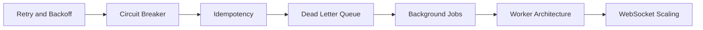

# Reliability Content Table

- [[Idempotency]]
- [[Retry and Backoff]]
- [[Circuit Breaker]]
- [[Dead Letter Queue]]
- [[Background Jobs]]
- [[Cron Jobs]]
- [[Worker Architecture]]
- [[Message Broker Comparison]]
- [[WebSocket Scaling]]

## Revision dashboard

Reliability means backend keeps working correctly even when requests repeat, services fail, jobs fail, or traffic grows.

## Visual topic map

Use this map like the Excalidraw roadmap: follow the arrows first, then open the linked notes.

## Color legend

- Blue = core concept
- Green = recommended pattern
- Red = risk or failure mode
- Purple = tradeoff
- Orange = current 2026 update

## Linked notes in this map

- [[Retry and Backoff]]
- [[Circuit Breaker]]
- [[Idempotency]]
- [[Dead Letter Queue]]
- [[Background Jobs]]
- [[Worker Architecture]]
- [[WebSocket Scaling]]

## Additional SDE-3 topics

- [[Graceful Degradation]]
- [[Event Streaming]]
- [[Durable Job Scheduler]]
