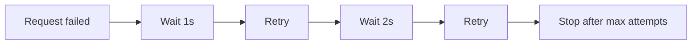
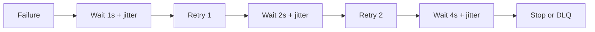

# Retry and Backoff

## Complete notes

Retry repeats failed operation. Backoff waits longer between retries.

## Easy explanation

Retry and backoff means trying again carefully after temporary failure, while avoiding retry storms.

In simple words: if you can explain `Retry and Backoff` with one real request, one failure case, and one metric, you understand the topic much better than just memorizing the definition.

## Simple example

Think of keeping the product working even when dependencies fail or traffic spikes. This topic explains how to limit blast radius and recover safely.

For `Retry and Backoff`, ask yourself:

1. What is the normal happy path?
2. What can fail?
3. What is the tradeoff?
4. What would I monitor in production?

## Real-life examples

### Easy real-life example

If a request times out once, the client waits briefly and tries again.

### Difficult production example

A high-scale service retries only idempotent operations with exponential backoff, jitter, max attempts, retry budget, and circuit breaker integration.

### How to relate this topic

When reading `Retry and Backoff`, connect it to:

- one user action
- one backend component
- one failure case
- one tradeoff
- one metric

## Important points

- Core idea: `Retry and Backoff` must be understood through its production use case, not just its definition.
- When to use it: Focus on timeout, retry, backoff, jitter, circuit breaker, idempotency, DLQ, graceful degradation, backpressure, and recovery testing.
- At scale: explain the bottleneck, failure path, operational owner, and rollback/fallback.
- What to monitor: SLO burn, error rate, p95/p99 latency, timeout count, retry count, queue age, DLQ size, and circuit breaker state.
- Interview rule: always give one concrete example, one tradeoff, one failure mode, and one metric.

## Diagram



## Common mistakes

- Retrying forever or retrying non-idempotent operations.
- No timeout on network calls.
- No fallback or degraded mode for optional dependencies.
- Letting queue backlog grow without DLQ or alerting.
- Testing only the happy path and not failure recovery.

## Quick revision

Retry repeats failed operation. Backoff waits longer between retries.

## Examples and deeper diagrams

### Bad retry

Retry immediately many times. This can overload the failing service even more.

### Good retry



### Example policy

```text
maxRetries = 3
baseDelay = 1 second
backoff = exponential
jitter = random 0-500ms
```

### Do not retry

- invalid password
- validation error
- permanent 4xx errors
- non-idempotent payment without idempotency key


## Deep understanding checklist

To fully understand `Retry and Backoff`, be able to answer:

1. Where does it sit in the architecture?
2. What production problem does it solve?
3. What is the simplest implementation?
4. What breaks when traffic or data grows?
5. What is the main failure mode?
6. What tradeoff does it introduce?
7. Which metric proves it is healthy?

Strong answer focus: Focus on timeout, retry, backoff, jitter, circuit breaker, idempotency, DLQ, graceful degradation, backpressure, and recovery testing.

## Senior interview bank

These are topic-specific questions and strong answers for `Retry and Backoff`.

### 1. What is the failure this pattern prevents?

Name the exact failure: timeout, retry storm, overload, duplicate side effect, poison message, queue backlog, or dependency outage. Then explain how the pattern limits blast radius.

### 2. What is the fallback or degraded mode?

Critical flows should continue while optional features degrade. For example, checkout continues without recommendations, email is queued for later, and analytics can be dropped temporarily.

### 3. How do you avoid making failure worse?

Use timeouts, retry budgets, exponential backoff with jitter, circuit breakers, idempotency, backpressure, and DLQs. Never retry forever and never let optional work consume critical resources.

### 4. What should alert?

Alert on user-visible symptoms: high error rate, high latency, low success rate, queue age, DLQ growth, SLO burn, and dependency outage. Avoid paging on noisy internal signals unless they predict user impact.

### 5. How do you prove the recovery path works?

Test it with failure injection, staging drills, load tests, replay from DLQ, rollback exercises, and runbooks. A recovery path that was never tested is a guess.

## Topic-specific drill

### How would I answer `Retry and Backoff` if the interviewer asks directly?

For `Retry and Backoff`, I would explain the failure it protects against, how it limits blast radius, what fallback exists, and which SLO or queue/dependency metric should alert.

### What is the trap question for `Retry and Backoff`?

The trap is giving only a definition. A senior answer must include a concrete production example, a failure mode, a tradeoff, and a metric.

### What should I draw?

Draw the smallest flow that shows where `Retry and Backoff` sits, then add the failure path next to the happy path.

## Reviewer checklist

- Can I explain this without reading the note?
- Can I draw the happy path and failure path?
- Can I name one concrete metric?
- Can I explain the tradeoff against a simpler option?
- Can I give a production example in under two minutes?
