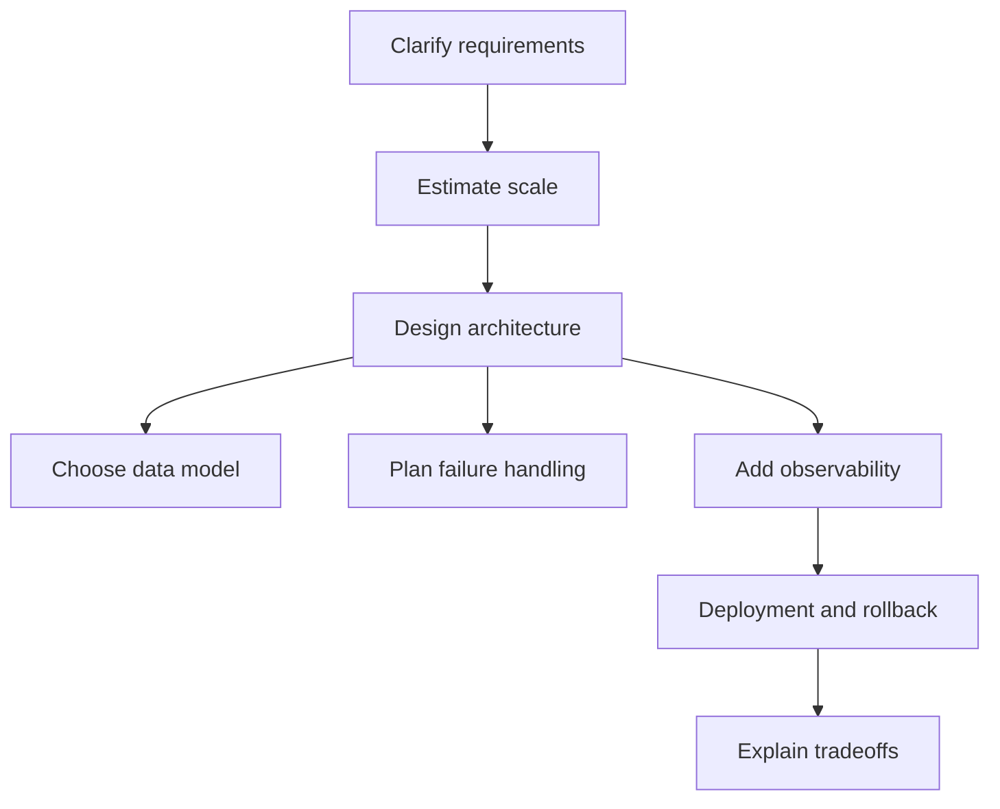

# SDE3 Backend Roadmap

## Complete notes

SDE3 Backend Roadmap is a backend/system-design concept used to make a production system correct, scalable, secure, or operable. The goal is to know where it fits, when to use it, what can fail, and how to explain it in an interview.

## Easy explanation

SDE3 Backend Roadmap is a backend/system-design concept used to make a production system correct, scalable, secure, or operable.

In simple words: if you can explain `SDE3 Backend Roadmap` with one real request, one failure case, and one metric, you understand the topic much better than just memorizing the definition.

## Simple example

Think of this as the study map. It tells you what order to learn topics and what senior-level depth is expected.

For `SDE3 Backend Roadmap`, ask yourself:

1. What is the normal happy path?
2. What can fail?
3. What is the tradeoff?
4. What would I monitor in production?

## Why this section exists

Your vault already covers many advanced backend topics. This section adds the senior/SDE-3 layer: tradeoffs, failure modes, distributed systems, data correctness, production debugging, and architecture judgement.

## Topic groups

- [[Distributed Systems Content Table]]
- [[Data Modeling Content Table]]
- [[Production Debugging Content Table]]
- [[Testing Strategy Content Table]]
- [[Architecture Patterns Content Table]]
- [[Performance Engineering Content Table]]
- [[System Design Practice Content Table]]

## SDE-3 mental model

## What SDE-3 notes must answer

- What breaks at scale?
- What is the bottleneck?
- What are the consistency guarantees?
- What happens when a dependency fails?
- How do we debug production?
- How do we deploy safely?
- How do we prove the system is working?

## Excalidraw map

![[SDE3 Backend Roadmap.excalidraw]]

## Real-life examples

### Easy real-life example

You follow a study path from API basics to databases, caching, reliability, observability, deployment, and system design practice.

### Difficult production example

You prepare for SDE-3 interviews by explaining tradeoffs, production failures, metrics, ownership, rollout, and debugging for every backend topic.

### How to relate this topic

When reading `SDE3 Backend Roadmap`, connect it to:

- one user action
- one backend component
- one failure case
- one tradeoff
- one metric

## Important points

- Core idea: `SDE3 Backend Roadmap` must be understood through its production use case, not just its definition.
- When to use it: Focus on requirements, scale, APIs, data model, high-level architecture, bottleneck, failure mode, consistency, observability, and tradeoffs.
- At scale: explain the bottleneck, failure path, operational owner, and rollback/fallback.
- What to monitor: QPS, p95 latency, availability, error rate, queue lag, cache hit rate, database latency, and saturation.
- Interview rule: always give one concrete example, one tradeoff, one failure mode, and one metric.

## Common mistakes

- Listing components without explaining why they are needed.
- Ignoring bottlenecks and failure modes.
- No scale estimate or data model.
- No observability or rollback plan.
- Choosing tools without tradeoffs.

## Quick revision

- One-line meaning: SDE3 Backend Roadmap is a backend/system-design concept used to make a production system correct, scalable, secure, or operable.
- Use it when: Use it when the system needs to handle real traffic, partial failure, scale, debugging, or long-term maintenance.
- Failure to mention: partial failure, overload, bad config, stale data, or unsafe retries.
- Tradeoff to mention: simplicity vs production safety.
- Metric to mention: latency, error rate, throughput, saturation, and user-visible success rate.

## Deep understanding checklist

To fully understand `SDE3 Backend Roadmap`, be able to answer:

1. Where does it sit in the architecture?
2. What production problem does it solve?
3. What is the simplest implementation?
4. What breaks when traffic or data grows?
5. What is the main failure mode?
6. What tradeoff does it introduce?
7. Which metric proves it is healthy?

Strong answer focus: Focus on requirements, scale, APIs, data model, high-level architecture, bottleneck, failure mode, consistency, observability, and tradeoffs.

## Senior interview bank

These are topic-specific questions and strong answers for `SDE3 Backend Roadmap`.

### 1. What is this roadmap for?

This roadmap is the order to become interview-ready for SDE-3 backend/system design: requirements, APIs, data model, distributed systems, reliability, observability, deployment, performance, and design practice.

### 2. How should I study it?

Open each content table in order, then open each topic note. For every topic, explain the definition, draw the diagram, give a production example, name a failure mode, name a metric, and answer the senior interview bank.

### 3. What separates SDE-3 from SDE-2?

SDE-3 answers are operational: tradeoffs, reliability, ownership, failure handling, debugging, rollout, monitoring, and long-term maintainability. SDE-2 answers often stop at components and happy path.

### 4. How do I know I am ready?

You are ready when you can design a system end-to-end, defend tradeoffs, debug a failure scenario, discuss consistency and scale, and explain rollback/observability without reading notes.

### 5. What should I revise last before interview?

Revise rate limiting, caching, database indexing, idempotency, queues, retries, circuit breakers, observability, API contracts, webhooks, production debugging, and the system design practice notes.

## Topic-specific drill

### How would I answer `SDE3 Backend Roadmap` if the interviewer asks directly?

For `SDE3 Backend Roadmap`, I would explain the study order, the SDE-3 expectation, which topics are high-risk in interviews, and how to self-test with examples, failure modes, metrics, and tradeoffs.

### What is the trap question for `SDE3 Backend Roadmap`?

The trap is giving only a definition. A senior answer must include a concrete production example, a failure mode, a tradeoff, and a metric.

### What should I draw?

Draw the smallest flow that shows where `SDE3 Backend Roadmap` sits, then add the failure path next to the happy path.

## Reviewer checklist

- Can I explain this without reading the note?
- Can I draw the happy path and failure path?
- Can I name one concrete metric?
- Can I explain the tradeoff against a simpler option?
- Can I give a production example in under two minutes?
