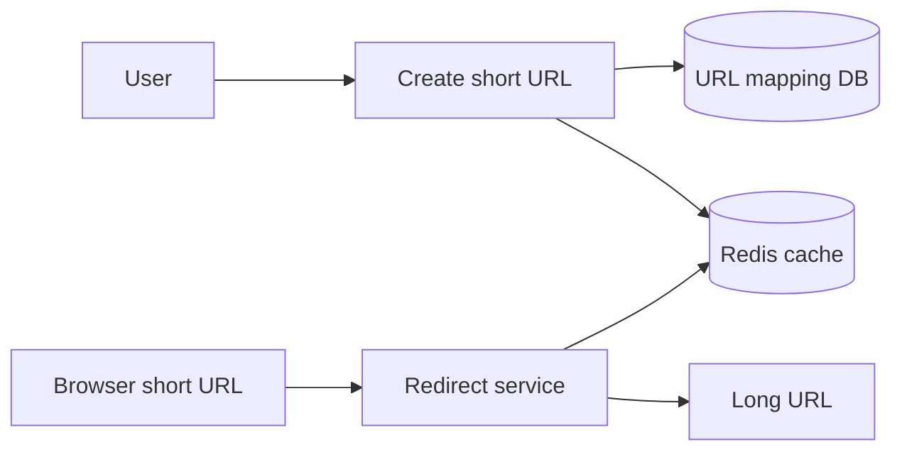

# Design URL Shortener

## Complete notes

URL shortener maps long URLs to short codes and redirects users quickly.

## Easy explanation

URL shortener maps long URLs to short codes and redirects users quickly.

In simple words: if you can explain `Design URL Shortener` with one real request, one failure case, and one metric, you understand the topic much better than just memorizing the definition.

## Simple example

Think of an interview design question. This note shows how to move from requirements to scale, APIs, data model, architecture, deep dive, failures, and tradeoffs.

For `Design URL Shortener`, ask yourself:

1. What is the normal happy path?
2. What can fail?
3. What is the tradeoff?
4. What would I monitor in production?

## Real-life examples

### Easy real-life example

You are asked to design a URL shortener and start with requirements, APIs, and database schema.

### Difficult production example

You are asked to design payment/chat/feed/file storage and must handle scale estimates, failure modes, consistency, bottlenecks, observability, and rollout.

### How to relate this topic

When reading `Design URL Shortener`, connect it to:

- one user action
- one backend component
- one failure case
- one tradeoff
- one metric

## Important points

- Core idea: `Design URL Shortener` must be understood through its production use case, not just its definition.
- When to use it: Focus on the interview flow: requirements, estimates, APIs, data model, architecture, deep dive, failure modes, observability, and tradeoffs.
- At scale: explain the bottleneck, failure path, operational owner, and rollback/fallback.
- What to monitor: QPS, storage, p95 latency, success rate, queue lag, delivery delay, fanout delay, and error rate.
- Interview rule: always give one concrete example, one tradeoff, one failure mode, and one metric.

## Diagram

## SDE-3 interview angle

At SDE-3 level, do not only define this topic. Explain tradeoffs, failure modes, production debugging signals, and what you would choose under different requirements.

## Common mistakes

- Starting with architecture before clarifying requirements.
- No rough scale math.
- No deep dive into the hardest part.
- Ignoring failure modes and tradeoffs.
- Not closing with monitoring and future improvements.

## Quick revision

URL shortener maps long URLs to short codes and redirects users quickly.

## Deep understanding checklist

To fully understand `Design URL Shortener`, be able to answer:

1. Where does it sit in the architecture?
2. What production problem does it solve?
3. What is the simplest implementation?
4. What breaks when traffic or data grows?
5. What is the main failure mode?
6. What tradeoff does it introduce?
7. Which metric proves it is healthy?

Strong answer focus: Focus on the interview flow: requirements, estimates, APIs, data model, architecture, deep dive, failure modes, observability, and tradeoffs.

## Production example and edge cases

Example: if designing this system in an interview, start with the user flow, estimate QPS/storage, define APIs, choose data model, draw services/cache/queue/database, then deep dive the hardest path. Always mention how the system fails and how you observe it.

For `Design URL Shortener`, the edge cases to always think about are:

- duplicate request or duplicate event
- dependency timeout or partial failure
- stale data or inconsistent state
- bad input or abusive client
- high traffic causing bottleneck
- rollback or replay after a bad deploy

Interview answer rule: after explaining the concept, immediately give one production example, one failure mode, one tradeoff, and one metric.

## Senior interview bank

These are topic-specific questions and strong answers for `Design URL Shortener`.

### 1. What is the first thing you ask?

Clarify requirements: users, core features, read/write ratio, scale, latency, availability, consistency, geography, security, and what is explicitly out of scope.

### 2. What design path should you follow?

Requirements -> scale estimate -> APIs -> data model -> high-level design -> deep dive -> failure modes -> observability -> tradeoffs.

### 3. What separates senior from mid-level?

Senior answers discuss tradeoffs, failure modes, ownership, rollout, metrics, and recovery. Mid-level answers often stop at listing components.

### 4. How do you choose the deep dive?

Pick the hardest product risk: feed fanout, payment idempotency, chat ordering, file upload consistency, search latency, or notification delivery.

### 5. How do you close the interview?

Summarize the design, name key tradeoffs, say what you would monitor, and mention the first bottleneck or future improvement.

## Topic-specific drill

### How would I answer `Design URL Shortener` if the interviewer asks directly?

For `Design URL Shortener`, I would explain requirements, scale estimates, APIs, data model, high-level design, deep-dive bottleneck, failure modes, observability, and tradeoffs.

### What is the trap question for `Design URL Shortener`?

The trap is giving only a definition. A senior answer must include a concrete production example, a failure mode, a tradeoff, and a metric.

### What should I draw?

Draw the smallest flow that shows where `Design URL Shortener` sits, then add the failure path next to the happy path.

## Reviewer checklist

- Can I explain this without reading the note?
- Can I draw the happy path and failure path?
- Can I name one concrete metric?
- Can I explain the tradeoff against a simpler option?
- Can I give a production example in under two minutes?
