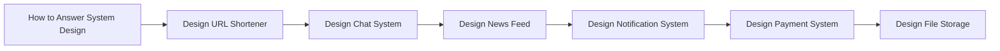

# System Design Practice Content Table

- [[How to Answer System Design]]
- [[Design URL Shortener]]
- [[Design Notification System]]
- [[Design Payment System]]
- [[Design Chat System]]
- [[Design News Feed]]
- [[Design File Storage]]

## Revision dashboard

Practice problems train you to combine requirements, APIs, data, scale, reliability, and tradeoffs.

## Visual topic map

Use this map like the Excalidraw roadmap: follow the arrows first, then open the linked notes.

## Color legend

- Blue = core concept
- Green = recommended pattern
- Red = risk or failure mode
- Purple = tradeoff
- Orange = current 2026 update

## Linked notes in this map

- [[How to Answer System Design]]
- [[Design URL Shortener]]
- [[Design Chat System]]
- [[Design News Feed]]
- [[Design Notification System]]
- [[Design Payment System]]
- [[Design File Storage]]
