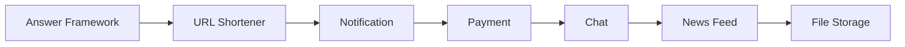

# System Design Practice Content Table

Practice problems train you to combine requirements, APIs, data, scale, reliability, observability, and tradeoffs. Use this section after core system design concepts.

## Study order

1. [[How to Answer System Design]]
2. [[Design URL Shortener]]
3. [[Design Notification System]]
4. [[Design Payment System]]
5. [[Design Chat System]]
6. [[Design News Feed]]
7. [[Design File Storage]]

## Complete answer framework

Every design answer should follow this flow:

1. clarify requirements
2. define non-functional requirements
3. estimate scale
4. design APIs
5. design data model
6. draw high-level architecture
7. deep dive into hardest part
8. discuss failure modes
9. add observability
10. state tradeoffs and future improvements

## Visual path

## What each problem teaches

| Problem | Main lesson | Hard part |
|---|---|---|
| URL Shortener | key generation, redirects, caching | hot links and analytics |
| Notification | async jobs, retries, DLQ | delivery guarantees |
| Payment | idempotency, transactions, audit | duplicate webhooks and consistency |
| Chat | WebSocket, ordering, presence | fanout and offline delivery |
| News Feed | fanout, ranking, caching | celebrity users and freshness |
| File Storage | object storage, metadata, CDN | large upload/download consistency |

## How this applies to InvoiceOps

InvoiceOps is closest to `Design Payment System` plus `Design Notification System`:

- invoices need payment idempotency
- reminders need async jobs
- dashboard needs caching
- audit logs need reliable writes
- future live status can use WebSocket

## Common mistakes

- starting with components before requirements
- skipping scale estimate
- drawing too many boxes without explaining data flow
- ignoring failure paths
- not choosing one deep dive
- forgetting metrics/logs/traces
- not stating tradeoffs

## Senior interview bank

### 1. What separates a strong system design answer?

A strong answer is structured, requirement-driven, explains tradeoffs, handles failure modes, and names metrics. It does not just list technologies.

### 2. How do you choose the deep dive?

Pick the riskiest part of the system: payment idempotency, feed fanout, chat ordering, file upload consistency, or notification retries.

### 3. How should you close the interview?

Summarize the design, name key tradeoffs, say what you would monitor, and mention the first bottleneck or future improvement.

## Practice method

For each problem:

1. solve in 35-45 minutes
2. draw architecture from memory
3. explain one failure mode
4. explain one scaling bottleneck
5. compare one alternative design
