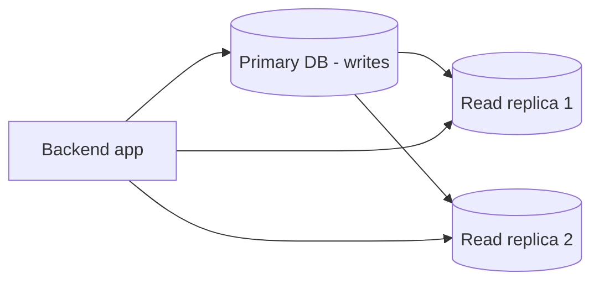
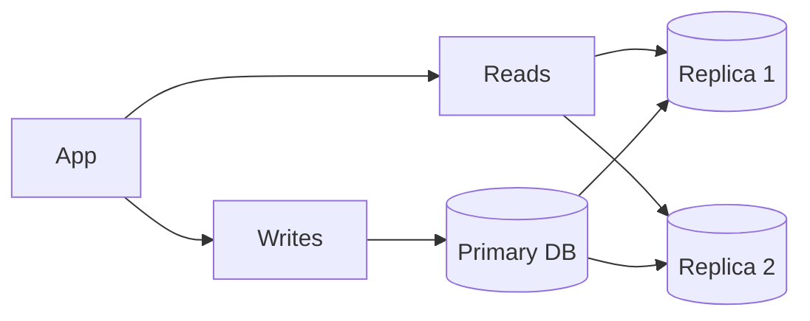

# Database Replication

## Complete notes

Database replication means copying data from one database server to another.

## Why it is used

- Improve read performance.
- Improve availability.
- Keep backup copy of data.
- Reduce load on primary database.

## Primary-replica model

Primary handles writes.
Replicas handle reads.

## Read scaling

If app has many read requests, send reads to replicas.

Writes still go to primary.

## Replication lag

Replica may be slightly behind primary.

Example:

1. User updates profile.
2. Write goes to primary.
3. Replica receives update after small delay.
4. If app reads from replica immediately, old data may appear.

## Common mistakes

- Assuming replicas are always instantly updated.
- Sending writes to read replicas.
- Not monitoring lag.

## Quick revision

Replication = copy same data to more DB servers, mostly to scale reads and improve availability.

## Deep revision

### Replication types

- Synchronous replication: write waits for replica confirmation.
- Asynchronous replication: primary responds first, replica catches up later.

### Read/write split

### Replication lag example

User updates profile and immediately refreshes page.
If read goes to lagging replica, old name may appear.

### Solutions

- Read your own writes from primary.
- Monitor lag.
- Use sticky read for recently updated user.
- Design UI to tolerate slight delay.

### Key point

Replication mostly helps read scaling and availability, not write scaling.
