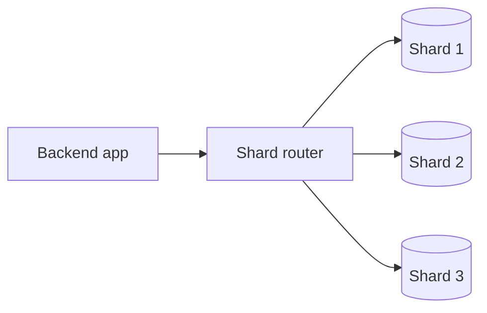
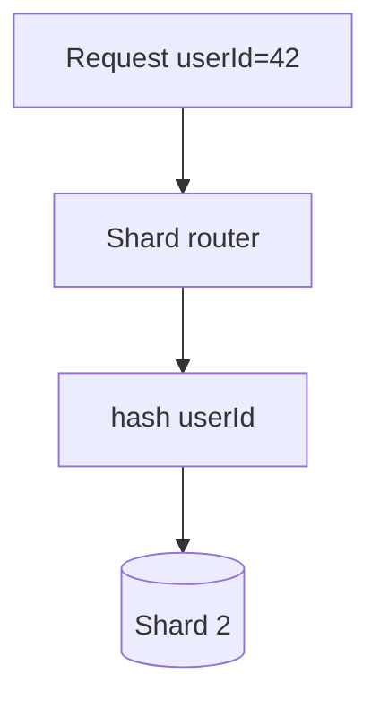

# Database Sharding

## Complete notes

Database sharding means splitting data across multiple database servers.

Instead of every server having full copy, each shard stores part of the data.

## Why sharding is used

- Database becomes too large.
- One database cannot handle all writes.
- Need to spread storage and traffic.

## Example

Split users by user ID:

- Shard 1: user ID 1 to 1,000,000
- Shard 2: user ID 1,000,001 to 2,000,000
- Shard 3: user ID 2,000,001 to 3,000,000

## Diagram

## Sharding strategies

- Range-based sharding.
- Hash-based sharding.
- Geo/location-based sharding.
- Tenant-based sharding.

## Problem

Sharding makes queries harder.

Example:

- Joining data across shards is difficult.
- Moving data between shards is complex.
- Bad shard key can create hot shard.

## Replication vs sharding

| Concept | Meaning | Best for |
|---|---|---|
| Replication | Copy same data | Read scaling and availability |
| Sharding | Split data into parts | Write/storage scaling |

## Quick revision

Replication copies data.
Sharding splits data.

## Deep revision

### Shard key

Shard key decides where data goes.

Good shard key should:

- spread data evenly
- match common queries
- avoid hot shard
- not change often

### Bad shard key problem

If all new users go to same shard, one shard becomes overloaded.

This is called hot shard.

### Diagram

### Sharding challenges

- cross-shard joins
- transactions across shards
- rebalancing data
- global secondary indexes
- backup/restore complexity

### When to shard

Shard only when database is too large or write-heavy for one primary.

Do not shard too early.
