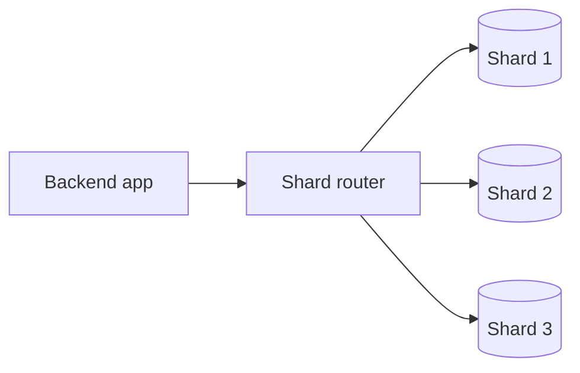
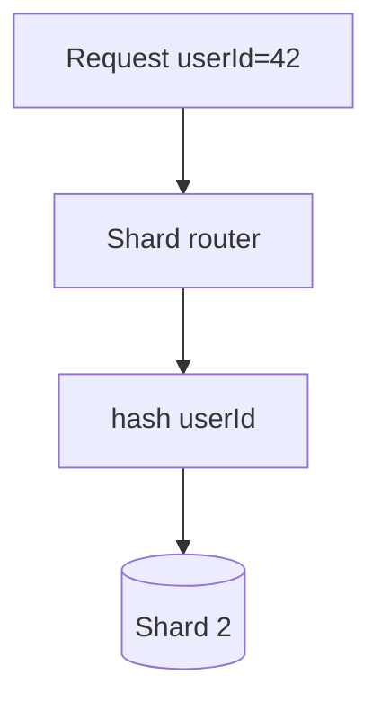

# Database Sharding

## Complete notes

Database sharding means splitting data across multiple database servers.

Instead of every server having full copy, each shard stores part of the data.

## Easy explanation

Database sharding means splitting data across multiple database servers.

In simple words: if you can explain `Database Sharding` with one real request, one failure case, and one metric, you understand the topic much better than just memorizing the definition.

## Simple example

Think of designing a backend system end to end. This topic explains where a component sits, why it is needed, what bottleneck it solves, and what tradeoff it introduces.

For `Database Sharding`, ask yourself:

1. What is the normal happy path?
2. What can fail?
3. What is the tradeoff?
4. What would I monitor in production?

## Why sharding is used

- Database becomes too large.
- One database cannot handle all writes.
- Need to spread storage and traffic.

## Example

Split users by user ID:

- Shard 1: user ID 1 to 1,000,000
- Shard 2: user ID 1,000,001 to 2,000,000
- Shard 3: user ID 2,000,001 to 3,000,000

## Diagram

## Sharding strategies

- Range-based sharding.
- Hash-based sharding.
- Geo/location-based sharding.
- Tenant-based sharding.

## Problem

Sharding makes queries harder.

Example:

- Joining data across shards is difficult.
- Moving data between shards is complex.
- Bad shard key can create hot shard.

## Replication vs sharding

| Concept | Meaning | Best for |
|---|---|---|
| Replication | Copy same data | Read scaling and availability |
| Sharding | Split data into parts | Write/storage scaling |

## Real-life examples

### Easy real-life example

You design a small app with users, API server, database, and cache.

### Difficult production example

You design a global service that needs load balancing, caching, replication, sharding, queues, observability, safe deployment, and clear tradeoffs.

### How to relate this topic

When reading `Database Sharding`, connect it to:

- one user action
- one backend component
- one failure case
- one tradeoff
- one metric

## Important points

- Core idea: `Database Sharding` must be understood through its production use case, not just its definition.
- When to use it: Focus on requirements, scale, APIs, data model, high-level architecture, bottleneck, failure mode, consistency, observability, and tradeoffs.
- At scale: explain the bottleneck, failure path, operational owner, and rollback/fallback.
- What to monitor: QPS, p95 latency, availability, error rate, queue lag, cache hit rate, database latency, and saturation.
- Interview rule: always give one concrete example, one tradeoff, one failure mode, and one metric.

## Common mistakes

- Listing components without explaining why they are needed.
- Ignoring bottlenecks and failure modes.
- No scale estimate or data model.
- No observability or rollback plan.
- Choosing tools without tradeoffs.

## Quick revision

[[Database Replication|Replication]] copies data.
Sharding splits data.

## Deep revision

### Shard key

Shard key decides where data goes.

Good shard key should:

- spread data evenly
- match common queries
- avoid hot shard
- not change often

### Bad shard key problem

If all new users go to same shard, one shard becomes overloaded.

This is called hot shard.

### Diagram

### Sharding challenges

- cross-shard joins
- transactions across shards
- rebalancing data
- global secondary indexes
- backup/restore complexity

### When to shard

Shard only when database is too large or write-heavy for one primary.

Do not shard too early.

## Deep understanding checklist

To fully understand `Database Sharding`, be able to answer:

1. Where does it sit in the architecture?
2. What production problem does it solve?
3. What is the simplest implementation?
4. What breaks when traffic or data grows?
5. What is the main failure mode?
6. What tradeoff does it introduce?
7. Which metric proves it is healthy?

Strong answer focus: Focus on requirements, scale, APIs, data model, high-level architecture, bottleneck, failure mode, consistency, observability, and tradeoffs.

## Senior interview bank

These are topic-specific questions and strong answers for `Database Sharding`.

### 1. What is the first thing you ask?

Clarify requirements: users, core features, read/write ratio, scale, latency, availability, consistency, geography, security, and what is explicitly out of scope.

### 2. What design path should you follow?

Requirements -> scale estimate -> APIs -> data model -> high-level design -> deep dive -> failure modes -> observability -> tradeoffs.

### 3. What separates senior from mid-level?

Senior answers discuss tradeoffs, failure modes, ownership, rollout, metrics, and recovery. Mid-level answers often stop at listing components.

### 4. How do you choose the deep dive?

Pick the hardest product risk: feed fanout, payment idempotency, chat ordering, file upload consistency, search latency, or notification delivery.

### 5. How do you close the interview?

Summarize the design, name key tradeoffs, say what you would monitor, and mention the first bottleneck or future improvement.

## Topic-specific drill

### How would I answer `Database Sharding` if the interviewer asks directly?

For `Database Sharding`, I would explain where it fits in the architecture, the scale problem it solves, the bottleneck or failure mode, the tradeoff, and the metric that proves the design is healthy.

### What is the trap question for `Database Sharding`?

The trap is giving only a definition. A senior answer must include a concrete production example, a failure mode, a tradeoff, and a metric.

### What should I draw?

Draw the smallest flow that shows where `Database Sharding` sits, then add the failure path next to the happy path.

## Reviewer checklist

- Can I explain this without reading the note?
- Can I draw the happy path and failure path?
- Can I name one concrete metric?
- Can I explain the tradeoff against a simpler option?
- Can I give a production example in under two minutes?
