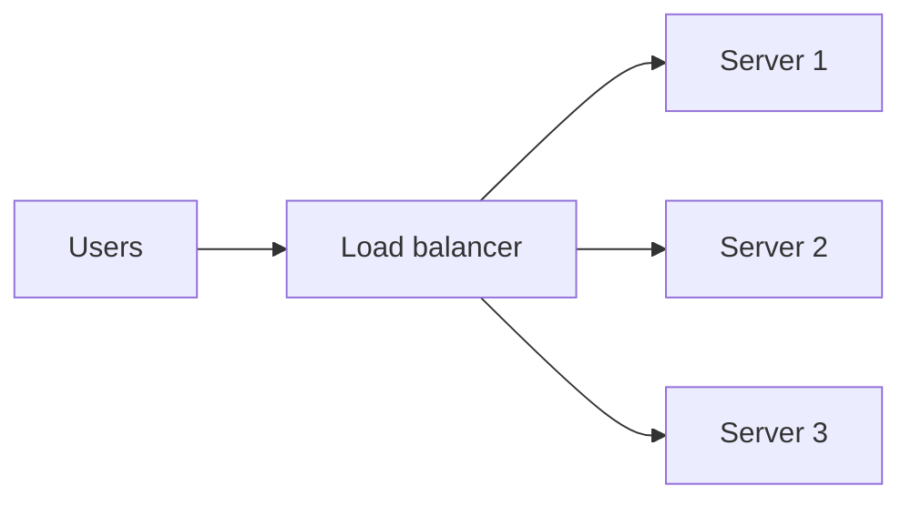
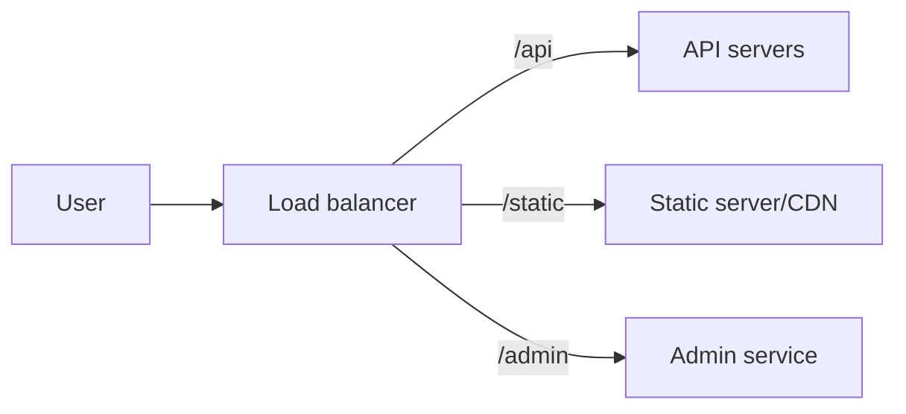

# Load Balancer

## Complete notes

Load balancer distributes user requests across multiple backend servers.

## Easy explanation

A load balancer is the traffic manager that spreads requests across healthy backend servers.

In simple words: if you can explain `Load Balancer` with one real request, one failure case, and one metric, you understand the topic much better than just memorizing the definition.

## Simple example

Imagine three API servers are running behind one endpoint. The load balancer receives user traffic, sends each request to a healthy server, and stops sending traffic to a server that fails health checks.

For `Load Balancer`, ask yourself:

1. Which algorithm is used?
2. What happens if one server dies?
3. Are sessions stored safely outside one server?
4. Is this Layer 4 or Layer 7?
5. What latency/error metrics prove it is healthy?

## Why it is used

- Prevent one server from taking all traffic.
- Improve availability.
- Allow horizontal scaling.
- Remove unhealthy servers from traffic.

## Diagram



## Common algorithms

- Round robin: send requests one by one to each server.
- Least connections: send to server with fewer active connections.
- IP hash: same user/IP may go to same server.
- Weighted round robin: stronger server receives more traffic.

## Health check

Load balancer checks if server is healthy.

If one server fails, traffic is sent to other servers.

## Common mistake

If user [[Sessions and Cookies|session]] is stored only in one server memory, user may break when next request goes to another server.

Solution:

- Store sessions in Redis/database.
- Or use sticky sessions, but shared session store is cleaner.

## Real-life examples

### Easy real-life example

Three API servers run behind one URL. The load balancer sends each request to a healthy server.

### Difficult production example

A Layer 7 load balancer routes `/api`, `/admin`, and `/static` differently, removes unhealthy nodes, handles TLS, and avoids sticky-session problems by storing sessions in Redis.

### How to relate this topic

When reading `Load Balancer`, connect it to:

- one user action
- one backend component
- one failure case
- one tradeoff
- one metric

## Important points

- Core idea: `Load Balancer` must be understood through its production use case, not just its definition.
- When to use it: Focus on requirements, scale, APIs, data model, high-level architecture, bottleneck, failure mode, consistency, observability, and tradeoffs.
- At scale: explain the bottleneck, failure path, operational owner, and rollback/fallback.
- What to monitor: QPS, p95 latency, availability, error rate, queue lag, cache hit rate, database latency, and saturation.
- Interview rule: always give one concrete example, one tradeoff, one failure mode, and one metric.

## Common mistakes

- Listing components without explaining why they are needed.
- Ignoring bottlenecks and failure modes.
- No scale estimate or data model.
- No observability or rollback plan.
- Choosing tools without tradeoffs.

## Quick revision

Load balancer = traffic manager between users and many backend servers.

## Important additions

### Layer 4 vs Layer 7

| Type | Works with | Example |
|---|---|---|
| Layer 4 | TCP/UDP | fast network load balancing |
| Layer 7 | HTTP/HTTPS | route by path/header/domain |

### Path-based routing



### Health check

Load balancer should call a health endpoint like:

```text

GET /health
```

If server fails health check, remove it from traffic.


## Deep understanding checklist

To fully understand `Load Balancer`, be able to answer:

1. Where does it sit in the architecture?
2. What production problem does it solve?
3. What is the simplest implementation?
4. What breaks when traffic or data grows?
5. What is the main failure mode?
6. What tradeoff does it introduce?
7. Which metric proves it is healthy?

Strong answer focus: Focus on requirements, scale, APIs, data model, high-level architecture, bottleneck, failure mode, consistency, observability, and tradeoffs.

## Senior interview bank

These are topic-specific questions and strong answers for `Load Balancer`.

### 1. What is the first thing you ask?

Clarify requirements: users, core features, read/write ratio, scale, latency, availability, consistency, geography, security, and what is explicitly out of scope.

### 2. What design path should you follow?

Requirements -> scale estimate -> APIs -> data model -> high-level design -> deep dive -> failure modes -> observability -> tradeoffs.

### 3. What separates senior from mid-level?

Senior answers discuss tradeoffs, failure modes, ownership, rollout, metrics, and recovery. Mid-level answers often stop at listing components.

### 4. How do you choose the deep dive?

Pick the hardest product risk: feed fanout, payment idempotency, chat ordering, file upload consistency, search latency, or notification delivery.

### 5. How do you close the interview?

Summarize the design, name key tradeoffs, say what you would monitor, and mention the first bottleneck or future improvement.

## Topic-specific drill

### How would I answer `Load Balancer` if the interviewer asks directly?

For `Load Balancer`, I would explain where it fits in the architecture, the scale problem it solves, the bottleneck or failure mode, the tradeoff, and the metric that proves the design is healthy.

### What is the trap question for `Load Balancer`?

The trap is giving only a definition. A senior answer must include a concrete production example, a failure mode, a tradeoff, and a metric.

### What should I draw?

Draw the smallest flow that shows where `Load Balancer` sits, then add the failure path next to the happy path.

## Reviewer checklist

- Can I explain this without reading the note?
- Can I draw the happy path and failure path?
- Can I name one concrete metric?
- Can I explain the tradeoff against a simpler option?
- Can I give a production example in under two minutes?
