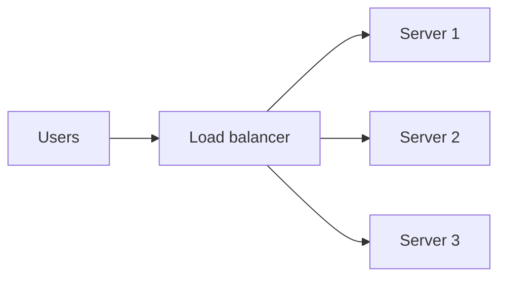
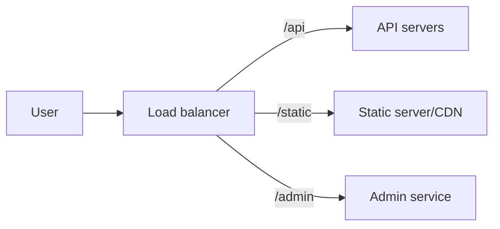

# Load Balancer

## Complete notes

Load balancer distributes user requests across multiple backend servers.

## Why it is used

- Prevent one server from taking all traffic.
- Improve availability.
- Allow horizontal scaling.
- Remove unhealthy servers from traffic.

## Diagram



## Common algorithms

- Round robin: send requests one by one to each server.
- Least connections: send to server with fewer active connections.
- IP hash: same user/IP may go to same server.
- Weighted round robin: stronger server receives more traffic.

## Health check

Load balancer checks if server is healthy.

If one server fails, traffic is sent to other servers.

## Common mistake

If user session is stored only in one server memory, user may break when next request goes to another server.

Solution:

- Store sessions in Redis/database.
- Or use sticky sessions, but shared session store is cleaner.

## Quick revision

Load balancer = traffic manager between users and many backend servers.

## Important additions

### Layer 4 vs Layer 7

| Type | Works with | Example |
|---|---|---|
| Layer 4 | TCP/UDP | fast network load balancing |
| Layer 7 | HTTP/HTTPS | route by path/header/domain |

### Path-based routing



### Health check

Load balancer should call a health endpoint like:

```text

GET /health
```

If server fails health check, remove it from traffic.
