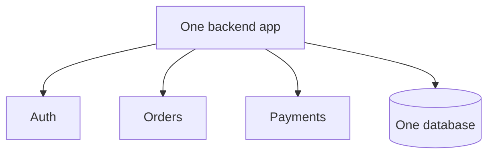
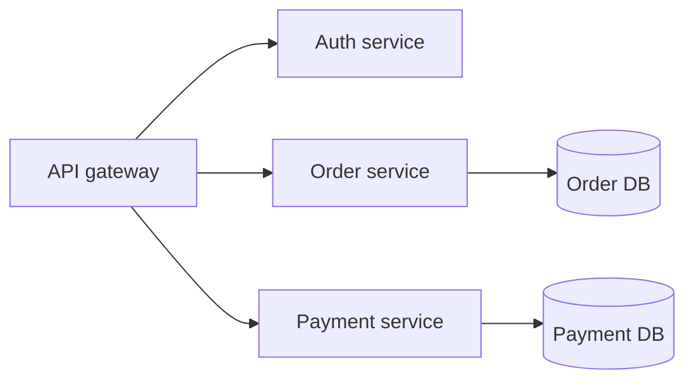

# Monolith and Microservices

## Complete notes

Monolith means most backend features live in one application.

Microservices means features are split into many small independent services.

## Monolith

### Good

- Simple to build.
- Simple to deploy.
- Good for startup/MVP.
- Easy local development.

### Problem

- Can become large and hard to maintain.
- One bug can affect whole app.
- Scaling one feature separately is difficult.

## Microservices

### Good

- Services can scale separately.
- Teams can own separate services.
- One service can be deployed independently.

### Problem

- More complex.
- Needs service communication.
- Needs monitoring, logs, CI/CD, and distributed debugging.
- Database consistency becomes harder.

## Quick revision

Start with monolith for simple product.
Move to microservices only when scale/team boundaries need it.

## Important additions

### Modular monolith

Before microservices, build a modular monolith.

That means one deployable app, but code is separated by modules:

- auth module
- product module
- order module
- payment module

### Migration path

### When microservices make sense

- many teams
- independent deploys needed
- one feature has different scale
- clear service boundaries exist

Do not choose microservices only because it sounds advanced.
