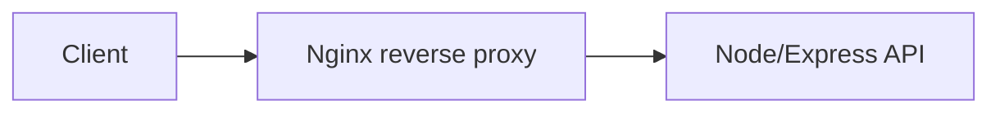
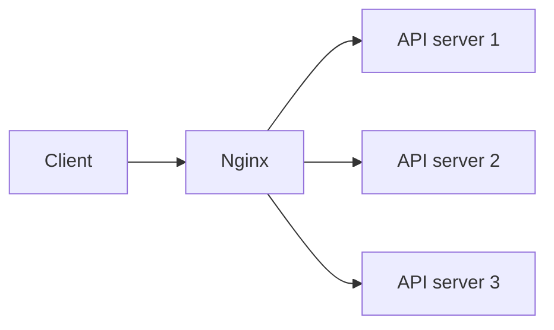

# Nginx

## Complete notes

Nginx is a web server that is often used as a reverse proxy and load balancer.

## Common uses

- Serve static files.
- Reverse proxy to Node/Express backend.
- Load balance between multiple servers.
- SSL/TLS termination.
- Compression and caching.
- Rate limiting.

## Reverse proxy

Client talks to Nginx.
Nginx forwards request to backend server.



## Load balancing



## Simple config idea

```nginx

upstream backend {
  server app1:3000;
  server app2:3000;
}

server {
  listen 80;

  location / {
    proxy_pass http://backend;
  }
}
```

## Quick revision

Nginx usually sits in front of backend servers and forwards, balances, secures, and optimizes traffic.

## Important additions

### Nginx in production

Nginx can do:

- reverse proxy
- static file serving
- gzip compression
- TLS/SSL termination
- path routing
- load balancing
- basic rate limiting

### Common reverse proxy headers

```nginx

proxy_set_header Host $host;
proxy_set_header X-Real-IP $remote_addr;
proxy_set_header X-Forwarded-For $proxy_add_x_forwarded_for;
proxy_set_header X-Forwarded-Proto $scheme;
```

These help backend know original client information.
