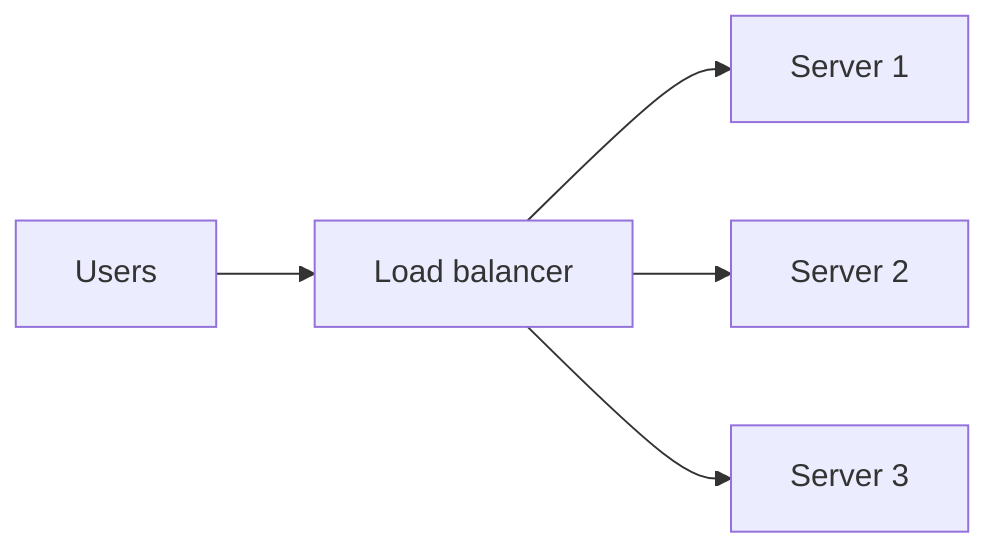
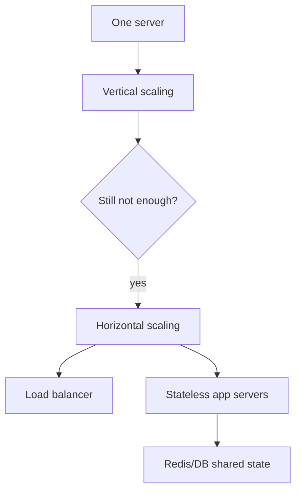

# Scaling Concepts

## Complete notes

Scaling means increasing system capacity.

If 100 users work fine but 1 million users crash the server, scaling is needed.

## Easy explanation

Scaling means increasing system capacity.

In simple words: if you can explain `Scaling Concepts` with one real request, one failure case, and one metric, you understand the topic much better than just memorizing the definition.

## Simple example

Think of designing a backend system end to end. This topic explains where a component sits, why it is needed, what bottleneck it solves, and what tradeoff it introduces.

For `Scaling Concepts`, ask yourself:

1. What is the normal happy path?
2. What can fail?
3. What is the tradeoff?
4. What would I monitor in production?

## Vertical scaling

Increase power of one machine.

Examples:

- More CPU.
- More RAM.
- Faster disk.

### Good

- Simple.
- No big architecture change.

### Problem

- Machine has a limit.
- Can become expensive.
- Still single point of failure.

## Horizontal scaling

Add more servers.

### Good

- Handles more traffic.
- Better fault tolerance.
- Can add/remove servers.

### Problem

- Needs load balancer.
- App should be stateless.
- Shared state should move to Redis/database.

## Important idea: stateless server

API server should not store important user state in local memory.

Use Redis/database for [[Sessions and Cookies|sessions]], cache, rate limits, and shared state.

## Real-life examples

### Easy real-life example

You design a small app with users, API server, database, and cache.

### Difficult production example

You design a global service that needs load balancing, caching, replication, sharding, queues, observability, safe deployment, and clear tradeoffs.

### How to relate this topic

When reading `Scaling Concepts`, connect it to:

- one user action
- one backend component
- one failure case
- one tradeoff
- one metric

## Important points

- Core idea: `Scaling Concepts` must be understood through its production use case, not just its definition.
- When to use it: Focus on requirements, scale, APIs, data model, high-level architecture, bottleneck, failure mode, consistency, observability, and tradeoffs.
- At scale: explain the bottleneck, failure path, operational owner, and rollback/fallback.
- What to monitor: QPS, p95 latency, availability, error rate, queue lag, cache hit rate, database latency, and saturation.
- Interview rule: always give one concrete example, one tradeoff, one failure mode, and one metric.

## Common mistakes

- Listing components without explaining why they are needed.
- Ignoring bottlenecks and failure modes.
- No scale estimate or data model.
- No observability or rollback plan.
- Choosing tools without tradeoffs.

## Quick revision

- Vertical scaling = bigger server.
- Horizontal scaling = more servers.
- Production systems usually use horizontal scaling.

## Deep revision

### Scaling bottlenecks

When app grows, bottleneck can be:

- CPU
- RAM
- database queries
- network
- disk I/O
- third-party APIs
- locks/shared state

### Scaling pattern

### Important metrics

- RPS: requests per second.
- Latency p95/p99.
- CPU usage.
- Memory usage.
- DB query time.
- Error rate.

### Common solution order

1. Measure bottleneck.
2. Optimize code/query.
3. Add [[cache]].
4. Scale app servers.
5. Scale database.
6. Add [[Message Queue with Redis|queue]] for slow work.

## Deep understanding checklist

To fully understand `Scaling Concepts`, be able to answer:

1. Where does it sit in the architecture?
2. What production problem does it solve?
3. What is the simplest implementation?
4. What breaks when traffic or data grows?
5. What is the main failure mode?
6. What tradeoff does it introduce?
7. Which metric proves it is healthy?

Strong answer focus: Focus on requirements, scale, APIs, data model, high-level architecture, bottleneck, failure mode, consistency, observability, and tradeoffs.

## Senior interview bank

These are topic-specific questions and strong answers for `Scaling Concepts`.

### 1. What is the first thing you ask?

Clarify requirements: users, core features, read/write ratio, scale, latency, availability, consistency, geography, security, and what is explicitly out of scope.

### 2. What design path should you follow?

Requirements -> scale estimate -> APIs -> data model -> high-level design -> deep dive -> failure modes -> observability -> tradeoffs.

### 3. What separates senior from mid-level?

Senior answers discuss tradeoffs, failure modes, ownership, rollout, metrics, and recovery. Mid-level answers often stop at listing components.

### 4. How do you choose the deep dive?

Pick the hardest product risk: feed fanout, payment idempotency, chat ordering, file upload consistency, search latency, or notification delivery.

### 5. How do you close the interview?

Summarize the design, name key tradeoffs, say what you would monitor, and mention the first bottleneck or future improvement.

## Topic-specific drill

### How would I answer `Scaling Concepts` if the interviewer asks directly?

For `Scaling Concepts`, I would explain where it fits in the architecture, the scale problem it solves, the bottleneck or failure mode, the tradeoff, and the metric that proves the design is healthy.

### What is the trap question for `Scaling Concepts`?

The trap is giving only a definition. A senior answer must include a concrete production example, a failure mode, a tradeoff, and a metric.

### What should I draw?

Draw the smallest flow that shows where `Scaling Concepts` sits, then add the failure path next to the happy path.

## Reviewer checklist

- Can I explain this without reading the note?
- Can I draw the happy path and failure path?
- Can I name one concrete metric?
- Can I explain the tradeoff against a simpler option?
- Can I give a production example in under two minutes?
