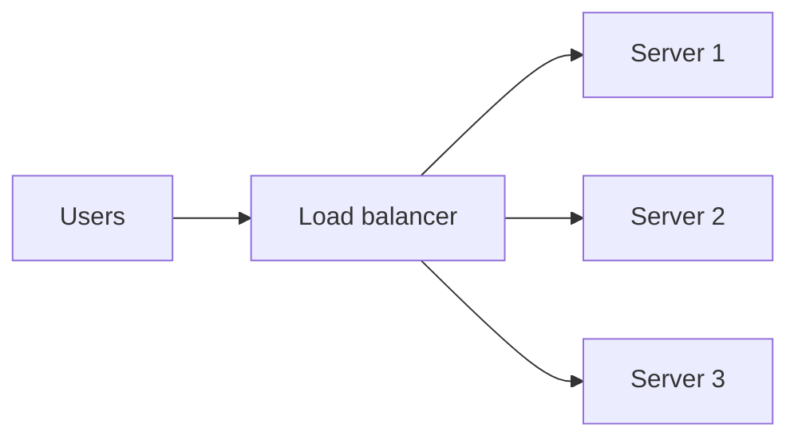
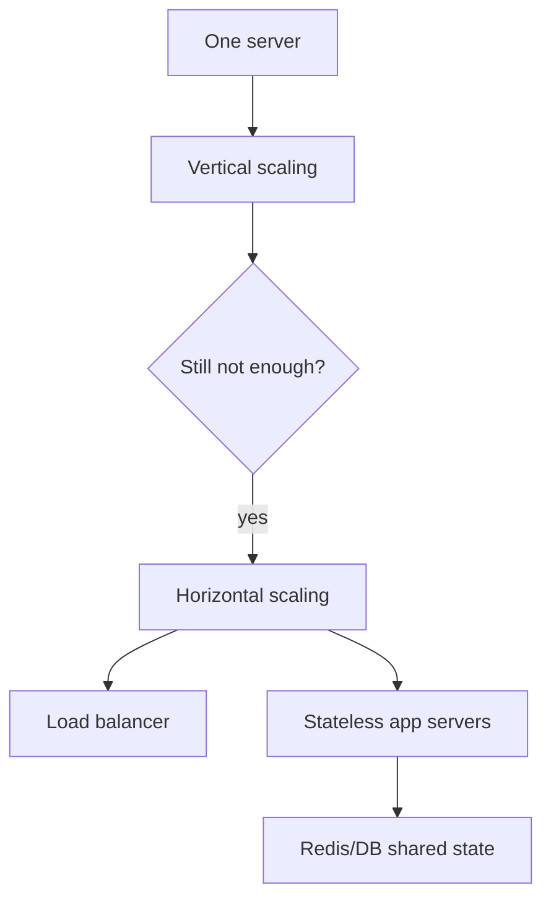

# Scaling Concepts

## Complete notes

Scaling means increasing system capacity.

If 100 users work fine but 1 million users crash the server, scaling is needed.

## Vertical scaling

Increase power of one machine.

Examples:

- More CPU.
- More RAM.
- Faster disk.

### Good

- Simple.
- No big architecture change.

### Problem

- Machine has a limit.
- Can become expensive.
- Still single point of failure.

## Horizontal scaling

Add more servers.

### Good

- Handles more traffic.
- Better fault tolerance.
- Can add/remove servers.

### Problem

- Needs load balancer.
- App should be stateless.
- Shared state should move to Redis/database.

## Important idea: stateless server

API server should not store important user state in local memory.

Use Redis/database for sessions, cache, rate limits, and shared state.

## Quick revision

- Vertical scaling = bigger server.
- Horizontal scaling = more servers.
- Production systems usually use horizontal scaling.

## Deep revision

### Scaling bottlenecks

When app grows, bottleneck can be:

- CPU
- RAM
- database queries
- network
- disk I/O
- third-party APIs
- locks/shared state

### Scaling pattern

### Important metrics

- RPS: requests per second.
- Latency p95/p99.
- CPU usage.
- Memory usage.
- DB query time.
- Error rate.

### Common solution order

1. Measure bottleneck.
2. Optimize code/query.
3. Add cache.
4. Scale app servers.
5. Scale database.
6. Add queue for slow work.
