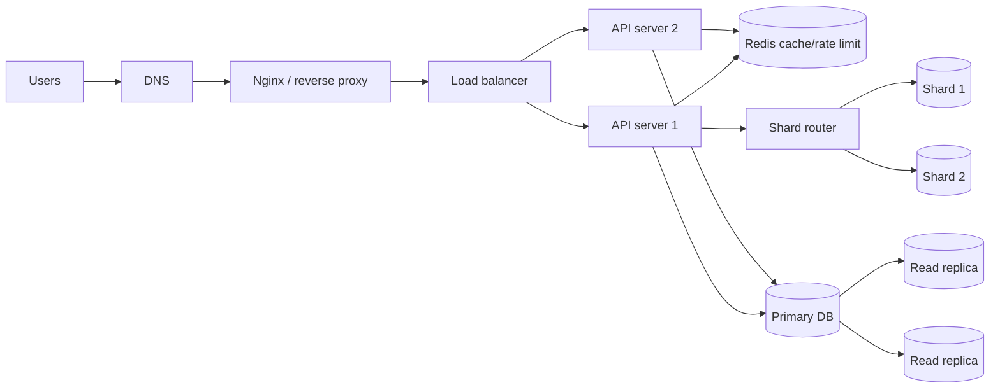

# System Design Content Table

## Course topics

- [[System Design introduction]]
- [[Scaling Concepts]]
- [[Load Balancer]]
- [[Nginx]]
- [[Monolith and Microservices]]
- [[Database Replication]]
- [[Database Sharding]]

## Revision dashboard

System design is about designing backend systems that can handle real users, traffic, data, failures, and growth.

## Study order

1. [[System Design introduction]]
2. [[Scaling Concepts]]
3. [[Load Balancer]]
4. [[Nginx]]
5. [[Monolith and Microservices]]
6. [[Database Replication]]
7. [[Database Sharding]]

## Big picture diagram

## Topic summary table

| Topic | What it solves | Remember |
|---|---|---|
| Scaling Concepts | More traffic/users | vertical vs horizontal |
| Load Balancer | Spread traffic | health checks and algorithms |
| Nginx | Reverse proxy/front server | proxy, SSL, static files, load balancing |
| Monolith and Microservices | Code/service structure | simple vs distributed |
| Database Replication | More read capacity | primary writes, replicas read |
| Database Sharding | Very large/write-heavy data | split data by shard key |

## Revision checklist

- I can explain why one server crashes at high traffic.
- I can compare vertical and horizontal scaling.
- I can draw users -> load balancer -> multiple servers.
- I can explain what Nginx does before the backend.
- I can compare monolith and microservices.
- I can explain replication lag.
- I can explain shard key and hot shard.
- I can say when Redis helps system design.

## Interview-style questions

1. What happens when traffic grows from 100 users to 1 million users?
2. Why do we need a load balancer?
3. What is the difference between Nginx and backend server?
4. Why should API servers be stateless?
5. When should we use database replication?
6. When should we use database sharding?
7. What is the difference between replication and sharding?

## Quick revision

- Load balancer spreads request load.
- Nginx sits in front and proxies traffic.
- Replication copies data for read scaling.
- Sharding splits data for write/storage scaling.
- Microservices are powerful but add distributed-system complexity.
