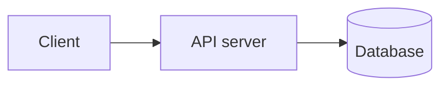
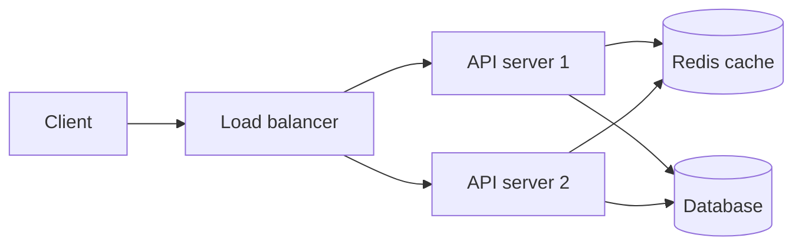

# System Design introduction

## Complete notes

System design means planning how the backend system should work at scale.

It is not only coding one API. It includes servers, database, cache, queue, load balancer, monitoring, and failure handling.

## Why system design is needed

A small app can run on one server.

When traffic grows, one server may become slow or crash.

System design helps decide how to handle:

- More users.
- More requests.
- More data.
- Failures.
- Security.
- Cost.

## Basic flow

## Scaled flow

## Important concepts

- Availability: system should stay up.
- Scalability: system should handle growth.
- Reliability: system should work correctly.
- Latency: response delay should be low.
- Throughput: system should handle many requests.

## Quick revision

System design = how to arrange backend parts so the app works for many users.
